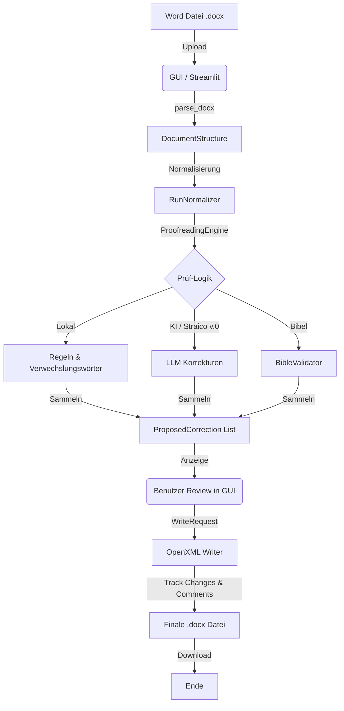

# MCP Lektor: Workflow-Dokumentation

Der Workflow ist in vier Hauptphasen unterteilt. In der aktuellen Prototyp-Phase ist die **Streamlit GUI** (`gui.py`) der Orchestrator, der die Core-Logik aufruft.

## 1. Phase: Extraktion & Analyse (Der Start)
**Einstiegspunkt:** Benutzer lädt eine `.docx`-Datei in der Streamlit GUI hoch.

1.  **Dateiaufbereitung:** `gui.py` speichert die hochgeladene Datei temporär.
2.  **Parsing:** Die Funktion `parse_docx()` (in `document_io.py`) nutzt die Bibliothek `python-docx`, um das Dokument in eine interne Struktur (`DocumentStructure`) zu überführen.
3.  **Normalisierung:** Der `RunNormalizer` (in `run_normalizer.py`) bereinigt zerstückelte Text-Elemente ("Runs") im Word-XML, damit Sätze am Stück geprüft werden können.
4.  **Platzhalter-Erkennung:** Während des Parsings werden Texte, die rot formatiert sind, automatisch als `is_placeholder=True` markiert (Klasse `TextRun` in `models.py`).

## 2. Phase: Prüfung (Das "Gehirn")
**Hauptklasse:** `ProofreadingEngine` (in `proofreading_engine.py`)

1.  **Regelbasierte Prüfung:** Die Engine führt lokale Prüfungen durch (ohne KI):
    *   `TypographyChecker`: Prüft Anführungszeichen, Gedankenstriche etc.
    *   `ConfusedWordsChecker`: Sucht nach häufig verwechselten Wörtern (aus `confused_words.yaml`).
2.  **KI-Prüfung (LLM):** Die Engine sendet den Text in Batches an `llm_client.py`.
    *   **NEU:** Hier wird jetzt die **Straico v.0 API** mit dem `smart_llm_selector` aufgerufen.
    *   Das LLM liefert ein JSON-Array mit Korrekturvorschlägen zurück.
3.  **Bibel-Prüfung:** Parallel dazu sucht der `BibleValidator` nach Bibelstellen und validiert diese online oder offline.
4.  **Ergebnis:** Alle Funde werden in einer Liste von `ProposedCorrection`-Objekten gesammelt.

## 3. Phase: Interaktive Review (Benutzer-Interaktion)
**Ort:** Streamlit GUI Dashboard

1.  **Anzeige:** Die GUI präsentiert die Korrekturen in einer Tabelle.
2.  **Entscheidung:** Der Benutzer wählt für jeden Vorschlag:
    *   **Annehmen:** Der Vorschlag wird für den Schreibvorgang markiert.
    *   **Ablehnen:** Der Vorschlag wird verworfen.
    *   **Editieren:** Der Benutzer korrigiert den Vorschlag manuell.
3.  **Validierung:** Die GUI erstellt einen `WriteRequest` (in `models.py`), der alle akzeptierten Änderungen enthält.

## 4. Phase: Generierung & Export (Das Ende)
**Hauptmodul:** `openxml_writer.py`

1.  **XML-Manipulation:** Die Funktion `write_corrected_document()` öffnet das ursprüngliche `.docx` als ZIP-Archiv.
2.  **Track Changes:** Für jede akzeptierte Korrektur werden im Word-XML (`document.xml`) spezielle Tags eingefügt:
    *   `<w:del>` für den gelöschten Originaltext.
    *   `<w:ins>` für den neuen Korrekturtext.
3.  **Kommentare:** Erklärungen der KI werden als Word-Kommentare (`comments.xml`) an die entsprechenden Stellen geheftet.
4.  **Integritätsprüfung:** Der `xml_validator.py` stellt sicher, dass das erzeugte XML valide ist, damit Word die Datei öffnen kann.
5.  **Download:** Die fertige Datei wird dem Benutzer in der GUI zum Download angeboten. **Hier endet der Workflow.**

---

### Visuelle Übersicht (Mermaid)

### Zusammenfassung der Schlüssel-Komponenten:

*   **Datenmodell:** `src/mcp_lektor/core/models.py` (Definiert die "Sprache", in der alle Komponenten sprechen).
*   **Schnittstelle nach außen:** `src/mcp_lektor/core/llm_client.py` (Zuständig für Straico/Langdock).
*   **Technisches Herz:** `src/mcp_lektor/core/openxml_writer.py` (Beherrscht die Word-Innereien).
