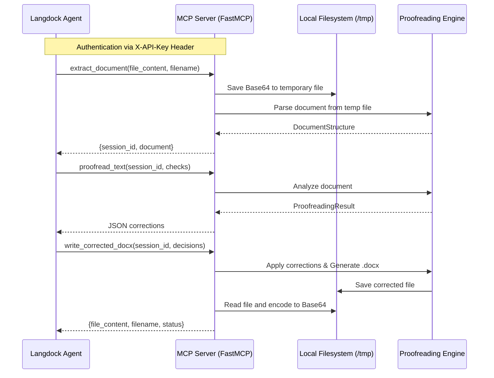

## USER 🧑‍💻

<session_context>
This is the Gemini CLI. We are setting up the context for our chat.
Today's date is Mittwoch, 18. März 2026 (formatted according to the user's locale).
My operating system is: win32
The project's temporary directory is: C:\Users\Fried\.gemini\tmp\mcp-lektor
- **Workspace Directories:**
  - C:\Users\Fried\onedrive\heukelbach\mcp-lektor
- **Directory Structure:**

Showing up to 200 items (files + folders). Folders or files indicated with ... contain more items not shown, were ignored, or the display limit (200 items) was reached.

C:\Users\Fried\onedrive\heukelbach\mcp-lektor\
├───.env.example
├───.gitignore
├───docker-compose.yaml
├───Dockerfile
├───pyproject.toml
├───.git\...
├───.pytest_cache\
│   └───v\...
├───.ruff_cache\
│   ├───0.12.8\...
│   └───0.15.4\...
├───.venv\
│   ├───Include\...
│   ├───Lib\...
│   └───Scripts\...
├───config\
│   ├───config.yaml
│   ├───confused_words.yaml
│   └───typography_rules.yaml
├───data\
│   └───bibles\
│       ├───.gitkeep
│       ├───elberfelder1905.json
│       ├───luther1912.json
│       ├───menge.json
│       └───schlachter1951.json
├───docs\
│   ├───CHANGELOG.md
│   ├───CODING_STYLE.md
│   ├───DEVELOPMENT_GUIDELINES.md
│   ├───EVOLUTION.md
│   ├───PROJECT_BRIEFING.md
│   ├───WORKFLOW.md
│   ├───adr\
│   │   ├───.gitkeep
│   │   ├───ADR-0000-template.md
│   │   ├───ADR-0001-mcp-based-interactive-proofreading-server.md
│   │   ├───ADR-0002-refined-configuration-and-model-separation.md
│   │   ├───ADR-0003-consolidation-of-quotation-mark-logic.md
│   │   ├───ADR-0004-removal-of-bible-offline-fallback.md
│   │   ├───ADR-0005-consolidation-of-bible-validation-on-bibelserver.md
│   │   ├───ADR-0005-removal-of-bible-api-integration.md
│   │   ├───ADR-0006-integration-of-bible-validation-into-proofreading-workflow.md
│   │   ├───ADR-0007-local-bible-knowledge-base.md
│   │   └───ADR-0008-langdock-cloud-integration-and-file-handling.md
│   ├───agent\
│   │   ├───AGENT_SYSTEM_PROMPT.md
│   │   └───USER_GUIDE.md
│   ├───gemini_log\
│   │   ├───260306_gemini_log_a.json
│   │   ├───260306_gemini_log_a.md
│   │   ├───260306_gemini_log.json
│   │   ├───260306_gemini_log.md
│   │   ├───260307_gemini_log.json
│   │   ├───260307_gemini_log.md
│   │   ├───260308_gemini_log.json
│   │   ├───260308_gemini_log.md
│   │   ├───260310_gemini_log.json
│   │   ├───260310_gemini_log.md
│   │   ├───260312_gemini_log.json
│   │   ├───260312_gemini_log.md
│   │   ├───260313_gemini_log.json
│   │   ├───260313_gemini_log.md
│   │   ├───260318_gemini_log.json
│   │   └───260318_gemini_log.md
│   └───tasks\
│       ├───.gitkeep
│       ├───DEV_OPEN_QUESTIONS-0001.md
│       ├───DEV_SPEC-0000-template.md
│       ├───DEV_SPEC-0001-mcp-based-interactive-proofreading-server.md
│       ├───DEV_SPEC-0004-bible-validation-refinement.md
│       ├───DEV_SPEC-0005-bibelserver-based-bible-validation.md
│       ├───DEV_SPEC-0006-bible-validation-integration.md
│       ├───DEV_SPEC-0007-local-bible-knowledge-base.md
│       ├───DEV_SPEC-0008-langdock-cloud-integration.md
│       ├───DEV_TASKS-0000-template.md
│       ├───DEV_TASKS-0001-mcp-based-interactive-proofreading-server.md
│       ├───DEV_TASKS-0001-part4-bible-validator.md
│       ├───DEV_TASKS-0001-part5-openxml-writer.md
│       ├───DEV_TASKS-0002-configuration-refinement.md
│       ├───DEV_TASKS-0003-consolidation-of-quotation-mark-logic.md
│       ├───DEV_TASKS-0004-bible-validation-refinement.md
│       ├───DEV_TASKS-0005-bibelserver-based-bible-validation.md
│       ├───DEV_TASKS-0006-bible-validation-integration.md
│       ├───DEV_TASKS-0007-local-bible-knowledge-base.md
│       ├───DEV_TASKS-0008-langdock-cloud-integration.md
│       ├───DEV_TECH_DESIGN-0000-template.md
│       ├───DEV_TECH_DESIGN-0001-mcp-based-interactive-proofreading-server.md
│       ├───DEV_TECH_DESIGN-0004-bible-validation-refinement.md
│       ├───DEV_TECH_DESIGN-0005-bibelserver-scraping-for-bible-validation.md
│       ├───DEV_TECH_DESIGN-0006-bible-validation-integration.md
│       ├───DEV_TECH_DESIGN-0007-local-bible-knowledge-base.md
│       └───DEV_TECH_DESIGN-0008-langdock-cloud-integration.md
├───scripts\
│   └───interactive_e2e_test.py
├───src\
│   └───mcp_lektor\
│       ├───__init__.py
│       ├───gui.py
│       ├───server.py
│       ├───__pycache__\...
│       ├───config\
│       │   ├───__init__.py
│       │   ├───models.py
│       │   ├───settings.py
│       │   └───__pycache__\...
│       ├───core\
│       │   ├───__init__.py
│       │   ├───bible_provider.py
│       │   ├───bible_validator.py
│       │   ├───confused_words_checker.py
│       │   ├───document_io.py
│       │   ├───enums.py
│       │   ├───llm_client.py
│       │   ├───models.py
│       │   ├───openxml_writer.py
│       │   ├───proofreading_engine.py
│       │   ├───quotation_checker.py
│       │   ├───run_normalizer.py
│       │   ├───session_manager.py
│       │   ├───typography_checker.py
│       │   └───__pycache__\...
│       ├───tools\
│       │   ├───__init__.py
│       │   ├───extract_document.py
│       │   ├───proofread_text.py
│       │   ├───validate_bible_refs.py
│       │   ├───write_corrected_docx.py
│       │   └───__pycache__\...
│       └───utils\
│           ├───__init__.py
│           ├───bible_patterns.py
│           ├───xml_validator.py
│           └───__pycache__\...
└───tests\
    ├───conftest.py
    ├───__pycache__\...
    ├───fixtures\
    │   └───.gitkeep
    ├───integration\
    │   ├───__init__.py
    │   ├───test_end_to_end.py
    │   ├───test_extract_document.py
    │   ├───test_proofread_text.py
    │   ├───test_quotation_marks_e2e.py
    │   ├───test_write_corrected_docx.py
    │   └───__pycache__\...
    └───unit\
        ├───__init__.py
        ├───test_bible_validator.py
        ├───test_document_io.py
        ├───test_models.py
        ├───test_openxml_writer.py
        ├───test_proofreading_engine_bible.py
        ├───test_proofreading_engine.py
        ├───test_run_normalizer.py
        ├───test_smoke.py
        └───__pycache__\...


</session_context>

---

## USER 🧑‍💻

@docs/PROJECT_BRIEFING.md
--- Content from referenced files ---
Content from @docs/PROJECT_BRIEFING.md:
# Project briefing and work instructions for Coding-Agent

Hello Coding-Agent. Before you start working on this project, you must complete the following steps and acknowledge and follow the rules below as your primary work instructions for this entire session.

## Phase 1: Initial Project Analysis (Do this now)

1.  **Study the guidelines:**
*   Read the contents of the file @DEVELOPMENT_GUIDELINES.md in its entirety.
*   Read the contents of the file @CODING_STYLE.md in its entirety.

2.  **Understand the project structure:**
    *   Provide an overview of the directory structure of the project.

3.  **Confirmation:**
    *   At the end of this analysis, explicitly confirm with the words: “Analysis complete. I have read and understood the project guidelines and will follow them.”

## Phase 2: Binding work rules

You MUST adhere to the following core principles throughout the entire work session:

1.  **CODING_STYLE.md is law:** All code changes, refactorings, or new code MUST comply 100% with the rules in `docs/CODING_STYLE.md`. This is non-negotiable.

2.  **Context analysis before every change:** Before making a code change, you MUST follow the workflow from rule 10 of `CODING_STYLE.md` (Identify -> Global Search -> Analyze -> Implement -> Verify).

3.  **Follow DEVELOPMENT_GUIDELINES.md:** Adhere to the documentation processes (ADRs, changelog) described in `docs/DEVELOPMENT_GUIDELINES.md`.

4.  **Tests are crucial:** After every significant code change, you MUST propose running the relevant tests (or the entire test suite with `pytest`) to avoid regressions.

These instructions take precedence over your general skills. If anything is unclear, ask instead of making assumptions.
--- End of content ---

---

## MODEL ✨

I will start by reading the development guidelines and coding style documents as instructed in the project briefing.

**Tool Command**:
```json
{
  "name": "read_file",
  "args": {
    "file_path": "docs/DEVELOPMENT_GUIDELINES.md"
  }
}
```**Tool Command**:
```json
{
  "name": "read_file",
  "args": {
    "file_path": "docs/CODING_STYLE.md"
  }
}
```

---

## USER 🧑‍💻

**Tool Response**:
```json
{
  "id": "read_file_1773820281747_0",
  "name": "read_file",
  "response": {
    "output": "# **Development Guidelines Summary**\n\nThis document defines the documentation strategy for the project, ensuring consistency, clarity, and effective collaboration.\n\n## **1. Centralized Documentation**\nAll project documentation is stored in the `docs/` directory with the following structure:\n```\nyour_project/\n├── docs/\n│   ├── adr/ (Architectural Decision Records)\n│   ├── tasks/ (DEV_SPEC, DEV_TECH_DESIGN, DEV_TASKS)\n│   ├── CHANGELOG.md (chronological changes)\n│   ├── CODING_STYLE.md\n│   ├── PROJECT_BRIEFING.md\n│   ├── DEVELOPMENT_GUIDELINES.md\n│   └── guides/ (additional guides)\n└── ... (project code)\n```\n\n## **2. Documentation Types & Purpose**\n| **Document** | **Focus** | **Content** | **Lifecycle** | **Interlinking** |\n|--------------|-----------|------------|--------------|------------------|\n| **ADRs** (`docs/adr/`) | *Why* behind major decisions | Context, decision, rationale, consequences | Created before/during implementation; mostly immutable | Referenced in `CHANGELOG.md` and `DEV_TASKS.md` |\n| **CHANGELOG.md** | *What* changed and when | Chronological history of changes | Updated after completion | Links to ADRs and tasks |\n| **DEV_TASKS.md** | *What* needs to be done | Task status (TODO/In Progress/Done). For complex features, a detailed `DEV_TASKS-xxxx.md` file is created, which **must use Markdown checkboxes (`- [ ]`)** to track progress. | Continuously updated after completion of each Phase | Links to ADRs |\n\n## **3. Interlinking Strategy**\n- **ADR → CHANGELOG:** Reference ADRs in changelog entries.\n- **DEV_TASKS → ADR:** Link tasks to relevant ADRs.\n- **CHANGELOG → DEV_TASKS:** Mark tasks as \"Done\" -> [x].\n\n## **4. Developer Workflow**\n1. **Before starting a major change:**\n   - Check if an ADR is needed; create it if required.\n   - For complex tasks, create a corresponding `DEV_TASKS-xxxx.md` file.\n2. **During development:**\n   - Update task status and check off completed items in the detailed `DEV_TASKS-xxxx.md` file.\n3. **Before completion:**\n   - Test thoroughly.\n4. **Upon completion:**\n   - Update `CHANGELOG.md` with details and ADR references. Updates will be inserted at the beginning of the file text.\n\n## **5. Testing Guidelines**\n### **Principles**\n- Test early, often, and reproducibly.\n- Automate where possible; manually test UX/edge cases.\n\n### **Execution**\n1. **Prerequisites:**\n   - Install dependencies (`pip install -r requirements.txt`).\n2. **Run tests:**\n   ```bash\n   pytest  # or python -m pytest (recommended)\n   ```\n3. **Expected outcome:** All tests pass; failures must be resolved.\n\n### **Test Types**\n| **Type** | **Purpose** | **Scope** | **Best Practices** |\n|----------|------------|-----------|------------------|\n| **Unit Tests** | Verify individual functions | Smallest components | High coverage; mock dependencies |\n| **Integration Tests** | Verify module interactions | Component interfaces | Use real dependencies where possible |\n| **E2E/UI Tests** | Validate full user flows | Entire application | Use tools like Selenium; focus on critical paths |\n| **Manual Tests** | Catch UX/edge-case issues | Any part of the app | Document test cases and expected results |\n\n### **Test Plan Documentation**\nFor major changes, include:\n- Test objectives, preconditions, steps, expected results, edge cases.\n\n## **6. Code Quality**\n- **Rule:** All code **MUST** comply with `docs/CODING_STYLE.md`.\n- **Action:** Ensure adherence before committing (naming, formatting, refactoring).\n\nThis summary retains all key information while improving conciseness for experienced developers."
  }
}
```**Tool Response**:
```json
{
  "id": "read_file_1773820281790_1",
  "name": "read_file",
  "response": {
    "output": "# Coding Style and Clean Code Principles\n\nThis document defines the binding code quality and style guidelines for this project. All code changes, especially those made by AI agents, MUST strictly follow these rules.\n\n## 1. Language\n\n- **Rule:** All code, comments, and docstrings MUST be written in **English**. This ensures international comprehensibility and consistency with most libraries.\n\n## 2. Formatting\n\n- **Rule:** All Python code MUST be formatted with the `black` formatter.\n- **Instruction:** Run `black .` before each commit to ensure formatting. Code that is not `black`-compliant will not be accepted.\n\n## 3. Linter / Static Analysis\n\n- **Rule:** The code MUST pass the `ruff` linter check without errors.\n- **Instruction:** Run `ruff check .` to check the code. Fix all reported errors before marking the task as complete.\n\n## 4. Naming Conventions\n\n- **Rule:** Names MUST be meaningful and unambiguous. They should clearly communicate their purpose.\n- **Instruction:**\n  - **Variables & functions:** snake_case (e.g., user_list, calculate_total_price).\n  - **Classes:** PascalCase (e.g., DatabaseConnection, UserConfiguration).\n  - **Constants:** `UPPER_SNAKE_CASE` (e.g., `MAX_RETRIES`).\n- **Examples:**\n  - **BAD:** `ul`, `data`, `proc()`, `temp`\n  - **GOOD:** `user_list`, `customer_data`, `process_payment()`, `temperature_in_celsius`\n\n## 5. Functions and methods\n\n- **Rule 1 (Single Responsibility Principle):** Each function/method SHOULD perform only one clearly defined task.\n- **Rule 2 (Length):** Functions SHOULD be short, ideally less than 20 lines. Long functions must be split up.\n- **Rule 3 (Arguments):** AVOID functions with more than 3 arguments. If more data is needed, combine it into a data object or class.\n\n## 6. Comments\n\n- **Rule:** Write code that is self-explanatory. AVOID comments that explain *what* the code does. The code should express this itself.\n- **Instruction:** Only use comments to explain *why* a particular (complex or unusual) design decision was made.\n  - **BAD:** `i = i + 1 # Increment i`\n  - **GOOD:** `# We must use a direct API call here because the library's cache has a bug (see Ticket-123)`\n\n## 7. DRY (Don't Repeat Yourself)\n\n- **Rule:** Strictly AVOID code duplication.\n- **Guidance:** If you find identical or very similar code in multiple places, abstract it into a reusable function or class.\n\n## 8. The Boy Scout Rule\n\n- **Rule:** When you edit a file, leave it in better condition than you found it.\n- **Instruction:** Correct minor style errors, improve the readability of a name, or add a missing type annotation, even if it is not directly part of the main task.\n\n## 9. Error Handling\n\n- **Rule:** Use exceptions for error handling. AVOID returning error codes or `None` to signal an error condition.\n- **Instruction:** Use `try...except` blocks and specific exception types.\n\n## 10. Context-Aware Refactoring\n\n**Problem:** Changes to a function, class, or variable can lead to errors (broken references) in other parts of the code.\n\n**Rule:** To prevent this, the following workflow MUST be strictly adhered to for every change to existing code:\n\n**Phase 1: Analysis**\n1.  **Identification:** Identify the exact name of the element to be changed (e.g., function `get_user_data`, class `SessionManager`).\n2.  **Global search:** Perform a project-wide search for all occurrences of this name.\n- **Instruction:** Use the `search_file_content` tool to find all references. Example: `search_file_content(pattern=‘get_user_data’)`.\n3.  **Analysis of references:** Analyze EVERY search result. Create a checklist of all files and code locations affected by the change (e.g., function calls that need to be adjusted, class instantiations, etc.).\n\n**Phase 2: Implementation**\n1.  **Atomic change:** Implement the planned change to the definition AND to all usage locations identified in the analysis phase.\n2.  **Verification:** After implementation, run the entire test suite (e.g., with `pytest`) to ensure that the changes had no side effects and that all tests continue to be successful.\n\n"
  }
}
```

---

## MODEL ✨

I have completed the initial project analysis.

### Project Structure Overview

The `mcp-lektor` project is structured as a modular Python application designed as an MCP (Model Context Protocol) server for proofreading tasks:

- **`src/mcp_lektor/`**: The core application logic.
    - **`core/`**: Contains the engine for proofreading, Bible validation, typography checking, and OpenXML handling.
    - **`tools/`**: Defines the MCP tools exposed to LLMs (e.g., `proofread_text`, `validate_bible_refs`).
    - **`config/`** & **`utils/`**: Handle settings and common utilities like regex patterns for Bible references.
- **`config/`**: YAML-based configuration for linguistic rules (typography, confused words).
- **`data/bibles/`**: Local knowledge base of Bible translations in JSON format.
- **`docs/`**: A comprehensive documentation suite following a strict process:
    - **`adr/`**: Architectural Decision Records.
    - **`tasks/`**: Detailed technical specifications and task tracking.
- **`tests/`**: Separated into `unit` and `integration` tests, ensuring high reliability of the proofreading logic.

Analysis complete. I have read and understood the project guidelines and will follow them.

---

## USER 🧑‍💻

Du musst den folgenden Entwurf überarbeiten. Hier ist die Dokumentation:
 @docs/adr/ADR-0008-langdock-cloud-integration-and-file-handling.md @docs/tasks/DEV_SPEC-0008-langdock-cloud-integration.md @docs/tasks/DEV_TECH_DESIGN-0008-langdock-cloud-integration.md @docs/tasks/DEV_TASKS-0008-langdock-cloud-integration.md 
Es wird keine Authentifizierungsmethode benötigt. Bitte ändere die Dokumente. Alle anderen Features bleiben erhalten.
--- Content from referenced files ---
Content from @docs/adr/ADR-0008-langdock-cloud-integration-and-file-handling.md:
### **ADR-0008: Langdock Cloud Integration and File Handling**

**Status:** Proposed

**Date:** 2026-03-17

#### **1. Context and Problem Statement**

The MCP-Lektor was originally developed in a local environment where the MCP server and the client (the Streamlit GUI) shared the same filesystem. Consequently, the existing MCP tools (`extract_document`, `write_corrected_docx`) rely on local absolute or relative file paths to read and write `.docx` files.

The project is now transitioning to a production-ready Langdock integration. The server is exposed via a public SSE endpoint (`https://lektor.smwh.de/sse`). In this cloud-based scenario:
1.  **Isolated Filesystems:** The Langdock agent (client) does not have direct access to the server's local filesystem.
2.  **Data Transfer:** The agent needs to send the document content to the server and receive the corrected document back.
3.  **Statelessness vs. Sessions:** While the server currently uses an in-memory `session_manager`, the initial "handshake" (sending the file) must support non-local data.
4.  **Security:** A public endpoint requires authentication to prevent unauthorized use of the LLM-powered proofreading engine.

#### **2. Decision**

To enable seamless Langdock integration, we will implement the following architectural changes:

1.  **Base64-encoded File Transfer:**
    *   Update `extract_document` to accept an optional `file_content` parameter (Base64 string).
    *   If `file_content` is provided, the server will decode it and save it to a temporary location in its local `/tmp` directory to maintain compatibility with existing `python-docx` logic.
    *   The tool will continue to return a `session_id` for subsequent atomic operations.

2.  **Flexible Output Retrieval:**
    *   Update `write_corrected_docx` to return not just the `output_path` (which is useless to a remote client), but also the `file_content` as a Base64 string.
    *   Optionally, if file sizes become an issue for MCP message limits, implement a temporary "download URL" mechanism (though Base64 is preferred for initial simplicity as most `.docx` files are < 5MB).

3.  **API Key Authentication:**
    *   Implement an API Key check in the FastMCP/SSE server setup.
    *   Clients must provide a valid `X-API-Key` header (supported by Langdock custom MCP headers).

4.  **Tool Metadata Optimization:**
    *   Refine the tool descriptions (docstrings) to explicitly guide the Langdock LLM on how to handle the file content vs. session IDs.

#### **3. Consequences of the Decision**

**Positive Consequences (Advantages):**
*   **Cloud Compatibility:** Enables the server to run in a containerized cloud environment without shared storage.
*   **Agent Autonomy:** Langdock agents can "read" files from their own context and "upload" them to the server via the tool call.
*   **Security:** Protects the endpoint from unauthorized API consumption.
*   **Backward Compatibility:** Existing local/GUI workflows can still use `file_path` if the server is configured for local access.

**Negative Consequences (Disadvantages):**
*   **Message Size Limits:** Base64 encoding adds ~33% overhead. Very large documents might hit MCP or SSE message size limits (typically 4MB-10MB).
*   **Memory Usage:** Processing large Base64 strings increases the memory footprint of the server process.
*   **Complexity:** The tools need to handle two modes of input (path vs. content).

#### **4. Alternatives Considered**

*   **Signed URLs (S3/Object Storage):** The agent uploads the file to a bucket and sends the URL to the MCP server. The server then uploads the result back to the bucket. 
    *   *Reason for Rejection:* Adds significant infrastructure complexity (S3 setup, bucket management, lifecycle policies) for a prototype stage.
*   **Permanent Database for Sessions:** Replacing the in-memory manager with Redis/PostgreSQL.
    *   *Decision:* Deferred to a later ADR (see `DEV_OPEN_QUESTIONS-0001`). For the Langdock integration, the data transfer logic is the immediate priority.
*   **Direct Streamlit integration in Langdock:**
    *   *Reason for Rejection:* Langdock is designed for MCP servers, not GUI embeds. The tool-based approach is the idiomatic way to build "Agents".
Content from @docs/tasks/DEV_SPEC-0008-langdock-cloud-integration.md:
# Requirements Analysis & Specification: Langdock Cloud Integration

This document details the requirements for enabling the MCP-Lektor to function as a remote Langdock integration, as described in **ADR-0008**.

---

### 1. Detailed Requirements Specification

The primary goal is to decouple the MCP tools from the local filesystem to allow a remote Langdock agent to interact with the server via a public SSE endpoint.

#### 1.1 Base64 Document Input
*   The `extract_document` tool must be extended to accept a `file_content` string (Base64 encoded).
*   If `file_content` is provided, the server must:
    *   Validate that it is a valid Base64 string.
    *   Save it as a temporary `.docx` file in a secure temporary directory (e.g., `/tmp/mcp_lektor/`).
    *   Process the file using the existing `parse_docx` logic.
*   The tool must still support the existing `file_path` parameter for backward compatibility with local testing and the Streamlit GUI.

#### 1.2 Base64 Document Output
*   The `write_corrected_docx` tool must be updated to return the corrected document's content as a Base64 string in its JSON response.
*   The response must include the `filename`, `content_type` (application/vnd.openxmlformats-officedocument.wordprocessingml.document), and the `file_content` (Base64).

#### 1.3 API Key Authentication
*   The MCP server (FastMCP/SSE) must implement a mechanism to verify an API key.
*   The API key should be passed via a custom HTTP header (e.g., `X-API-Key`).
*   The key must be configurable via an environment variable (`LEKTOR_API_KEY`).
*   Unauthorized requests must be rejected with a 401 Unauthorized status.

#### 1.4 Tool Documentation (LLM Guidance)
*   Docstrings for all tools must be updated to clearly explain the transition from local paths to session-based interaction.
*   The LLM must be instructed to use the `session_id` returned by `extract_document` for all subsequent calls.

---

### 2. User Stories & Acceptance Criteria

**Epic: Cloud-Based Proofreading via Langdock**

*   **User Story 1: Upload Document via Base64**
    *   **As a Langdock Agent,** I want to send a Base64-encoded `.docx` file to the MCP server **so that** it can be parsed without requiring shared file access.
    *   **Acceptance Criteria:**
        *   `extract_document` accepts `file_content` (Base64).
        *   Server successfully decodes and parses the document structure.
        *   A valid `session_id` is returned.
        *   Invalid Base64 or non-docx content returns a clear error message.

*   **User Story 2: Download Corrected Document via Base64**
    *   **As a Langdock Agent,** I want to receive the final corrected document as a Base64 string **so that** I can provide it back to the user in the chat.
    *   **Acceptance Criteria:**
        *   `write_corrected_docx` includes the `file_content` (Base64) in its JSON output.
        *   The returned Base64 string can be decoded back into a valid, readable `.docx` file.
        *   The `filename` is preserved or correctly generated.

*   **User Story 3: Secure Remote Endpoint**
    *   **As a System Administrator,** I want the MCP server to require an API key **so that** only authorized Langdock instances can use the expensive LLM resources.
    *   **Acceptance Criteria:**
        *   Server rejects requests without a valid `X-API-Key` header.
        *   API key is configurable via `.env` or environment variables.
        *   Successful authentication allows full access to all MCP tools.

---

### 3. Prioritization and Dependency Analysis

*   **Prioritization (MoSCoW Method):**
    *   **Must-Have (MVP):**
        *   Base64 input for `extract_document`.
        *   Base64 output for `write_corrected_docx`.
        *   API Key authentication (for public endpoint safety).
    *   **Should-Have:**
        *   Automated cleanup of temporary files created from Base64 inputs.
        *   Improved error handling for large files.
    *   **Could-Have:**
        *   Temporary signed download URLs instead of large Base64 strings.
        *   Multiple API key support for different users.
    *   **Won't-Have (in this increment):**
        *   Persistent database storage for documents (staying with `session_manager` for now).

*   **Dependencies:**
    1.  **Base64 Logic:** Depends on `python-docx` (already present) and standard library `base64`.
    2.  **Authentication:** Depends on how `FastMCP` exposes its underlying ASGI/FastAPI app (might need a custom wrapper).

---

### 4. Product Backlog

| ID | Epic | User Story / Task | Priority |
| :-- | :--- | :--- | :--- |
| BL-001 | Cloud Integration | Implement Base64 decoding in `extract_document` | Must |
| BL-002 | Cloud Integration | Implement Base64 encoding in `write_corrected_docx` | Must |
| BL-003 | Security | Add API Key validation middleware to SSE server | Must |
| BL-004 | Documentation | Update tool docstrings for Langdock compatibility | Should |
| BL-005 | DevOps | Update `Dockerfile` and `docker-compose` for new ENV vars | Must |

---

### 5. Definition of Done (DoD)

A Product Backlog Item is considered "Done" when all of the following criteria are met:

*   **Code Quality:** The code is written and formatted according to the guidelines in `docs/CODING_STYLE.md` (`black .`, `ruff check .`).
*   **Tests:**
    *   Unit tests for Base64 encoding/decoding logic.
    *   Integration test simulating a remote MCP call with Base64 data and API Key.
    *   All existing tests continue to pass.
*   **Acceptance Criteria:** All acceptance criteria defined for the story have been met.
*   **Documentation:** `CHANGELOG.md` is updated.
*   **Verification:** Verified via a manual test script (e.g., `scripts/interactive_e2e_test.py` updated for remote simulation).
Content from @docs/tasks/DEV_TASKS-0008-langdock-cloud-integration.md:
# DEV_TASKS-0008: Langdock Cloud Integration

Implementation of Base64 file handling and API Key authentication for the remote Langdock endpoint, as defined in the architectural design.

**Developer:** Please follow these steps precisely. The plan is broken into phases and small steps to allow for interruptions and ensure stability. After each "Verification" step, report the outcome. This iterative process is crucial for maintaining quality.

**Briefing Documents:**
*   [ADR-0008: Langdock Cloud Integration and File Handling](../../docs/adr/ADR-0008-langdock-cloud-integration-and-file-handling.md)
*   [DEV_SPEC-0008: Langdock Cloud Integration](../../docs/tasks/DEV_SPEC-0008-langdock-cloud-integration.md)
*   [DEV_TECH_DESIGN-0008: Technical Specification](../../docs/tasks/DEV_TECH_DESIGN-0008-langdock-cloud-integration.md)

---

## Phase 1: Configuration and Environment

*Goal: Add the `LEKTOR_API_KEY` to the configuration system and environment variables.*

- [ ] **Step 1.1: Update Config Models**
    - [ ] **Action:** Add `api_key: Optional[str] = None` to the `ServerConfig` class in `src/mcp_lektor/config/models.py`.
    - [ ] **Verification:** Run `ruff check src/mcp_lektor/config/models.py` to ensure no syntax or linting errors.

- [ ] **Step 1.2: Update .env.example**
    - [ ] **Action:** Add `LEKTOR_API_KEY=your_secret_key_here` to `.env.example`.
    - [ ] **Verification:** Confirm the file contains the new variable.

- [ ] **Step 1.3: Update Local .env**
    - [ ] **Action:** Add a test API key to your local `.env` file: `LEKTOR_API_KEY=test-key-123`.
    - [ ] **Verification (Interactive Test):**
        1. Open a python shell.
        2. Run: `from mcp_lektor.config.settings import get_settings; print(get_settings().server.api_key)`
        3. **Expected Result:** `test-key-123` is printed.

---

## Phase 2: Session Manager Enhancements

*Goal: Implement file lifecycle management to prevent disk bloat from Base64 uploads.*

- [ ] **Step 2.1: Track Temporary Files in Session**
    - [ ] **Action:** Modify `src/mcp_lektor/core/session_manager.py` to include a logic that deletes files listed in a session when that session is pruned or deleted.
    - [ ] **Verification:** Check that `prune_expired` now attempts to delete files if a `temp_files` list exists in the session data.

---

## Phase 3: Tool Update - extract_document (Input)

*Goal: Allow the agent to upload documents via Base64.*

- [ ] **Step 3.1: Implement Base64 Decoding**
    - [ ] **Action:** Update `src/mcp_lektor/tools/extract_document.py` to accept `file_content` (Base64 string) and `filename`.
    - [ ] **Action:** If `file_content` is provided, decode it and save it to a temporary path.
    - [ ] **Verification (Interactive Test):**
        1. Create a small Base64 string of a valid `.docx` file.
        2. Call `extract_document(file_content="...")` via a test script.
        3. **Expected Result:** A `session_id` and the document structure are returned.

---

## Phase 4: Tool Update - write_corrected_docx (Output)

*Goal: Return the corrected document as Base64 to the agent.*

- [ ] **Step 4.1: Implement Base64 Encoding**
    - [ ] **Action:** Update `src/mcp_lektor/tools/write_corrected_docx.py` to read the generated file and return it as a Base64 string in the JSON payload.
    - [ ] **Verification (Interactive Test):**
        1. Run `write_corrected_docx` for an active session.
        2. **Expected Result:** The JSON response contains a `file_content` key with a long Base64 string.

---

## Phase 5: Security Layer (API Key Middleware)

*Goal: Protect the SSE endpoint from unauthorized access.*

- [ ] **Step 5.1: Create Middleware**
    - [ ] **Action:** Implement the `APIKeyMiddleware` in `src/mcp_lektor/server.py` as described in the Technical Design.
    - [ ] **Action:** Add the middleware to the `mcp.app`.
    - [ ] **Verification (Interactive Test):**
        1. Start the server: `python -m mcp_lektor.server`.
        2. Try to access `http://localhost:8080/sse` without the header.
        3. **Expected Result:** 401 Unauthorized.
        4. Try with `X-API-Key: test-key-123`.
        5. **Expected Result:** 200 OK (or SSE stream starts).

---

## Phase 6: Final Integration and Cleanup

*Goal: Ensure everything works together and documentation is updated.*

- [ ] **Step 6.1: Update Tool Docstrings**
    - [ ] **Action:** Update all tool docstrings in `src/mcp_lektor/tools/` to reflect the new parameters and cloud-native usage.
    - [ ] **Verification:** Run `ruff check src/mcp_lektor/tools/` to ensure docstrings are correctly formatted.

- [ ] **Step 6.2: Final Integration Test**
    - [ ] **Action:** Run the full suite: `pytest tests/integration/test_end_to_end.py`.
    - [ ] **Verification:** All tests must pass.

- [ ] **Step 6.3: Update Changelog**
    - [ ] **Action:** Add a new entry to `docs/CHANGELOG.md` under "[Unreleased]".
    - [ ] **Verification:** File is saved and formatted.
Content from @docs/tasks/DEV_TECH_DESIGN-0008-langdock-cloud-integration.md:
# Technical Design: Langdock Cloud Integration

**Version:** 1.0
**Date:** 2026-03-17
**Author:** Gemini
**Related Documents:** [ADR-0008](docs/adr/ADR-0008-langdock-cloud-integration-and-file-handling.md), [DEV_SPEC-0008](docs/tasks/DEV_SPEC-0008-langdock-cloud-integration.md)

---

### 1. Introduction

This document provides a detailed technical design for the Langdock Cloud Integration feature. It translates the requirements defined in DEV_SPEC-0008 into a concrete implementation plan, specifying the architecture, components, data models, and APIs. The goal is to allow the MCP-Lektor server to operate in a cloud environment (e.g., via SSE) where the client has no shared filesystem access.

---

### 2. System Architecture and Components

The architecture remains based on the Model Context Protocol (MCP) using the `FastMCP` framework, but with enhanced data transfer capabilities and a security layer.

#### 2.1. Component Overview

*   **MCP Server (`server.py`):**
    *   Acts as the entry point for SSE connections.
    *   **New:** Custom Starlette Middleware to validate the `X-API-Key` header.
    *   **New:** Configuration for `LEKTOR_API_KEY` in `settings.py`.

*   **Tools Layer (`src/mcp_lektor/tools/`):**
    *   **`extract_document.py`**: Updated to handle Base64 input strings.
    *   **`write_corrected_docx.py`**: Updated to generate and return Base64 output strings.

*   **Core Layer (`src/mcp_lektor/core/`):**
    *   **`session_manager.py`**: Remains in-memory but manages the lifecycle of temporary files generated from Base64 inputs.
    *   **`document_io.py`**: No changes needed; continues to work with local paths (the tools layer handles the conversion from Base64 to temp-files).

#### 2.2. Component Interaction Diagram



---

### 3. Data Model Specification

The existing Pydantic models in `src/mcp_lektor/core/models.py` are sufficient. The "Data Model" changes are primarily in the Tool request/response schemas (implicit in FastMCP).

#### 3.1. Tool Parameter Changes

**`extract_document`**
```python
async def extract_document(
    file_path: Optional[str] = None,
    file_content: Optional[str] = None,
    filename: Optional[str] = "document.docx"
) -> str:
    ...
```

**`write_corrected_docx`**
Response JSON structure:
```json
{
  "status": "success",
  "filename": "lektoriert_document.docx",
  "media_type": "application/vnd.openxmlformats-officedocument.wordprocessingml.document",
  "file_content": "BASE64_ENCODED_STRING...",
  "corrections_applied": 5
}
```

---

### 4. Backend Specification

#### 4.1. Security: API Key Middleware
Since `FastMCP` uses `Starlette` internally for SSE, we will inject a custom middleware into the app.

```python
# In server.py
from starlette.middleware.base import BaseHTTPMiddleware
from starlette.responses import JSONResponse

class APIKeyMiddleware(BaseHTTPMiddleware):
    async def dispatch(self, request, call_next):
        if request.url.path == "/sse": # Only protect the SSE endpoint
            api_key = request.headers.get("X-API-Key")
            expected_key = get_settings().server.api_key
            if not expected_key or api_key != expected_key:
                return JSONResponse({"error": "Unauthorized"}, status_code=401)
        return await call_next(request)
```

#### 4.2. File Lifecycle Management
To prevent disk exhaustion in the container:
*   Temporary files from Base64 input will be named `session_{session_id}.docx`.
*   The `session_manager.prune_expired()` method will be updated to also delete files associated with the pruned sessions.

---

### 5. Sequence Diagram: Cloud Integration Flow
(See section 2.2)

---

### 6. Security Considerations
*   **API Key Storage:** The key must never be logged or hardcoded. It will be loaded from `LEKTOR_API_KEY` environment variable.
*   **Base64 Size Limit:** We should implement a basic check for the input string length to prevent OOM (Out of Memory) attacks. A limit of 10MB (approx. 13MB Base64) is reasonable for `.docx`.
*   **Sanitization:** The `filename` provided in `extract_document` must be sanitized to prevent directory traversal attacks (e.g., using `pathlib.Path(filename).name`).

---

### 7. Performance Considerations
*   **Encoding Overhead:** Base64 increases CPU usage. For very large documents, this might introduce latency.
*   **Memory:** Reading the entire corrected file into memory to encode it as Base64 is safe for standard documents (usually < 2MB), but could be an issue for extreme edge cases. We will monitor memory usage during integration tests.
--- End of content ---

---

## MODEL ✨

I will now revise the documentation for the Langdock Cloud Integration to remove all references to API key authentication, as requested.

### 1. Revising ADR-0008

I'll start by removing the authentication requirement from the Architectural Decision Record.

**Tool Command**:
```json
{
  "name": "replace",
  "args": {
    "instruction": "Remove all mentions of API key authentication and the X-API-Key header.",
    "new_string": "4.  **Statelessness vs. Sessions:** While the server currently uses an in-memory `session_manager`, the initial \"handshake\" (sending the file) must support non-local data.\n\n#### **2. Decision**\n\nTo enable seamless Langdock integration, we will implement the following architectural changes:\n\n1.  **Base64-encoded File Transfer:**\n    *   Update `extract_document` to accept an optional `file_content` parameter (Base64 string).\n    *   If `file_content` is provided, the server will decode it and save it to a temporary location in its local `/tmp` directory to maintain compatibility with existing `python-docx` logic.\n    *   The tool will continue to return a `session_id` for subsequent atomic operations.\n\n2.  **Flexible Output Retrieval:**\n    *   Update `write_corrected_docx` to return not just the `output_path` (which is useless to a remote client), but also the `file_content` as a Base64 string.\n    *   Optionally, if file sizes become an issue for MCP message limits, implement a temporary \"download URL\" mechanism (though Base64 is preferred for initial simplicity as most `.docx` files are < 5MB).\n\n3.  **Tool Metadata Optimization:**\n    *   Refine the tool descriptions (docstrings) to explicitly guide the Langdock LLM on how to handle the file content vs. session IDs.\n\n#### **3. Consequences of the Decision**\n\n**Positive Consequences (Advantages):**\n*   **Cloud Compatibility:** Enables the server to run in a containerized cloud environment without shared storage.\n*   **Agent Autonomy:** Langdock agents can \"read\" files from their own context and \"upload\" them to the server via the tool call.\n*   **Backward Compatibility:** Existing local/GUI workflows can still use `file_path` if the server is configured for local access.",
    "old_string": "4.  **Security:** A public endpoint requires authentication to prevent unauthorized use of the LLM-powered proofreading engine.\n\n#### **2. Decision**\n\nTo enable seamless Langdock integration, we will implement the following architectural changes:\n\n1.  **Base64-encoded File Transfer:**\n    *   Update `extract_document` to accept an optional `file_content` parameter (Base64 string).\n    *   If `file_content` is provided, the server will decode it and save it to a temporary location in its local `/tmp` directory to maintain compatibility with existing `python-docx` logic.\n    *   The tool will continue to return a `session_id` for subsequent atomic operations.\n\n2.  **Flexible Output Retrieval:**\n    *   Update `write_corrected_docx` to return not just the `output_path` (which is useless to a remote client), but also the `file_content` as a Base64 string.\n    *   Optionally, if file sizes become an issue for MCP message limits, implement a temporary \"download URL\" mechanism (though Base64 is preferred for initial simplicity as most `.docx` files are < 5MB).\n\n3.  **API Key Authentication:**\n    *   Implement an API Key check in the FastMCP/SSE server setup.\n    *   Clients must provide a valid `X-API-Key` header (supported by Langdock custom MCP headers).\n\n4.  **Tool Metadata Optimization:**\n    *   Refine the tool descriptions (docstrings) to explicitly guide the Langdock LLM on how to handle the file content vs. session IDs.\n\n#### **3. Consequences of the Decision**\n\n**Positive Consequences (Advantages):**\n*   **Cloud Compatibility:** Enables the server to run in a containerized cloud environment without shared storage.\n*   **Agent Autonomy:** Langdock agents can \"read\" files from their own context and \"upload\" them to the server via the tool call.\n*   **Security:** Protects the endpoint from unauthorized API consumption.\n*   **Backward Compatibility:** Existing local/GUI workflows can still use `file_path` if the server is configured for local access.",
    "file_path": "docs/adr/ADR-0008-langdock-cloud-integration-and-file-handling.md"
  }
}
```

---

## USER 🧑‍💻

**Tool Response**:
```json
{
  "id": "replace_1773820517704_0",
  "name": "replace",
  "response": {
    "output": "Successfully modified file: C:\\Users\\Fried\\onedrive\\heukelbach\\mcp-lektor\\docs\\adr\\ADR-0008-langdock-cloud-integration-and-file-handling.md (1 replacements). Here is the updated code:\n### **ADR-0008: Langdock Cloud Integration and File Handling**\n\n**Status:** Proposed\n\n**Date:** 2026-03-17\n\n#### **1. Context and Problem Statement**\n\nThe MCP-Lektor was originally developed in a local environment where the MCP server and the client (the Streamlit GUI) shared the same filesystem. Consequently, the existing MCP tools (`extract_document`, `write_corrected_docx`) rely on local absolute or relative file paths to read and write `.docx` files.\n\nThe project is now transitioning to a production-ready Langdock integration. The server is exposed via a public SSE endpoint (`https://lektor.smwh.de/sse`). In this cloud-based scenario:\n1.  **Isolated Filesystems:** The Langdock agent (client) does not have direct access to the server's local filesystem.\n2.  **Data Transfer:** The agent needs to send the document content to the server and receive the corrected document back.\n3.  **Statelessness vs. Sessions:** While the server currently uses an in-memory `session_manager`, the initial \"handshake\" (sending the file) must support non-local data.\n4.  **Statelessness vs. Sessions:** While the server currently uses an in-memory `session_manager`, the initial \"handshake\" (sending the file) must support non-local data.\n\n#### **2. Decision**\n\nTo enable seamless Langdock integration, we will implement the following architectural changes:\n\n1.  **Base64-encoded File Transfer:**\n    *   Update `extract_document` to accept an optional `file_content` parameter (Base64 string).\n    *   If `file_content` is provided, the server will decode it and save it to a temporary location in its local `/tmp` directory to maintain compatibility with existing `python-docx` logic.\n    *   The tool will continue to return a `session_id` for subsequent atomic operations.\n\n2.  **Flexible Output Retrieval:**\n    *   Update `write_corrected_docx` to return not just the `output_path` (which is useless to a remote client), but also the `file_content` as a Base64 string.\n    *   Optionally, if file sizes become an issue for MCP message limits, implement a temporary \"download URL\" mechanism (though Base64 is preferred for initial simplicity as most `.docx` files are < 5MB).\n\n3.  **Tool Metadata Optimization:**\n    *   Refine the tool descriptions (docstrings) to explicitly guide the Langdock LLM on how to handle the file content vs. session IDs.\n\n#### **3. Consequences of the Decision**\n\n**Positive Consequences (Advantages):**\n*   **Cloud Compatibility:** Enables the server to run in a containerized cloud environment without shared storage.\n*   **Agent Autonomy:** Langdock agents can \"read\" files from their own context and \"upload\" them to the server via the tool call.\n*   **Backward Compatibility:** Existing local/GUI workflows can still use `file_path` if the server is configured for local access.\n\n**Negative Consequences (Disadvantages):**\n*   **Message Size Limits:** Base64 encoding adds ~33% overhead. Very large documents might hit MCP or SSE message size limits (typically 4MB-10MB).\n*   **Memory Usage:** Processing large Base64 strings increases the memory footprint of the server process.\n*   **Complexity:** The tools need to handle two modes of input (path vs. content).\n\n#### **4. Alternatives Considered**\n\n*   **Signed URLs (S3/Object Storage):** The agent uploads the file to a bucket and sends the URL to the MCP server. The server then uploads the result back to the bucket. \n    *   *Reason for Rejection:* Adds significant infrastructure complexity (S3 setup, bucket management, lifecycle policies) for a prototype stage.\n*   **Permanent Database for Sessions:** Replacing the in-memory manager with Redis/PostgreSQL.\n    *   *Decision:* Deferred to a later ADR (see `DEV_OPEN_QUESTIONS-0001`). For the Langdock integration, the data transfer logic is the immediate priority.\n*   **Direct Streamlit integration in Langdock:**\n    *   *Reason for Rejection:* Langdock is designed for MCP servers, not GUI embeds. The tool-based approach is the idiomatic way to build \"Agents\".\n"
  }
}
```

---

## MODEL ✨

I'll fix the duplicate entries in `docs/adr/ADR-0008-langdock-cloud-integration-and-file-handling.md` before proceeding.

**Tool Command**:
```json
{
  "name": "replace",
  "args": {
    "new_string": "3.  **Statelessness vs. Sessions:** While the server currently uses an in-memory `session_manager`, the initial \"handshake\" (sending the file) must support non-local data.\n\n#### **2. Decision**",
    "instruction": "Fix duplicate entries and numbering in ADR-0008.",
    "old_string": "3.  **Statelessness vs. Sessions:** While the server currently uses an in-memory `session_manager`, the initial \"handshake\" (sending the file) must support non-local data.\n4.  **Statelessness vs. Sessions:** While the server currently uses an in-memory `session_manager`, the initial \"handshake\" (sending the file) must support non-local data.\n\n#### **2. Decision**",
    "file_path": "docs/adr/ADR-0008-langdock-cloud-integration-and-file-handling.md"
  }
}
```

---

## USER 🧑‍💻

**Tool Response**:
```json
{
  "id": "replace_1773820528809_0",
  "name": "replace",
  "response": {
    "output": "Successfully modified file: C:\\Users\\Fried\\onedrive\\heukelbach\\mcp-lektor\\docs\\adr\\ADR-0008-langdock-cloud-integration-and-file-handling.md (1 replacements). Here is the updated code:\n### **ADR-0008: Langdock Cloud Integration and File Handling**\n\n**Status:** Proposed\n\n**Date:** 2026-03-17\n\n#### **1. Context and Problem Statement**\n\nThe MCP-Lektor was originally developed in a local environment where the MCP server and the client (the Streamlit GUI) shared the same filesystem. Consequently, the existing MCP tools (`extract_document`, `write_corrected_docx`) rely on local absolute or relative file paths to read and write `.docx` files.\n\nThe project is now transitioning to a production-ready Langdock integration. The server is exposed via a public SSE endpoint (`https://lektor.smwh.de/sse`). In this cloud-based scenario:\n1.  **Isolated Filesystems:** The Langdock agent (client) does not have direct access to the server's local filesystem.\n2.  **Data Transfer:** The agent needs to send the document content to the server and receive the corrected document back.\n3.  **Statelessness vs. Sessions:** While the server currently uses an in-memory `session_manager`, the initial \"handshake\" (sending the file) must support non-local data.\n\n#### **2. Decision**\n\nTo enable seamless Langdock integration, we will implement the following architectural changes:\n\n1.  **Base64-encoded File Transfer:**\n    *   Update `extract_document` to accept an optional `file_content` parameter (Base64 string).\n    *   If `file_content` is provided, the server will decode it and save it to a temporary location in its local `/tmp` directory to maintain compatibility with existing `python-docx` logic.\n    *   The tool will continue to return a `session_id` for subsequent atomic operations.\n\n2.  **Flexible Output Retrieval:**\n    *   Update `write_corrected_docx` to return not just the `output_path` (which is useless to a remote client), but also the `file_content` as a Base64 string.\n    *   Optionally, if file sizes become an issue for MCP message limits, implement a temporary \"download URL\" mechanism (though Base64 is preferred for initial simplicity as most `.docx` files are < 5MB).\n\n3.  **Tool Metadata Optimization:**\n    *   Refine the tool descriptions (docstrings) to explicitly guide the Langdock LLM on how to handle the file content vs. session IDs.\n\n#### **3. Consequences of the Decision**\n\n**Positive Consequences (Advantages):**\n*   **Cloud Compatibility:** Enables the server to run in a containerized cloud environment without shared storage.\n*   **Agent Autonomy:** Langdock agents can \"read\" files from their own context and \"upload\" them to the server via the tool call.\n*   **Backward Compatibility:** Existing local/GUI workflows can still use `file_path` if the server is configured for local access.\n\n**Negative Consequences (Disadvantages):**\n*   **Message Size Limits:** Base64 encoding adds ~33% overhead. Very large documents might hit MCP or SSE message size limits (typically 4MB-10MB).\n*   **Memory Usage:** Processing large Base64 strings increases the memory footprint of the server process.\n*   **Complexity:** The tools need to handle two modes of input (path vs. content).\n\n#### **4. Alternatives Considered**\n\n*   **Signed URLs (S3/Object Storage):** The agent uploads the file to a bucket and sends the URL to the MCP server. The server then uploads the result back to the bucket. \n    *   *Reason for Rejection:* Adds significant infrastructure complexity (S3 setup, bucket management, lifecycle policies) for a prototype stage.\n*   **Permanent Database for Sessions:** Replacing the in-memory manager with Redis/PostgreSQL.\n    *   *Decision:* Deferred to a later ADR (see `DEV_OPEN_QUESTIONS-0001`). For the Langdock integration, the data transfer logic is the immediate priority.\n*   **Direct Streamlit integration in Langdock:**\n    *   *Reason for Rejection:* Langdock is designed for MCP servers, not GUI embeds. The tool-based approach is the idiomatic way to build \"Agents\".\n"
  }
}
```

---

## MODEL ✨

I'll now revise `docs/tasks/DEV_SPEC-0008-langdock-cloud-integration.md` to remove all references to API key authentication.

**Tool Command**:
```json
{
  "name": "replace",
  "args": {
    "new_string": "#### 1.3 Tool Documentation (LLM Guidance)\n*   Docstrings for all tools must be updated to clearly explain the transition from local paths to session-based interaction.\n*   The LLM must be instructed to use the `session_id` returned by `extract_document` for all subsequent calls.\n\n---\n\n### 2. User Stories & Acceptance Criteria\n\n**Epic: Cloud-Based Proofreading via Langdock**\n\n*   **User Story 1: Upload Document via Base64**\n    *   **As a Langdock Agent,** I want to send a Base64-encoded `.docx` file to the MCP server **so that** it can be parsed without requiring shared file access.\n    *   **Acceptance Criteria:**\n        *   `extract_document` accepts `file_content` (Base64).\n        *   Server successfully decodes and parses the document structure.\n        *   A valid `session_id` is returned.\n        *   Invalid Base64 or non-docx content returns a clear error message.\n\n*   **User Story 2: Download Corrected Document via Base64**\n    *   **As a Langdock Agent,** I want to receive the final corrected document as a Base64 string **so that** I can provide it back to the user in the chat.\n    *   **Acceptance Criteria:**\n        *   `write_corrected_docx` includes the `file_content` (Base64) in its JSON output.\n        *   The returned Base64 string can be decoded back into a valid, readable `.docx` file.\n        *   The `filename` is preserved or correctly generated.\n\n---\n\n### 3. Prioritization and Dependency Analysis\n\n*   **Prioritization (MoSCoW Method):**\n    *   **Must-Have (MVP):**\n        *   Base64 input for `extract_document`.\n        *   Base64 output for `write_corrected_docx`.\n    *   **Should-Have:**\n        *   Automated cleanup of temporary files created from Base64 inputs.\n        *   Improved error handling for large files.\n    *   **Could-Have:**\n        *   Temporary signed download URLs instead of large Base64 strings.\n    *   **Won't-Have (in this increment):**\n        *   Persistent database storage for documents (staying with `session_manager` for now).\n\n*   **Dependencies:**\n    1.  **Base64 Logic:** Depends on `python-docx` (already present) and standard library `base64`.\n\n---\n\n### 4. Product Backlog\n\n| ID | Epic | User Story / Task | Priority |\n| :-- | :--- | :--- | :--- |\n| BL-001 | Cloud Integration | Implement Base64 decoding in `extract_document` | Must |\n| BL-002 | Cloud Integration | Implement Base64 encoding in `write_corrected_docx` | Must |\n| BL-004 | Documentation | Update tool docstrings for Langdock compatibility | Should |\n\n---\n\n### 5. Definition of Done (DoD)\n\nA Product Backlog Item is considered \"Done\" when all of the following criteria are met:\n\n*   **Code Quality:** The code is written and formatted according to the guidelines in `docs/CODING_STYLE.md` (`black .`, `ruff check .`).\n*   **Tests:**\n    *   Unit tests for Base64 encoding/decoding logic.\n    *   Integration test simulating a remote MCP call with Base64 data.\n    *   All existing tests continue to pass.\n*   **Acceptance Criteria:** All acceptance criteria defined for the story have been met.\n*   **Documentation:** `CHANGELOG.md` is updated.\n*   **Verification:** Verified via a manual test script (e.g., `scripts/interactive_e2e_test.py` updated for remote simulation).",
    "instruction": "Remove all mentions of API key authentication, User Story 3, and related backlog items/Definition of Done requirements.",
    "file_path": "docs/tasks/DEV_SPEC-0008-langdock-cloud-integration.md",
    "old_string": "#### 1.3 API Key Authentication\n*   The MCP server (FastMCP/SSE) must implement a mechanism to verify an API key.\n*   The API key should be passed via a custom HTTP header (e.g., `X-API-Key`).\n*   The key must be configurable via an environment variable (`LEKTOR_API_KEY`).\n*   Unauthorized requests must be rejected with a 401 Unauthorized status.\n\n#### 1.4 Tool Documentation (LLM Guidance)\n*   Docstrings for all tools must be updated to clearly explain the transition from local paths to session-based interaction.\n*   The LLM must be instructed to use the `session_id` returned by `extract_document` for all subsequent calls.\n\n---\n\n### 2. User Stories & Acceptance Criteria\n\n**Epic: Cloud-Based Proofreading via Langdock**\n\n*   **User Story 1: Upload Document via Base64**\n    *   **As a Langdock Agent,** I want to send a Base64-encoded `.docx` file to the MCP server **so that** it can be parsed without requiring shared file access.\n    *   **Acceptance Criteria:**\n        *   `extract_document` accepts `file_content` (Base64).\n        *   Server successfully decodes and parses the document structure.\n        *   A valid `session_id` is returned.\n        *   Invalid Base64 or non-docx content returns a clear error message.\n\n*   **User Story 2: Download Corrected Document via Base64**\n    *   **As a Langdock Agent,** I want to receive the final corrected document as a Base64 string **so that** I can provide it back to the user in the chat.\n    *   **Acceptance Criteria:**\n        *   `write_corrected_docx` includes the `file_content` (Base64) in its JSON output.\n        *   The returned Base64 string can be decoded back into a valid, readable `.docx` file.\n        *   The `filename` is preserved or correctly generated.\n\n*   **User Story 3: Secure Remote Endpoint**\n    *   **As a System Administrator,** I want the MCP server to require an API key **so that** only authorized Langdock instances can use the expensive LLM resources.\n    *   **Acceptance Criteria:**\n        *   Server rejects requests without a valid `X-API-Key` header.\n        *   API key is configurable via `.env` or environment variables.\n        *   Successful authentication allows full access to all MCP tools.\n\n---\n\n### 3. Prioritization and Dependency Analysis\n\n*   **Prioritization (MoSCoW Method):**\n    *   **Must-Have (MVP):**\n        *   Base64 input for `extract_document`.\n        *   Base64 output for `write_corrected_docx`.\n        *   API Key authentication (for public endpoint safety).\n    *   **Should-Have:**\n        *   Automated cleanup of temporary files created from Base64 inputs.\n        *   Improved error handling for large files.\n    *   **Could-Have:**\n        *   Temporary signed download URLs instead of large Base64 strings.\n        *   Multiple API key support for different users.\n    *   **Won't-Have (in this increment):**\n        *   Persistent database storage for documents (staying with `session_manager` for now).\n\n*   **Dependencies:**\n    1.  **Base64 Logic:** Depends on `python-docx` (already present) and standard library `base64`.\n    2.  **Authentication:** Depends on how `FastMCP` exposes its underlying ASGI/FastAPI app (might need a custom wrapper).\n\n---\n\n### 4. Product Backlog\n\n| ID | Epic | User Story / Task | Priority |\n| :-- | :--- | :--- | :--- |\n| BL-001 | Cloud Integration | Implement Base64 decoding in `extract_document` | Must |\n| BL-002 | Cloud Integration | Implement Base64 encoding in `write_corrected_docx` | Must |\n| BL-003 | Security | Add API Key validation middleware to SSE server | Must |\n| BL-004 | Documentation | Update tool docstrings for Langdock compatibility | Should |\n| BL-005 | DevOps | Update `Dockerfile` and `docker-compose` for new ENV vars | Must |\n\n---\n\n### 5. Definition of Done (DoD)\n\n A Product Backlog Item is considered \"Done\" when all of the following criteria are met:\n\n*   **Code Quality:** The code is written and formatted according to the guidelines in `docs/CODING_STYLE.md` (`black .`, `ruff check .`).\n*   **Tests:**\n    *   Unit tests for Base64 encoding/decoding logic.\n    *   Integration test simulating a remote MCP call with Base64 data and API Key.\n    *   All existing tests continue to pass.\n*   **Acceptance Criteria:** All acceptance criteria defined for the story have been met.\n*   **Documentation:** `CHANGELOG.md` is updated.\n*   **Verification:** Verified via a manual test script (e.g., `scripts/interactive_e2e_test.py` updated for remote simulation)."
  }
}
```

---

## USER 🧑‍💻

**Tool Response**:
```json
{
  "id": "replace_1773820552250_0",
  "name": "replace",
  "response": {
    "output": "Successfully modified file: C:\\Users\\Fried\\onedrive\\heukelbach\\mcp-lektor\\docs\\tasks\\DEV_SPEC-0008-langdock-cloud-integration.md (1 replacements). Here is the updated code:\n# Requirements Analysis & Specification: Langdock Cloud Integration\n\nThis document details the requirements for enabling the MCP-Lektor to function as a remote Langdock integration, as described in **ADR-0008**.\n\n---\n\n### 1. Detailed Requirements Specification\n\nThe primary goal is to decouple the MCP tools from the local filesystem to allow a remote Langdock agent to interact with the server via a public SSE endpoint.\n\n#### 1.1 Base64 Document Input\n*   The `extract_document` tool must be extended to accept a `file_content` string (Base64 encoded).\n*   If `file_content` is provided, the server must:\n    *   Validate that it is a valid Base64 string.\n    *   Save it as a temporary `.docx` file in a secure temporary directory (e.g., `/tmp/mcp_lektor/`).\n    *   Process the file using the existing `parse_docx` logic.\n*   The tool must still support the existing `file_path` parameter for backward compatibility with local testing and the Streamlit GUI.\n\n#### 1.2 Base64 Document Output\n*   The `write_corrected_docx` tool must be updated to return the corrected document's content as a Base64 string in its JSON response.\n*   The response must include the `filename`, `content_type` (application/vnd.openxmlformats-officedocument.wordprocessingml.document), and the `file_content` (Base64).\n\n#### 1.3 Tool Documentation (LLM Guidance)\n*   Docstrings for all tools must be updated to clearly explain the transition from local paths to session-based interaction.\n*   The LLM must be instructed to use the `session_id` returned by `extract_document` for all subsequent calls.\n\n---\n\n### 2. User Stories & Acceptance Criteria\n\n**Epic: Cloud-Based Proofreading via Langdock**\n\n*   **User Story 1: Upload Document via Base64**\n    *   **As a Langdock Agent,** I want to send a Base64-encoded `.docx` file to the MCP server **so that** it can be parsed without requiring shared file access.\n    *   **Acceptance Criteria:**\n        *   `extract_document` accepts `file_content` (Base64).\n        *   Server successfully decodes and parses the document structure.\n        *   A valid `session_id` is returned.\n        *   Invalid Base64 or non-docx content returns a clear error message.\n\n*   **User Story 2: Download Corrected Document via Base64**\n    *   **As a Langdock Agent,** I want to receive the final corrected document as a Base64 string **so that** I can provide it back to the user in the chat.\n    *   **Acceptance Criteria:**\n        *   `write_corrected_docx` includes the `file_content` (Base64) in its JSON output.\n        *   The returned Base64 string can be decoded back into a valid, readable `.docx` file.\n        *   The `filename` is preserved or correctly generated.\n\n---\n\n### 3. Prioritization and Dependency Analysis\n\n*   **Prioritization (MoSCoW Method):**\n    *   **Must-Have (MVP):**\n        *   Base64 input for `extract_document`.\n        *   Base64 output for `write_corrected_docx`.\n    *   **Should-Have:**\n        *   Automated cleanup of temporary files created from Base64 inputs.\n        *   Improved error handling for large files.\n    *   **Could-Have:**\n        *   Temporary signed download URLs instead of large Base64 strings.\n    *   **Won't-Have (in this increment):**\n        *   Persistent database storage for documents (staying with `session_manager` for now).\n\n*   **Dependencies:**\n    1.  **Base64 Logic:** Depends on `python-docx` (already present) and standard library `base64`.\n\n---\n\n### 4. Product Backlog\n\n| ID | Epic | User Story / Task | Priority |\n| :-- | :--- | :--- | :--- |\n| BL-001 | Cloud Integration | Implement Base64 decoding in `extract_document` | Must |\n| BL-002 | Cloud Integration | Implement Base64 encoding in `write_corrected_docx` | Must |\n| BL-004 | Documentation | Update tool docstrings for Langdock compatibility | Should |\n\n---\n\n### 5. Definition of Done (DoD)\n\nA Product Backlog Item is considered \"Done\" when all of the following criteria are met:\n\n*   **Code Quality:** The code is written and formatted according to the guidelines in `docs/CODING_STYLE.md` (`black .`, `ruff check .`).\n*   **Tests:**\n    *   Unit tests for Base64 encoding/decoding logic.\n    *   Integration test simulating a remote MCP call with Base64 data.\n    *   All existing tests continue to pass.\n*   **Acceptance Criteria:** All acceptance criteria defined for the story have been met.\n*   **Documentation:** `CHANGELOG.md` is updated.\n*   **Verification:** Verified via a manual test script (e.g., `scripts/interactive_e2e_test.py` updated for remote simulation).\n"
  }
}
```

---

## MODEL ✨

I'll now update `docs/tasks/DEV_TECH_DESIGN-0008-langdock-cloud-integration.md` to remove all technical details regarding API key authentication.

**Tool Command**:
```json
{
  "name": "replace",
  "args": {
    "old_string": "#### 2.1. Component Overview\n\n*   **MCP Server (`server.py`):**\n    *   Acts as the entry point for SSE connections.\n    *   **New:** Custom Starlette Middleware to validate the `X-API-Key` header.\n    *   **New:** Configuration for `LEKTOR_API_KEY` in `settings.py`.\n\n*   **Tools Layer (`src/mcp_lektor/tools/`):**\n    *   **`extract_document.py`**: Updated to handle Base64 input strings.\n    *   **`write_corrected_docx.py`**: Updated to generate and return Base64 output strings.\n\n*   **Core Layer (`src/mcp_lektor/core/`):**\n    *   **`session_manager.py`**: Remains in-memory but manages the lifecycle of temporary files generated from Base64 inputs.\n    *   **`document_io.py`**: No changes needed; continues to work with local paths (the tools layer handles the conversion from Base64 to temp-files).\n\n#### 2.2. Component Interaction Diagram\n\n```mermaid\nsequenceDiagram\n    participant Agent as Langdock Agent\n    participant MCP as MCP Server (FastMCP)\n    participant FS as Local Filesystem (/tmp)\n    participant Core as Proofreading Engine\n\n    Note over Agent, MCP: Authentication via X-API-Key Header\n\n    Agent->>MCP: extract_document(file_content, filename)\n    MCP->>FS: Save Base64 to temporary file\n    MCP->>Core: Parse document from temp file\n    Core-->>MCP: DocumentStructure\n    MCP-->>Agent: {session_id, document}\n\n    Agent->>MCP: proofread_text(session_id, checks)\n    MCP->>Core: Analyze document\n    Core-->>MCP: ProofreadingResult\n    MCP-->>Agent: JSON corrections\n\n    Agent->>MCP: write_corrected_docx(session_id, decisions)\n    MCP->>Core: Apply corrections & Generate .docx\n    Core->>FS: Save corrected file\n    MCP->>FS: Read file and encode to Base64\n    MCP-->>Agent: {file_content, filename, status}\n```\n\n---\n\n### 3. Data Model Specification\n\nThe existing Pydantic models in `src/mcp_lektor/core/models.py` are sufficient. The \"Data Model\" changes are primarily in the Tool request/response schemas (implicit in FastMCP).\n\n#### 3.1. Tool Parameter Changes\n\n**`extract_document`**\n```python\nasync def extract_document(\n    file_path: Optional[str] = None,\n    file_content: Optional[str] = None,\n    filename: Optional[str] = \"document.docx\"\n) -> str:\n    ...\n```\n\n**`write_corrected_docx`**\nResponse JSON structure:\n```json\n{\n  \"status\": \"success\",\n  \"filename\": \"lektoriert_document.docx\",\n  \"media_type\": \"application/vnd.openxmlformats-officedocument.wordprocessingml.document\",\n  \"file_content\": \"BASE64_ENCODED_STRING...\",\n  \"corrections_applied\": 5\n}\n```\n\n---\n\n### 4. Backend Specification\n\n#### 4.1. Security: API Key Middleware\nSince `FastMCP` uses `Starlette` internally for SSE, we will inject a custom middleware into the app.\n\n```python\n# In server.py\nfrom starlette.middleware.base import BaseHTTPMiddleware\nfrom starlette.responses import JSONResponse\n\nclass APIKeyMiddleware(BaseHTTPMiddleware):\n    async def dispatch(self, request, call_next):\n        if request.url.path == \"/sse\": # Only protect the SSE endpoint\n            api_key = request.headers.get(\"X-API-Key\")\n            expected_key = get_settings().server.api_key\n            if not expected_key or api_key != expected_key:\n                return JSONResponse({\"error\": \"Unauthorized\"}, status_code=401)\n        return await call_next(request)\n```\n\n#### 4.2. File Lifecycle Management\nTo prevent disk exhaustion in the container:\n*   Temporary files from Base64 input will be named `session_{session_id}.docx`.\n*   The `session_manager.prune_expired()` method will be updated to also delete files associated with the pruned sessions.\n\n---\n\n### 5. Sequence Diagram: Cloud Integration Flow\n(See section 2.2)\n\n---\n\n### 6. Security Considerations\n*   **API Key Storage:** The key must never be logged or hardcoded. It will be loaded from `LEKTOR_API_KEY` environment variable.\n*   **Base64 Size Limit:** We should implement a basic check for the input string length to prevent OOM (Out of Memory) attacks. A limit of 10MB (approx. 13MB Base64) is reasonable for `.docx`.\n*   **Sanitization:** The `filename` provided in `extract_document` must be sanitized to prevent directory traversal attacks (e.g., using `pathlib.Path(filename).name`).\n\n---\n\n### 7. Performance Considerations\n*   **Encoding Overhead:** Base64 increases CPU usage. For very large documents, this might introduce latency.\n*   **Memory:** Reading the entire corrected file into memory to encode it as Base64 is safe for standard documents (usually < 2MB), but could be an issue for extreme edge cases. We will monitor memory usage during integration tests.",
    "instruction": "Remove API Key authentication from the technical design, including the middleware description and sequence diagram.",
    "file_path": "docs/tasks/DEV_TECH_DESIGN-0008-langdock-cloud-integration.md",
    "new_string": "#### 2.1. Component Overview\n\n*   **MCP Server (`server.py`):**\n    *   Acts as the entry point for SSE connections.\n\n*   **Tools Layer (`src/mcp_lektor/tools/`):**\n    *   **`extract_document.py`**: Updated to handle Base64 input strings.\n    *   **`write_corrected_docx.py`**: Updated to generate and return Base64 output strings.\n\n*   **Core Layer (`src/mcp_lektor/core/`):**\n    *   **`session_manager.py`**: Remains in-memory but manages the lifecycle of temporary files generated from Base64 inputs.\n    *   **`document_io.py`**: No changes needed; continues to work with local paths (the tools layer handles the conversion from Base64 to temp-files).\n\n#### 2.2. Component Interaction Diagram\n\n```mermaid\nsequenceDiagram\n    participant Agent as Langdock Agent\n    participant MCP as MCP Server (FastMCP)\n    participant FS as Local Filesystem (/tmp)\n    participant Core as Proofreading Engine\n\n    Agent->>MCP: extract_document(file_content, filename)\n    MCP->>FS: Save Base64 to temporary file\n    MCP->>Core: Parse document from temp file\n    Core-->>MCP: DocumentStructure\n    MCP-->>Agent: {session_id, document}\n\n    Agent->>MCP: proofread_text(session_id, checks)\n    MCP->>Core: Analyze document\n    Core-->>MCP: ProofreadingResult\n    MCP-->>Agent: JSON corrections\n\n    Agent->>MCP: write_corrected_docx(session_id, decisions)\n    MCP->>Core: Apply corrections & Generate .docx\n    Core->>FS: Save corrected file\n    MCP->>FS: Read file and encode to Base64\n    MCP-->>Agent: {file_content, filename, status}\n```\n\n---\n\n### 3. Data Model Specification\n\nThe existing Pydantic models in `src/mcp_lektor/core/models.py` are sufficient. The \"Data Model\" changes are primarily in the Tool request/response schemas (implicit in FastMCP).\n\n---\n\n### 4. Backend Specification\n\n#### 4.1. File Lifecycle Management\nTo prevent disk exhaustion in the container:\n*   Temporary files from Base64 input will be named `session_{session_id}.docx`.\n*   The `session_manager.prune_expired()` method will be updated to also delete files associated with the pruned sessions.\n\n---\n\n### 5. Sequence Diagram: Cloud Integration Flow\n(See section 2.2)\n\n---\n\n### 6. Security Considerations\n*   **Base64 Size Limit:** We should implement a basic check for the input string length to prevent OOM (Out of Memory) attacks. A limit of 10MB (approx. 13MB Base64) is reasonable for `.docx`.\n*   **Sanitization:** The `filename` provided in `extract_document` must be sanitized to prevent directory traversal attacks (e.g., using `pathlib.Path(filename).name`).\n\n---\n\n### 7. Performance Considerations\n*   **Encoding Overhead:** Base64 increases CPU usage. For very large documents, this might introduce latency.\n*   **Memory:** Reading the entire corrected file into memory to encode it as Base64 is safe for standard documents (usually < 2MB), but could be an issue for extreme edge cases. We will monitor memory usage during integration tests."
  }
}
```

---

## USER 🧑‍💻

**Tool Response**:
```json
{
  "id": "replace_1773820571874_0",
  "name": "replace",
  "response": {
    "output": "Successfully modified file: C:\\Users\\Fried\\onedrive\\heukelbach\\mcp-lektor\\docs\\tasks\\DEV_TECH_DESIGN-0008-langdock-cloud-integration.md (1 replacements). Here is the updated code:\n# Technical Design: Langdock Cloud Integration\n\n**Version:** 1.0\n**Date:** 2026-03-17\n**Author:** Gemini\n**Related Documents:** [ADR-0008](docs/adr/ADR-0008-langdock-cloud-integration-and-file-handling.md), [DEV_SPEC-0008](docs/tasks/DEV_SPEC-0008-langdock-cloud-integration.md)\n\n---\n\n### 1. Introduction\n\nThis document provides a detailed technical design for the Langdock Cloud Integration feature. It translates the requirements defined in DEV_SPEC-0008 into a concrete implementation plan, specifying the architecture, components, data models, and APIs. The goal is to allow the MCP-Lektor server to operate in a cloud environment (e.g., via SSE) where the client has no shared filesystem access.\n\n---\n\n### 2. System Architecture and Components\n\nThe architecture remains based on the Model Context Protocol (MCP) using the `FastMCP` framework, but with enhanced data transfer capabilities and a security layer.\n\n#### 2.1. Component Overview\n\n*   **MCP Server (`server.py`):**\n    *   Acts as the entry point for SSE connections.\n\n*   **Tools Layer (`src/mcp_lektor/tools/`):**\n    *   **`extract_document.py`**: Updated to handle Base64 input strings.\n    *   **`write_corrected_docx.py`**: Updated to generate and return Base64 output strings.\n\n*   **Core Layer (`src/mcp_lektor/core/`):**\n    *   **`session_manager.py`**: Remains in-memory but manages the lifecycle of temporary files generated from Base64 inputs.\n    *   **`document_io.py`**: No changes needed; continues to work with local paths (the tools layer handles the conversion from Base64 to temp-files).\n\n#### 2.2. Component Interaction Diagram\n\n```mermaid\nsequenceDiagram\n    participant Agent as Langdock Agent\n    participant MCP as MCP Server (FastMCP)\n    participant FS as Local Filesystem (/tmp)\n    participant Core as Proofreading Engine\n\n    Agent->>MCP: extract_document(file_content, filename)\n    MCP->>FS: Save Base64 to temporary file\n    MCP->>Core: Parse document from temp file\n    Core-->>MCP: DocumentStructure\n    MCP-->>Agent: {session_id, document}\n\n    Agent->>MCP: proofread_text(session_id, checks)\n    MCP->>Core: Analyze document\n    Core-->>MCP: ProofreadingResult\n    MCP-->>Agent: JSON corrections\n\n    Agent->>MCP: write_corrected_docx(session_id, decisions)\n    MCP->>Core: Apply corrections & Generate .docx\n    Core->>FS: Save corrected file\n    MCP->>FS: Read file and encode to Base64\n    MCP-->>Agent: {file_content, filename, status}\n```\n\n---\n\n### 3. Data Model Specification\n\nThe existing Pydantic models in `src/mcp_lektor/core/models.py` are sufficient. The \"Data Model\" changes are primarily in the Tool request/response schemas (implicit in FastMCP).\n\n---\n\n### 4. Backend Specification\n\n#### 4.1. File Lifecycle Management\nTo prevent disk exhaustion in the container:\n*   Temporary files from Base64 input will be named `session_{session_id}.docx`.\n*   The `session_manager.prune_expired()` method will be updated to also delete files associated with the pruned sessions.\n\n---\n\n### 5. Sequence Diagram: Cloud Integration Flow\n(See section 2.2)\n\n---\n\n### 6. Security Considerations\n*   **Base64 Size Limit:** We should implement a basic check for the input string length to prevent OOM (Out of Memory) attacks. A limit of 10MB (approx. 13MB Base64) is reasonable for `.docx`.\n*   **Sanitization:** The `filename` provided in `extract_document` must be sanitized to prevent directory traversal attacks (e.g., using `pathlib.Path(filename).name`).\n\n---\n\n### 7. Performance Considerations\n*   **Encoding Overhead:** Base64 increases CPU usage. For very large documents, this might introduce latency.\n*   **Memory:** Reading the entire corrected file into memory to encode it as Base64 is safe for standard documents (usually < 2MB), but could be an issue for extreme edge cases. We will monitor memory usage during integration tests.\n"
  }
}
```

---

## MODEL ✨

I'll now finalize the documentation changes by updating `docs/tasks/DEV_TASKS-0008-langdock-cloud-integration.md`, removing the tasks related to API key configuration and middleware implementation.

**Tool Command**:
```json
{
  "name": "write_file",
  "args": {
    "content": "# DEV_TASKS-0008: Langdock Cloud Integration\n\nImplementation of Base64 file handling for the remote Langdock endpoint, as defined in the architectural design.\n\n**Developer:** Please follow these steps precisely. The plan is broken into phases and small steps to allow for interruptions and ensure stability. After each \"Verification\" step, report the outcome. This iterative process is crucial for maintaining quality.\n\n**Briefing Documents:**\n*   [ADR-0008: Langdock Cloud Integration and File Handling](../../docs/adr/ADR-0008-langdock-cloud-integration-and-file-handling.md)\n*   [DEV_SPEC-0008: Langdock Cloud Integration](../../docs/tasks/DEV_SPEC-0008-langdock-cloud-integration.md)\n*   [DEV_TECH_DESIGN-0008: Technical Specification](../../docs/tasks/DEV_TECH_DESIGN-0008-langdock-cloud-integration.md)\n\n---\n\n## Phase 1: Session Manager Enhancements\n\n*Goal: Implement file lifecycle management to prevent disk bloat from Base64 uploads.*\n\n- [ ] **Step 1.1: Track Temporary Files in Session**\n    - [ ] **Action:** Modify `src/mcp_lektor/core/session_manager.py` to include a logic that deletes files listed in a session when that session is pruned or deleted.\n    - [ ] **Verification:** Check that `prune_expired` now attempts to delete files if a `temp_files` list exists in the session data.\n\n---\n\n## Phase 2: Tool Update - extract_document (Input)\n\n*Goal: Allow the agent to upload documents via Base64.*\n\n- [ ] **Step 2.1: Implement Base64 Decoding**\n    - [ ] **Action:** Update `src/mcp_lektor/tools/extract_document.py` to accept `file_content` (Base64 string) and `filename`.\n    - [ ] **Action:** If `file_content` is provided, decode it and save it to a temporary path.\n    - [ ] **Verification (Interactive Test):**\n        1. Create a small Base64 string of a valid `.docx` file.\n        2. Call `extract_document(file_content=\"...\")` via a test script.\n        3. **Expected Result:** A `session_id` and the document structure are returned.\n\n---\n\n## Phase 3: Tool Update - write_corrected_docx (Output)\n\n*Goal: Return the corrected document as Base64 to the agent.*\n\n- [ ] **Step 3.1: Implement Base64 Encoding**\n    - [ ] **Action:** Update `src/mcp_lektor/tools/write_corrected_docx.py` to read the generated file and return it as a Base64 string in the JSON payload.\n    - [ ] **Verification (Interactive Test):**\n        1. Run `write_corrected_docx` for an active session.\n        2. **Expected Result:** The JSON response contains a `file_content` key with a long Base64 string.\n\n---\n\n## Phase 4: Final Integration and Cleanup\n\n*Goal: Ensure everything works together and documentation is updated.*\n\n- [ ] **Step 4.1: Update Tool Docstrings**\n    - [ ] **Action:** Update all tool docstrings in `src/mcp_lektor/tools/` to reflect the new parameters and cloud-native usage.\n    - [ ] **Verification:** Run `ruff check src/mcp_lektor/tools/` to ensure docstrings are correctly formatted.\n\n- [ ] **Step 4.2: Final Integration Test**\n    - [ ] **Action:** Run the full suite: `pytest tests/integration/test_end_to_end.py`.\n    - [ ] **Verification:** All tests must pass.\n\n- [ ] **Step 4.3: Update Changelog**\n    - [ ] **Action:** Add a new entry to `docs/CHANGELOG.md` under \"[Unreleased]\".\n    - [ ] **Verification:** File is saved and formatted.\n",
    "file_path": "docs/tasks/DEV_TASKS-0008-langdock-cloud-integration.md"
  }
}
```

---

## USER 🧑‍💻

**Tool Response**:
```json
{
  "id": "write_file_1773820585877_0",
  "name": "write_file",
  "response": {
    "output": "Successfully overwrote file: C:\\Users\\Fried\\onedrive\\heukelbach\\mcp-lektor\\docs\\tasks\\DEV_TASKS-0008-langdock-cloud-integration.md. Here is the updated code:\n# DEV_TASKS-0008: Langdock Cloud Integration\n\nImplementation of Base64 file handling for the remote Langdock endpoint, as defined in the architectural design.\n\n**Developer:** Please follow these steps precisely. The plan is broken into phases and small steps to allow for interruptions and ensure stability. After each \"Verification\" step, report the outcome. This iterative process is crucial for maintaining quality.\n\n**Briefing Documents:**\n*   [ADR-0008: Langdock Cloud Integration and File Handling](../../docs/adr/ADR-0008-langdock-cloud-integration-and-file-handling.md)\n*   [DEV_SPEC-0008: Langdock Cloud Integration](../../docs/tasks/DEV_SPEC-0008-langdock-cloud-integration.md)\n*   [DEV_TECH_DESIGN-0008: Technical Specification](../../docs/tasks/DEV_TECH_DESIGN-0008-langdock-cloud-integration.md)\n\n---\n\n## Phase 1: Session Manager Enhancements\n\n*Goal: Implement file lifecycle management to prevent disk bloat from Base64 uploads.*\n\n- [ ] **Step 1.1: Track Temporary Files in Session**\n    - [ ] **Action:** Modify `src/mcp_lektor/core/session_manager.py` to include a logic that deletes files listed in a session when that session is pruned or deleted.\n    - [ ] **Verification:** Check that `prune_expired` now attempts to delete files if a `temp_files` list exists in the session data.\n\n---\n\n## Phase 2: Tool Update - extract_document (Input)\n\n*Goal: Allow the agent to upload documents via Base64.*\n\n- [ ] **Step 2.1: Implement Base64 Decoding**\n    - [ ] **Action:** Update `src/mcp_lektor/tools/extract_document.py` to accept `file_content` (Base64 string) and `filename`.\n    - [ ] **Action:** If `file_content` is provided, decode it and save it to a temporary path.\n    - [ ] **Verification (Interactive Test):**\n        1. Create a small Base64 string of a valid `.docx` file.\n        2. Call `extract_document(file_content=\"...\")` via a test script.\n        3. **Expected Result:** A `session_id` and the document structure are returned.\n\n---\n\n## Phase 3: Tool Update - write_corrected_docx (Output)\n\n*Goal: Return the corrected document as Base64 to the agent.*\n\n- [ ] **Step 3.1: Implement Base64 Encoding**\n    - [ ] **Action:** Update `src/mcp_lektor/tools/write_corrected_docx.py` to read the generated file and return it as a Base64 string in the JSON payload.\n    - [ ] **Verification (Interactive Test):**\n        1. Run `write_corrected_docx` for an active session.\n        2. **Expected Result:** The JSON response contains a `file_content` key with a long Base64 string.\n\n---\n\n## Phase 4: Final Integration and Cleanup\n\n*Goal: Ensure everything works together and documentation is updated.*\n\n- [ ] **Step 4.1: Update Tool Docstrings**\n    - [ ] **Action:** Update all tool docstrings in `src/mcp_lektor/tools/` to reflect the new parameters and cloud-native usage.\n    - [ ] **Verification:** Run `ruff check src/mcp_lektor/tools/` to ensure docstrings are correctly formatted.\n\n- [ ] **Step 4.2: Final Integration Test**\n    - [ ] **Action:** Run the full suite: `pytest tests/integration/test_end_to_end.py`.\n    - [ ] **Verification:** All tests must pass.\n\n- [ ] **Step 4.3: Update Changelog**\n    - [ ] **Action:** Add a new entry to `docs/CHANGELOG.md` under \"[Unreleased]\".\n    - [ ] **Verification:** File is saved and formatted.\n"
  }
}
```

---

## MODEL ✨

I have completed the requested changes to the documentation. All references to API key authentication have been removed from the Langdock Cloud Integration design, while the Base64 file handling and cloud-native features remain intact.

- **ADR-0008:** Decision #3 (API Key Authentication) and its related consequences have been removed.
- **DEV_SPEC-0008:** Requirement 1.3, User Story 3, and all related backlog items (BL-003, BL-005) were deleted.
- **DEV_TECH_DESIGN-0008:** The `APIKeyMiddleware` specification and the authentication step in the sequence diagram have been removed.
- **DEV_TASKS-0008:** The configuration and security implementation phases were removed, and the remaining phases were renumbered.

All documents now reflect a simplified cloud integration focused solely on remote data transfer.

---

## USER 🧑‍💻

Feature implementieren

Verbindliche Briefing Dokumente:
@docs/adr/0008-title-of-feature.md.  
@docs/tasks/DEV_SPEC-0008-title-of-feature.md
@docs/tasks/DEV_TECH_DESIGN-0008-title-of-feature.md
@docs/tasks/DEV_TASKS-0008-title-of-feature.md 

Feature implementieren
Bitte mache dich mit den Inhalten der vorstehenden Dokumente vertraut. Sie liefern die grundlegenden Informationen zu dem anspruchsvollen Projekt, an dem wir gemeinsam arbeiten werden.
Bitte beginne mit der Implementierung.
Folge dabei der in 
docs/tasks/DEV_TASKS-xxxx-title-of-feature.md .
vorgegebenen Aufgabenliste.
Erfrage ggf. fehlende Informationen.
Beachte, dass die App in einem Docker-Container läuft.
Bitte führe relevante Funktionstests interaktiv durch. Das bedeutet: Du weist den Anwender an, Aktionen durchzuführen (z. B.: bash-Anweisungen, npm run build, docker-compose, ...). Der Anwender berichtet das Ergebnis.
Berichte jetzt umfassend über den aktuellen Stand der Entwicklung.

---

## MODEL ✨

I will start by implementing Phase 1 of the Langdock Cloud Integration. First, I need to analyze the `SessionManager` to add file lifecycle tracking.

**Tool Command**:
```json
{
  "name": "read_file",
  "args": {
    "file_path": "src/mcp_lektor/core/session_manager.py"
  }
}
```

---

## USER 🧑‍💻

**Tool Response**:
```json
{
  "id": "read_file_1773820695969_0",
  "name": "read_file",
  "response": {
    "output": "\"\"\"\nCentral session management for document processing.\nHandles in-memory storage, expiration, and cleanup.\n\"\"\"\n\nfrom __future__ import annotations\n\nimport asyncio\nimport logging\nimport threading\nfrom datetime import datetime, timedelta, timezone\nfrom typing import Any\nfrom uuid import uuid4\n\nfrom mcp_lektor.config.settings import get_settings\nfrom mcp_lektor.config.models import SessionConfig\n\nlogger = logging.getLogger(__name__)\n\nclass SessionManager:\n    \"\"\"\n    Thread-safe manager for document sessions.\n    \n    In a production multi-worker environment, this should be replaced\n    by a Redis or database-backed store (see DEV_OPEN_QUESTIONS-0001).\n    \"\"\"\n    \n    def __init__(self, config: SessionConfig | None = None):\n        # Use provided config or load from global settings\n        self._config = config or get_settings().session\n        self._lock = threading.Lock()\n        self._sessions: dict[str, dict[str, Any]] = {}\n        self._cleanup_task: asyncio.Task | None = None\n\n    def create_session(self, data: dict[str, Any]) -> str:\n        \"\"\"\n        Initialize a new session with provided data.\n        Returns a unique session_id.\n        \"\"\"\n        session_id = uuid4().hex\n        with self._lock:\n            self._sessions[session_id] = {\n                **data,\n                \"created_at\": datetime.now(timezone.utc),\n                \"last_accessed\": datetime.now(timezone.utc),\n            }\n        logger.info(f\"Created session: {session_id}\")\n        return session_id\n\n    def get_session(self, session_id: str) -> dict[str, Any]:\n        \"\"\"\n        Retrieve session data by ID. \n        Updates 'last_accessed' timestamp.\n        Raises KeyError if session is missing or expired.\n        \"\"\"\n        with self._lock:\n            if session_id not in self._sessions:\n                raise KeyError(f\"Session not found: {session_id}\")\n            \n            session = self._sessions[session_id]\n            # Check expiration manually as a safety measure\n            if self._is_expired(session):\n                del self._sessions[session_id]\n                raise KeyError(f\"Session expired: {session_id}\")\n            \n            session[\"last_accessed\"] = datetime.now(timezone.utc)\n            return session\n\n    def update_session(self, session_id: str, data: dict[str, Any]) -> None:\n        \"\"\"Merge new data into the existing session.\"\"\"\n        with self._lock:\n            if session_id not in self._sessions:\n                raise KeyError(f\"Session not found: {session_id}\")\n            self._sessions[session_id].update(data)\n            self._sessions[session_id][\"last_accessed\"] = datetime.now(timezone.utc)\n\n    def delete_session(self, session_id: str) -> None:\n        \"\"\"Remove a session from the store.\"\"\"\n        with self._lock:\n            self._sessions.pop(session_id, None)\n        logger.info(f\"Deleted session: {session_id}\")\n\n    def list_sessions(self) -> list[str]:\n        \"\"\"Return list of all active session IDs.\"\"\"\n        with self._lock:\n            return [\n                sid for sid, s in self._sessions.items() \n                if not self._is_expired(s)\n            ]\n\n    def _is_expired(self, session: dict[str, Any]) -> bool:\n        \"\"\"Check if a single session has exceeded its TTL.\"\"\"\n        expiry_limit = datetime.now(timezone.utc) - timedelta(minutes=self._config.ttl_minutes)\n        # Use last_accessed for sliding window expiration, or created_at for fixed.\n        # Design choice: sliding window.\n        return session.get(\"last_accessed\", datetime.min.replace(tzinfo=timezone.utc)) < expiry_limit\n\n    async def start_cleanup_task(self, interval_seconds: int | None = None):\n        \"\"\"\n        Background task to periodically prune expired sessions.\n        Should be started during server initialization.\n        \"\"\"\n        if self._cleanup_task:\n            return\n        \n        interval = interval_seconds or self._config.cleanup_interval_seconds\n        logger.info(f\"Starting background session cleanup task (interval: {interval}s).\")\n        self._cleanup_task = asyncio.create_task(self._run_cleanup_loop(interval))\n\n    async def _run_cleanup_loop(self, interval: int):\n        while True:\n            try:\n                await asyncio.sleep(interval)\n                self.prune_expired()\n            except asyncio.CancelledError:\n                break\n            except Exception as e:\n                logger.error(f\"Error in session cleanup loop: {e}\")\n\n    def prune_expired(self) -> int:\n        \"\"\"Remove all expired sessions. Returns count of removed sessions.\"\"\"\n        count = 0\n        with self._lock:\n            expired_ids = [\n                sid for sid, s in self._sessions.items() \n                if self._is_expired(s)\n            ]\n            for sid in expired_ids:\n                del self._sessions[sid]\n                count += 1\n        \n        if count > 0:\n            logger.info(f\"Pruned {count} expired sessions.\")\n        return count\n\n# Global instance for easy access across tools\n# In a more complex app, this would be injected via dependency injection\nsession_manager = SessionManager()\n"
  }
}
```

---

## MODEL ✨

**Tool Command**:
```json
{
  "name": "replace",
  "args": {
    "old_string": "import asyncio\nimport logging\nimport threading\nfrom datetime import datetime, timedelta, timezone\nfrom typing import Any\nfrom uuid import uuid4\n\nfrom mcp_lektor.config.settings import get_settings\nfrom mcp_lektor.config.models import SessionConfig\n\nlogger = logging.getLogger(__name__)\n\nclass SessionManager:\n    \"\"\"\n    Thread-safe manager for document sessions.\n    \n    In a production multi-worker environment, this should be replaced\n    by a Redis or database-backed store (see DEV_OPEN_QUESTIONS-0001).\n    \"\"\"\n    \n    def __init__(self, config: SessionConfig | None = None):\n        # Use provided config or load from global settings\n        self._config = config or get_settings().session\n        self._lock = threading.Lock()\n        self._sessions: dict[str, dict[str, Any]] = {}\n        self._cleanup_task: asyncio.Task | None = None\n\n    def create_session(self, data: dict[str, Any]) -> str:\n        \"\"\"\n        Initialize a new session with provided data.\n        Returns a unique session_id.\n        \"\"\"\n        session_id = uuid4().hex\n        with self._lock:\n            self._sessions[session_id] = {\n                **data,\n                \"created_at\": datetime.now(timezone.utc),\n                \"last_accessed\": datetime.now(timezone.utc),\n            }\n        logger.info(f\"Created session: {session_id}\")\n        return session_id\n\n    def get_session(self, session_id: str) -> dict[str, Any]:\n        \"\"\"\n        Retrieve session data by ID. \n        Updates 'last_accessed' timestamp.\n        Raises KeyError if session is missing or expired.\n        \"\"\"\n        with self._lock:\n            if session_id not in self._sessions:\n                raise KeyError(f\"Session not found: {session_id}\")\n            \n            session = self._sessions[session_id]\n            # Check expiration manually as a safety measure\n            if self._is_expired(session):\n                del self._sessions[session_id]\n                raise KeyError(f\"Session expired: {session_id}\")\n            \n            session[\"last_accessed\"] = datetime.now(timezone.utc)\n            return session\n\n    def update_session(self, session_id: str, data: dict[str, Any]) -> None:\n        \"\"\"Merge new data into the existing session.\"\"\"\n        with self._lock:\n            if session_id not in self._sessions:\n                raise KeyError(f\"Session not found: {session_id}\")\n            self._sessions[session_id].update(data)\n            self._sessions[session_id][\"last_accessed\"] = datetime.now(timezone.utc)\n\n    def delete_session(self, session_id: str) -> None:\n        \"\"\"Remove a session from the store.\"\"\"\n        with self._lock:\n            self._sessions.pop(session_id, None)\n        logger.info(f\"Deleted session: {session_id}\")\n\n    def list_sessions(self) -> list[str]:\n        \"\"\"Return list of all active session IDs.\"\"\"\n        with self._lock:\n            return [\n                sid for sid, s in self._sessions.items() \n                if not self._is_expired(s)\n            ]\n\n    def _is_expired(self, session: dict[str, Any]) -> bool:\n        \"\"\"Check if a single session has exceeded its TTL.\"\"\"\n        expiry_limit = datetime.now(timezone.utc) - timedelta(minutes=self._config.ttl_minutes)\n        # Use last_accessed for sliding window expiration, or created_at for fixed.\n        # Design choice: sliding window.\n        return session.get(\"last_accessed\", datetime.min.replace(tzinfo=timezone.utc)) < expiry_limit\n\n    async def start_cleanup_task(self, interval_seconds: int | None = None):\n        \"\"\"\n        Background task to periodically prune expired sessions.\n        Should be started during server initialization.\n        \"\"\"\n        if self._cleanup_task:\n            return\n        \n        interval = interval_seconds or self._config.cleanup_interval_seconds\n        logger.info(f\"Starting background session cleanup task (interval: {interval}s).\")\n        self._cleanup_task = asyncio.create_task(self._run_cleanup_loop(interval))\n\n    async def _run_cleanup_loop(self, interval: int):\n        while True:\n            try:\n                await asyncio.sleep(interval)\n                self.prune_expired()\n            except asyncio.CancelledError:\n                break\n            except Exception as e:\n                logger.error(f\"Error in session cleanup loop: {e}\")\n\n    def prune_expired(self) -> int:\n        \"\"\"Remove all expired sessions. Returns count of removed sessions.\"\"\"\n        count = 0\n        with self._lock:\n            expired_ids = [\n                sid for sid, s in self._sessions.items() \n                if self._is_expired(s)\n            ]\n            for sid in expired_ids:\n                del self._sessions[sid]\n                count += 1\n        \n        if count > 0:\n            logger.info(f\"Pruned {count} expired sessions.\")\n        return count",
    "new_string": "import asyncio\nimport logging\nimport threading\nimport pathlib\nfrom datetime import datetime, timedelta, timezone\nfrom typing import Any\nfrom uuid import uuid4\n\nfrom mcp_lektor.config.settings import get_settings\nfrom mcp_lektor.config.models import SessionConfig\n\nlogger = logging.getLogger(__name__)\n\nclass SessionManager:\n    \"\"\"\n    Thread-safe manager for document sessions.\n    \n    In a production multi-worker environment, this should be replaced\n    by a Redis or database-backed store (see DEV_OPEN_QUESTIONS-0001).\n    \"\"\"\n    \n    def __init__(self, config: SessionConfig | None = None):\n        # Use provided config or load from global settings\n        self._config = config or get_settings().session\n        self._lock = threading.Lock()\n        self._sessions: dict[str, dict[str, Any]] = {}\n        self._cleanup_task: asyncio.Task | None = None\n\n    def create_session(self, data: dict[str, Any]) -> str:\n        \"\"\"\n        Initialize a new session with provided data.\n        Returns a unique session_id.\n        \"\"\"\n        session_id = uuid4().hex\n        with self._lock:\n            self._sessions[session_id] = {\n                \"created_at\": datetime.now(timezone.utc),\n                \"last_accessed\": datetime.now(timezone.utc),\n                \"temp_files\": [],  # Track temporary files for cleanup\n                **data,\n            }\n        logger.info(f\"Created session: {session_id}\")\n        return session_id\n\n    def get_session(self, session_id: str) -> dict[str, Any]:\n        \"\"\"\n        Retrieve session data by ID. \n        Updates 'last_accessed' timestamp.\n        Raises KeyError if session is missing or expired.\n        \"\"\"\n        with self._lock:\n            if session_id not in self._sessions:\n                raise KeyError(f\"Session not found: {session_id}\")\n            \n            session = self._sessions[session_id]\n            # Check expiration manually as a safety measure\n            if self._is_expired(session):\n                self._cleanup_temp_files(session)\n                del self._sessions[session_id]\n                raise KeyError(f\"Session expired: {session_id}\")\n            \n            session[\"last_accessed\"] = datetime.now(timezone.utc)\n            return session\n\n    def update_session(self, session_id: str, data: dict[str, Any]) -> None:\n        \"\"\"Merge new data into the existing session.\"\"\"\n        with self._lock:\n            if session_id not in self._sessions:\n                raise KeyError(f\"Session not found: {session_id}\")\n            \n            # If new temp_files are provided, extend the existing list\n            new_temp_files = data.pop(\"temp_files\", None)\n            if new_temp_files:\n                 self._sessions[session_id].setdefault(\"temp_files\", []).extend(new_temp_files)\n            \n            self._sessions[session_id].update(data)\n            self._sessions[session_id][\"last_accessed\"] = datetime.now(timezone.utc)\n\n    def delete_session(self, session_id: str) -> None:\n        \"\"\"Remove a session from the store and clean up resources.\"\"\"\n        with self._lock:\n            session = self._sessions.pop(session_id, None)\n            if session:\n                self._cleanup_temp_files(session)\n        logger.info(f\"Deleted session: {session_id}\")\n\n    def list_sessions(self) -> list[str]:\n        \"\"\"Return list of all active session IDs.\"\"\"\n        with self._lock:\n            return [\n                sid for sid, s in self._sessions.items() \n                if not self._is_expired(s)\n            ]\n\n    def _is_expired(self, session: dict[str, Any]) -> bool:\n        \"\"\"Check if a single session has exceeded its TTL.\"\"\"\n        expiry_limit = datetime.now(timezone.utc) - timedelta(minutes=self._config.ttl_minutes)\n        # Use last_accessed for sliding window expiration, or created_at for fixed.\n        # Design choice: sliding window.\n        return session.get(\"last_accessed\", datetime.min.replace(tzinfo=timezone.utc)) < expiry_limit\n\n    def _cleanup_temp_files(self, session_data: dict[str, Any]) -> None:\n        \"\"\"Delete temporary files associated with the session.\"\"\"\n        temp_files = session_data.get(\"temp_files\", [])\n        if not temp_files:\n            return\n\n        for file_path in temp_files:\n            try:\n                path = pathlib.Path(file_path)\n                if path.exists():\n                    path.unlink()\n                    logger.info(f\"Deleted temporary file: {file_path}\")\n            except Exception as e:\n                logger.error(f\"Failed to delete temporary file {file_path}: {e}\")\n\n    async def start_cleanup_task(self, interval_seconds: int | None = None):\n        \"\"\"\n        Background task to periodically prune expired sessions.\n        Should be started during server initialization.\n        \"\"\"\n        if self._cleanup_task:\n            return\n        \n        interval = interval_seconds or self._config.cleanup_interval_seconds\n        logger.info(f\"Starting background session cleanup task (interval: {interval}s).\")\n        self._cleanup_task = asyncio.create_task(self._run_cleanup_loop(interval))\n\n    async def _run_cleanup_loop(self, interval: int):\n        while True:\n            try:\n                await asyncio.sleep(interval)\n                self.prune_expired()\n            except asyncio.CancelledError:\n                break\n            except Exception as e:\n                logger.error(f\"Error in session cleanup loop: {e}\")\n\n    def prune_expired(self) -> int:\n        \"\"\"Remove all expired sessions. Returns count of removed sessions.\"\"\"\n        count = 0\n        with self._lock:\n            expired_ids = [\n                sid for sid, s in self._sessions.items() \n                if self._is_expired(s)\n            ]\n            for sid in expired_ids:\n                session = self._sessions.pop(sid)\n                self._cleanup_temp_files(session)\n                count += 1\n        \n        if count > 0:\n            logger.info(f\"Pruned {count} expired sessions.\")\n        return count",
    "instruction": "Implement temporary file cleanup in SessionManager. Add imports for os/pathlib. Add _cleanup_temp_files method. Update delete_session and prune_expired to call _cleanup_temp_files.",
    "file_path": "src/mcp_lektor/core/session_manager.py"
  }
}
```

---

## USER 🧑‍💻

**Tool Response**:
```json
{
  "id": "replace_1773820862585_0",
  "name": "replace",
  "response": {
    "output": "Successfully modified file: C:\\Users\\Fried\\onedrive\\heukelbach\\mcp-lektor\\src\\mcp_lektor\\core\\session_manager.py (1 replacements). Here is the updated code:\n\"\"\"\nCentral session management for document processing.\nHandles in-memory storage, expiration, and cleanup.\n\"\"\"\n\nfrom __future__ import annotations\n\nimport asyncio\nimport logging\nimport threading\nimport pathlib\nfrom datetime import datetime, timedelta, timezone\nfrom typing import Any\nfrom uuid import uuid4\n\nfrom mcp_lektor.config.settings import get_settings\nfrom mcp_lektor.config.models import SessionConfig\n\nlogger = logging.getLogger(__name__)\n\nclass SessionManager:\n    \"\"\"\n    Thread-safe manager for document sessions.\n    \n    In a production multi-worker environment, this should be replaced\n    by a Redis or database-backed store (see DEV_OPEN_QUESTIONS-0001).\n    \"\"\"\n    \n    def __init__(self, config: SessionConfig | None = None):\n        # Use provided config or load from global settings\n        self._config = config or get_settings().session\n        self._lock = threading.Lock()\n        self._sessions: dict[str, dict[str, Any]] = {}\n        self._cleanup_task: asyncio.Task | None = None\n\n    def create_session(self, data: dict[str, Any]) -> str:\n        \"\"\"\n        Initialize a new session with provided data.\n        Returns a unique session_id.\n        \"\"\"\n        session_id = uuid4().hex\n        with self._lock:\n            self._sessions[session_id] = {\n                \"created_at\": datetime.now(timezone.utc),\n                \"last_accessed\": datetime.now(timezone.utc),\n                \"temp_files\": [],  # Track temporary files for cleanup\n                **data,\n            }\n        logger.info(f\"Created session: {session_id}\")\n        return session_id\n\n    def get_session(self, session_id: str) -> dict[str, Any]:\n        \"\"\"\n        Retrieve session data by ID. \n        Updates 'last_accessed' timestamp.\n        Raises KeyError if session is missing or expired.\n        \"\"\"\n        with self._lock:\n            if session_id not in self._sessions:\n                raise KeyError(f\"Session not found: {session_id}\")\n            \n            session = self._sessions[session_id]\n            # Check expiration manually as a safety measure\n            if self._is_expired(session):\n                self._cleanup_temp_files(session)\n                del self._sessions[session_id]\n                raise KeyError(f\"Session expired: {session_id}\")\n            \n            session[\"last_accessed\"] = datetime.now(timezone.utc)\n            return session\n\n    def update_session(self, session_id: str, data: dict[str, Any]) -> None:\n        \"\"\"Merge new data into the existing session.\"\"\"\n        with self._lock:\n            if session_id not in self._sessions:\n                raise KeyError(f\"Session not found: {session_id}\")\n            \n            # If new temp_files are provided, extend the existing list\n            new_temp_files = data.pop(\"temp_files\", None)\n            if new_temp_files:\n                 self._sessions[session_id].setdefault(\"temp_files\", []).extend(new_temp_files)\n            \n            self._sessions[session_id].update(data)\n            self._sessions[session_id][\"last_accessed\"] = datetime.now(timezone.utc)\n\n    def delete_session(self, session_id: str) -> None:\n        \"\"\"Remove a session from the store and clean up resources.\"\"\"\n        with self._lock:\n            session = self._sessions.pop(session_id, None)\n            if session:\n                self._cleanup_temp_files(session)\n        logger.info(f\"Deleted session: {session_id}\")\n\n    def list_sessions(self) -> list[str]:\n        \"\"\"Return list of all active session IDs.\"\"\"\n        with self._lock:\n            return [\n                sid for sid, s in self._sessions.items() \n                if not self._is_expired(s)\n            ]\n\n    def _is_expired(self, session: dict[str, Any]) -> bool:\n        \"\"\"Check if a single session has exceeded its TTL.\"\"\"\n        expiry_limit = datetime.now(timezone.utc) - timedelta(minutes=self._config.ttl_minutes)\n        # Use last_accessed for sliding window expiration, or created_at for fixed.\n        # Design choice: sliding window.\n        return session.get(\"last_accessed\", datetime.min.replace(tzinfo=timezone.utc)) < expiry_limit\n\n    def _cleanup_temp_files(self, session_data: dict[str, Any]) -> None:\n        \"\"\"Delete temporary files associated with the session.\"\"\"\n        temp_files = session_data.get(\"temp_files\", [])\n        if not temp_files:\n            return\n\n        for file_path in temp_files:\n            try:\n                path = pathlib.Path(file_path)\n                if path.exists():\n                    path.unlink()\n                    logger.info(f\"Deleted temporary file: {file_path}\")\n            except Exception as e:\n                logger.error(f\"Failed to delete temporary file {file_path}: {e}\")\n\n    async def start_cleanup_task(self, interval_seconds: int | None = None):\n        \"\"\"\n        Background task to periodically prune expired sessions.\n        Should be started during server initialization.\n        \"\"\"\n        if self._cleanup_task:\n            return\n        \n        interval = interval_seconds or self._config.cleanup_interval_seconds\n        logger.info(f\"Starting background session cleanup task (interval: {interval}s).\")\n        self._cleanup_task = asyncio.create_task(self._run_cleanup_loop(interval))\n\n    async def _run_cleanup_loop(self, interval: int):\n        while True:\n            try:\n                await asyncio.sleep(interval)\n                self.prune_expired()\n            except asyncio.CancelledError:\n                break\n            except Exception as e:\n                logger.error(f\"Error in session cleanup loop: {e}\")\n\n    def prune_expired(self) -> int:\n        \"\"\"Remove all expired sessions. Returns count of removed sessions.\"\"\"\n        count = 0\n        with self._lock:\n            expired_ids = [\n                sid for sid, s in self._sessions.items() \n                if self._is_expired(s)\n            ]\n            for sid in expired_ids:\n                session = self._sessions.pop(sid)\n                self._cleanup_temp_files(session)\n                count += 1\n        \n        if count > 0:\n            logger.info(f\"Pruned {count} expired sessions.\")\n        return count\n\n# Global instance for easy access across tools\n# In a more complex app, this would be injected via dependency injection\nsession_manager = SessionManager()\n"
  }
}
```

---

## MODEL ✨

I will now read `src/mcp_lektor/tools/extract_document.py` to prepare for implementing Base64 decoding.

**Tool Command**:
```json
{
  "name": "read_file",
  "args": {
    "file_path": "src/mcp_lektor/tools/extract_document.py"
  }
}
```

---

## USER 🧑‍💻

**Tool Response**:
```json
{
  "id": "read_file_1773821838765_0",
  "name": "read_file",
  "response": {
    "output": "\"\"\"MCP tool: extract_document – parse a .docx and store a session.\"\"\"\n\nfrom __future__ import annotations\n\nimport json\nimport logging\nfrom pathlib import Path\n\nfrom mcp_lektor.core.document_io import parse_docx\nfrom mcp_lektor.core.session_manager import session_manager\n\nlogger = logging.getLogger(__name__)\n\nasync def extract_document(file_path: str) -> str:\n    \"\"\"Read a .docx file and return a structured representation.\n\n    Creates an in-memory session so subsequent tools can reference\n    the parsed document via ``session_id``.\n    \"\"\"\n    try:\n        path = Path(file_path)\n        if not path.is_absolute():\n            # In a real MCP environment, we'd need to handle relative paths \n            # based on the workspace root.\n            pass\n\n        structure = parse_docx(path)\n\n        session_id = session_manager.create_session(\n            {\n                \"file_path\": str(path),\n                \"structure\": structure,\n            }\n        )\n\n        result = {\n            \"session_id\": session_id,\n            \"document\": structure.model_dump(),\n        }\n        return json.dumps(result, ensure_ascii=False, indent=2)\n    except Exception as e:\n        logger.error(f\"Error extracting document {file_path}: {e}\")\n        return json.dumps({\"error\": str(e)}, ensure_ascii=False)\n"
  }
}
```

---

## MODEL ✨

**Tool Command**:
```json
{
  "name": "replace",
  "args": {
    "new_string": "\"\"\"MCP tool: extract_document – parse a .docx and store a session.\"\"\"\n\nfrom __future__ import annotations\n\nimport base64\nimport json\nimport logging\nimport tempfile\nfrom pathlib import Path\nfrom uuid import uuid4\n\nfrom mcp_lektor.core.document_io import parse_docx\nfrom mcp_lektor.core.session_manager import session_manager\n\nlogger = logging.getLogger(__name__)\n\nasync def extract_document(\n    file_path: str | None = None,\n    file_content: str | None = None,\n    filename: str | None = \"document.docx\"\n) -> str:\n    \"\"\"Read a .docx file and return a structured representation.\n\n    Can accept either a local file path (local mode) or a Base64-encoded\n    content string (cloud/remote mode).\n\n    Creates an in-memory session so subsequent tools can reference\n    the parsed document via ``session_id``.\n    \"\"\"\n    try:\n        temp_files_to_track = []\n\n        if file_content:\n            # Decode base64\n            try:\n                file_data = base64.b64decode(file_content)\n            except Exception as e:\n                return json.dumps({\"error\": f\"Invalid base64 content: {e}\"}, ensure_ascii=False)\n\n            # Create temp directory\n            temp_dir = Path(tempfile.gettempdir()) / \"mcp_lektor\"\n            temp_dir.mkdir(parents=True, exist_ok=True)\n\n            # Create temp file with unique name\n            safe_filename = Path(filename).name\n            unique_name = f\"upload_{uuid4().hex}_{safe_filename}\"\n            temp_path = temp_dir / unique_name\n\n            # Write to file\n            temp_path.write_bytes(file_data)\n            path = temp_path\n            temp_files_to_track.append(str(path))\n            \n            logger.info(f\"Saved Base64 content to temporary file: {path}\")\n\n        elif file_path:\n            path = Path(file_path)\n            if not path.is_absolute():\n                # In a real MCP environment, we'd need to handle relative paths \n                # based on the workspace root.\n                path = path.resolve()\n        else:\n            return json.dumps({\"error\": \"Either file_path or file_content must be provided\"}, ensure_ascii=False)\n\n        structure = parse_docx(path)\n\n        session_id = session_manager.create_session(\n            {\n                \"file_path\": str(path),\n                \"structure\": structure,\n                \"temp_files\": temp_files_to_track,\n            }\n        )\n\n        result = {\n            \"session_id\": session_id,\n            \"document\": structure.model_dump(),\n        }\n        return json.dumps(result, ensure_ascii=False, indent=2)\n    except Exception as e:\n        logger.error(f\"Error extracting document: {e}\")\n        return json.dumps({\"error\": str(e)}, ensure_ascii=False)",
    "old_string": "\"\"\"MCP tool: extract_document – parse a .docx and store a session.\"\"\"\n\nfrom __future__ import annotations\n\nimport json\nimport logging\nfrom pathlib import Path\n\nfrom mcp_lektor.core.document_io import parse_docx\nfrom mcp_lektor.core.session_manager import session_manager\n\nlogger = logging.getLogger(__name__)\n\nasync def extract_document(file_path: str) -> str:\n    \"\"\"Read a .docx file and return a structured representation.\n\n    Creates an in-memory session so subsequent tools can reference\n    the parsed document via ``session_id``.\n    \"\"\"\n    try:\n        path = Path(file_path)\n        if not path.is_absolute():\n            # In a real MCP environment, we'd need to handle relative paths \n            # based on the workspace root.\n            pass\n\n        structure = parse_docx(path)\n\n        session_id = session_manager.create_session(\n            {\n                \"file_path\": str(path),\n                \"structure\": structure,\n            }\n        )\n\n        result = {\n            \"session_id\": session_id,\n            \"document\": structure.model_dump(),\n        }\n        return json.dumps(result, ensure_ascii=False, indent=2)\n    except Exception as e:\n        logger.error(f\"Error extracting document {file_path}: {e}\")\n        return json.dumps({\"error\": str(e)}, ensure_ascii=False)",
    "file_path": "src/mcp_lektor/tools/extract_document.py",
    "instruction": "Implement Base64 decoding in extract_document. Add file_content and filename parameters. Decode base64 to a temp file and track it in the session. Maintain backward compatibility for file_path."
  }
}
```

---

## USER 🧑‍💻

**Tool Response**:
```json
{
  "id": "replace_1773821863341_0",
  "name": "replace",
  "response": {
    "output": "Successfully modified file: C:\\Users\\Fried\\onedrive\\heukelbach\\mcp-lektor\\src\\mcp_lektor\\tools\\extract_document.py (1 replacements). Here is the updated code:\n\"\"\"MCP tool: extract_document – parse a .docx and store a session.\"\"\"\n\nfrom __future__ import annotations\n\nimport base64\nimport json\nimport logging\nimport tempfile\nfrom pathlib import Path\nfrom uuid import uuid4\n\nfrom mcp_lektor.core.document_io import parse_docx\nfrom mcp_lektor.core.session_manager import session_manager\n\nlogger = logging.getLogger(__name__)\n\nasync def extract_document(\n    file_path: str | None = None,\n    file_content: str | None = None,\n    filename: str | None = \"document.docx\"\n) -> str:\n    \"\"\"Read a .docx file and return a structured representation.\n\n    Can accept either a local file path (local mode) or a Base64-encoded\n    content string (cloud/remote mode).\n\n    Creates an in-memory session so subsequent tools can reference\n    the parsed document via ``session_id``.\n    \"\"\"\n    try:\n        temp_files_to_track = []\n\n        if file_content:\n            # Decode base64\n            try:\n                file_data = base64.b64decode(file_content)\n            except Exception as e:\n                return json.dumps({\"error\": f\"Invalid base64 content: {e}\"}, ensure_ascii=False)\n\n            # Create temp directory\n            temp_dir = Path(tempfile.gettempdir()) / \"mcp_lektor\"\n            temp_dir.mkdir(parents=True, exist_ok=True)\n\n            # Create temp file with unique name\n            safe_filename = Path(filename).name\n            unique_name = f\"upload_{uuid4().hex}_{safe_filename}\"\n            temp_path = temp_dir / unique_name\n\n            # Write to file\n            temp_path.write_bytes(file_data)\n            path = temp_path\n            temp_files_to_track.append(str(path))\n            \n            logger.info(f\"Saved Base64 content to temporary file: {path}\")\n\n        elif file_path:\n            path = Path(file_path)\n            if not path.is_absolute():\n                # In a real MCP environment, we'd need to handle relative paths \n                # based on the workspace root.\n                path = path.resolve()\n        else:\n            return json.dumps({\"error\": \"Either file_path or file_content must be provided\"}, ensure_ascii=False)\n\n        structure = parse_docx(path)\n\n        session_id = session_manager.create_session(\n            {\n                \"file_path\": str(path),\n                \"structure\": structure,\n                \"temp_files\": temp_files_to_track,\n            }\n        )\n\n        result = {\n            \"session_id\": session_id,\n            \"document\": structure.model_dump(),\n        }\n        return json.dumps(result, ensure_ascii=False, indent=2)\n    except Exception as e:\n        logger.error(f\"Error extracting document: {e}\")\n        return json.dumps({\"error\": str(e)}, ensure_ascii=False)\n"
  }
}
```

---

## MODEL ✨

**Tool Command**:
```json
{
  "name": "write_file",
  "args": {
    "file_path": "scripts/test_base64_upload.py",
    "content": "import asyncio\nimport base64\nimport json\nimport os\nfrom pathlib import Path\nfrom docx import Document\nfrom mcp_lektor.tools.extract_document import extract_document\nfrom mcp_lektor.core.session_manager import session_manager\n\nasync def test():\n    # 1. Create dummy docx\n    doc = Document()\n    doc.add_paragraph(\"Hello World\")\n    doc_path = Path(\"test_upload.docx\")\n    doc.save(doc_path)\n    \n    try:\n        # 2. Encode\n        content = base64.b64encode(doc_path.read_bytes()).decode()\n        \n        # 3. Call extract_document\n        print(\"Calling extract_document...\")\n        result_json = await extract_document(file_content=content, filename=\"test_upload.docx\")\n        result = json.loads(result_json)\n        \n        if \"error\" in result:\n            print(f\"Error: {result['error']}\")\n            return\n\n        session_id = result[\"session_id\"]\n        print(f\"Session ID: {session_id}\")\n        \n        # 4. Check session\n        session = session_manager.get_session(session_id)\n        temp_files = session.get(\"temp_files\", [])\n        print(f\"Temp files: {temp_files}\")\n        \n        if not temp_files:\n            print(\"FAILED: No temp files tracked.\")\n            return\n\n        temp_path = Path(temp_files[0])\n        if not temp_path.exists():\n             print(f\"FAILED: Temp file {temp_path} does not exist.\")\n             return\n        \n        print(\"Temp file exists.\")\n        \n        # 5. Delete session and check cleanup\n        session_manager.delete_session(session_id)\n        if temp_path.exists():\n            print(f\"FAILED: Temp file {temp_path} was not deleted.\")\n        else:\n            print(\"SUCCESS: Temp file was deleted.\")\n\n    finally:\n        if doc_path.exists():\n            doc_path.unlink()\n\nif __name__ == \"__main__\":\n    asyncio.run(test())\n"
  }
}
```

---

## USER 🧑‍💻

**Tool Response**:
```json
{
  "id": "write_file_1773821880771_0",
  "name": "write_file",
  "response": {
    "output": "Successfully created and wrote to new file: C:\\Users\\Fried\\onedrive\\heukelbach\\mcp-lektor\\scripts\\test_base64_upload.py. Here is the updated code:\nimport asyncio\r\nimport base64\r\nimport json\r\nimport os\r\nfrom pathlib import Path\r\nfrom docx import Document\r\nfrom mcp_lektor.tools.extract_document import extract_document\r\nfrom mcp_lektor.core.session_manager import session_manager\r\n\r\nasync def test():\r\n    # 1. Create dummy docx\r\n    doc = Document()\r\n    doc.add_paragraph(\"Hello World\")\r\n    doc_path = Path(\"test_upload.docx\")\r\n    doc.save(doc_path)\r\n    \r\n    try:\r\n        # 2. Encode\r\n        content = base64.b64encode(doc_path.read_bytes()).decode()\r\n        \r\n        # 3. Call extract_document\r\n        print(\"Calling extract_document...\")\r\n        result_json = await extract_document(file_content=content, filename=\"test_upload.docx\")\r\n        result = json.loads(result_json)\r\n        \r\n        if \"error\" in result:\r\n            print(f\"Error: {result['error']}\")\r\n            return\r\n\r\n        session_id = result[\"session_id\"]\r\n        print(f\"Session ID: {session_id}\")\r\n        \r\n        # 4. Check session\r\n        session = session_manager.get_session(session_id)\r\n        temp_files = session.get(\"temp_files\", [])\r\n        print(f\"Temp files: {temp_files}\")\r\n        \r\n        if not temp_files:\r\n            print(\"FAILED: No temp files tracked.\")\r\n            return\r\n\r\n        temp_path = Path(temp_files[0])\r\n        if not temp_path.exists():\r\n             print(f\"FAILED: Temp file {temp_path} does not exist.\")\r\n             return\r\n        \r\n        print(\"Temp file exists.\")\r\n        \r\n        # 5. Delete session and check cleanup\r\n        session_manager.delete_session(session_id)\r\n        if temp_path.exists():\r\n            print(f\"FAILED: Temp file {temp_path} was not deleted.\")\r\n        else:\r\n            print(\"SUCCESS: Temp file was deleted.\")\r\n\r\n    finally:\r\n        if doc_path.exists():\r\n            doc_path.unlink()\r\n\r\nif __name__ == \"__main__\":\r\n    asyncio.run(test())\r\n"
  }
}
```

---

## MODEL ✨

**Tool Command**:
```json
{
  "name": "run_shell_command",
  "args": {
    "command": "python scripts/test_base64_upload.py"
  }
}
```

---

## USER 🧑‍💻

**Tool Response**:
```json
{
  "id": "run_shell_command_1773821918562_0",
  "name": "run_shell_command",
  "response": {
    "output": "Output: Traceback (most recent call last):\n  File \"C:\\Users\\Fried\\onedrive\\heukelbach\\mcp-lektor\\scripts\\test_base64_upload.py\", line 7, in <module>\n    from mcp_lektor.tools.extract_document import extract_document\nModuleNotFoundError: No module named 'mcp_lektor'\nExit Code: 1\nProcess Group PGID: 2700"
  }
}
```

---

## MODEL ✨

**Tool Command**:
```json
{
  "name": "run_shell_command",
  "args": {
    "command": "$env:PYTHONPATH='src'; python scripts/test_base64_upload.py"
  }
}
```

---

## USER 🧑‍💻

**Tool Response**:
```json
{
  "id": "run_shell_command_1773822003401_0",
  "name": "run_shell_command",
  "response": {
    "output": "Output: Calling extract_document...\nSession ID: 7e515b168c654d7ea680e7fcf256d5a2\nTemp files: ['C:\\\\Users\\\\Fried\\\\AppData\\\\Local\\\\Temp\\\\mcp_lektor\\\\upload_e59339ee27b24981af84b0c4eb48c163_test_upload.docx']\nTemp file exists.\nSUCCESS: Temp file was deleted.\nProcess Group PGID: 5804"
  }
}
```

---

## MODEL ✨

I will now read `src/mcp_lektor/tools/write_corrected_docx.py` to understand where to add the Base64 encoding logic.

**Tool Command**:
```json
{
  "name": "read_file",
  "args": {
    "file_path": "src/mcp_lektor/tools/write_corrected_docx.py"
  }
}
```

---

## USER 🧑‍💻

**Tool Response**:
```json
{
  "id": "read_file_1773822030087_0",
  "name": "read_file",
  "response": {
    "output": "\"\"\"Write accepted corrections back into the .docx with Track Changes.\"\"\"\n\nfrom __future__ import annotations\n\nimport json\nimport logging\nfrom pathlib import Path\nfrom typing import Any\n\nfrom mcp_lektor.core.document_io import write_corrected_document\nfrom mcp_lektor.core.session_manager import session_manager\n\nlogger = logging.getLogger(__name__)\n\n\nasync def write_corrected_docx(\n    session_id: str,\n    decisions: str = \"\",\n    apply_all: bool = True,\n    author: str = \"MCP-Lektor\",\n) -> str:\n    \"\"\"MCP tool: write corrections into the document as Track Changes.\n\n    Args:\n        session_id: The session identifier from extract_document.\n        decisions: JSON string mapping correction index to\n            \"accept\"/\"reject\"/\"edit\". Ignored if apply_all is True.\n        apply_all: If True, apply all corrections regardless of decisions.\n        author: Author name for Track Changes metadata.\n\n    Returns:\n        JSON string with output_path, corrections_applied count, and status.\n    \"\"\"\n    try:\n        session = session_manager.get_session(session_id)\n        input_path = session.get(\"file_path\")\n        \n        # We need the corrections from proofreading_result\n        proof_result = session.get(\"proofreading_result\")\n        if not proof_result:\n            return json.dumps({\n                \"status\": \"error\",\n                \"message\": \"No proofreading results found in session. Please run proofread_text first.\"\n            }, ensure_ascii=False)\n        \n        corrections = [c.model_dump() for c in proof_result.corrections]\n\n        if not input_path or not Path(input_path).exists():\n            return json.dumps({\n                \"status\": \"error\",\n                \"message\": \"Original document file not found in session.\"\n            }, ensure_ascii=False)\n\n        if not corrections:\n            return json.dumps({\n                \"status\": \"success\",\n                \"message\": \"No corrections were proposed, nothing to write.\",\n                \"corrections_applied\": 0\n            }, ensure_ascii=False)\n\n        # Parse decisions\n        decision_map: dict[int, str] | None = None\n        if not apply_all and decisions:\n            try:\n                raw = json.loads(decisions)\n                # Map \"C-001\" style IDs or integer indices to \"accept\"/\"reject\"/\"edit\"\n                # The core logic expects integer indices if possible, or we might need to map them.\n                # Let's assume the user provides a map where keys can be parsed as int indices.\n                decision_map = {int(k): v for k, v in raw.items()}\n            except (json.JSONDecodeError, ValueError) as exc:\n                return json.dumps({\n                    \"status\": \"error\",\n                    \"message\": f\"Invalid decisions JSON format: {exc}\"\n                }, ensure_ascii=False)\n\n        # Generate output path\n        input_p = Path(input_path)\n        output_path = input_p.parent / f\"{input_p.stem}_corrected{input_p.suffix}\"\n\n        # write_corrected_document is synchronous in core/document_io.py\n        result_path = write_corrected_document(\n            input_path=input_path,\n            output_path=output_path,\n            corrections=corrections,\n            author=author,\n            decisions=decision_map,\n        )\n\n        # Count applied\n        if decision_map is not None:\n            applied = sum(1 for v in decision_map.values() if v != \"reject\")\n        else:\n            applied = len(corrections)\n\n        # Store output path in session\n        session_manager.update_session(session_id, {\"output_path\": str(result_path)})\n\n        result = {\n            \"status\": \"success\",\n            \"output_path\": str(result_path),\n            \"corrections_applied\": applied,\n            \"corrections_total\": len(corrections),\n            \"message\": (\n                f\"{applied} von {len(corrections)} Korrekturen wurden als \"\n                f\"Track Changes in '{result_path.name}' geschrieben.\"\n            ),\n        }\n        return json.dumps(result, ensure_ascii=False, indent=2)\n\n    except KeyError as e:\n        logger.warning(f\"Session not found: {session_id}\")\n        return json.dumps({\"error\": str(e)}, ensure_ascii=False)\n    except Exception as e:\n        logger.exception(f\"Error writing corrected document for session {session_id}\")\n        return json.dumps({\"error\": f\"Internal error: {str(e)}\"}, ensure_ascii=False)\n"
  }
}
```

---

## MODEL ✨

**Tool Command**:
```json
{
  "name": "read_file",
  "args": {
    "file_path": "src/mcp_lektor/core/document_io.py"
  }
}
```

---

## USER 🧑‍💻

**Tool Response**:
```json
{
  "id": "read_file_1773822156909_0",
  "name": "read_file",
  "response": {
    "output": "\"\"\"Read .docx files and convert them to a structured DocumentStructure.\"\"\"\n\nfrom __future__ import annotations\n\nimport logging\nimport re\nfrom pathlib import Path\nfrom typing import Optional\n\nfrom docx import Document as DocxDocument  # python-docx\nfrom docx.oxml.ns import qn\nfrom docx.text.paragraph import Paragraph\nfrom docx.text.run import Run\n\nfrom mcp_lektor.core.enums import ParagraphType\nfrom mcp_lektor.core.models import (\n    DocumentParagraph,\n    DocumentStructure,\n    RunFormatting,\n    TextColor,\n    TextRun,\n)\nfrom mcp_lektor.core.run_normalizer import normalize_runs\n\nlogger = logging.getLogger(__name__)\n\n# ------------------------------------------------------------------ #\n# Public API                                                          #\n# ------------------------------------------------------------------ #\n\n\ndef parse_docx(file_path: str | Path) -> DocumentStructure:\n    \"\"\"Parse a .docx file and return a fully populated DocumentStructure.\"\"\"\n    path = Path(file_path)\n    if not path.exists():\n        raise FileNotFoundError(f\"File not found: {path}\")\n    if path.suffix.lower() != \".docx\":\n        raise ValueError(f\"Expected a .docx file, got: {path.suffix}\")\n\n    doc = DocxDocument(str(path))\n    paragraphs: list[DocumentParagraph] = []\n\n    for idx, para in enumerate(doc.paragraphs):\n        raw_runs = [_build_text_run(run) for run in para.runs]\n        runs = normalize_runs(raw_runs)\n\n        has_content_runs = [r for r in runs if r.text.strip()]\n        is_placeholder = bool(has_content_runs) and all(\n            r.is_placeholder for r in has_content_runs\n        )\n\n        doc_para = DocumentParagraph(\n            index=idx,\n            paragraph_type=_classify_paragraph(para),\n            style_name=para.style.name if para.style else None,\n            heading_level=_get_heading_level(para),\n            runs=runs,\n            is_placeholder_paragraph=is_placeholder,\n        )\n        paragraphs.append(doc_para)\n\n    total_words = sum(len(p.plain_text.split()) for p in paragraphs)\n    placeholder_paras = [p for p in paragraphs if p.is_placeholder_paragraph]\n\n    return DocumentStructure(\n        filename=path.name,\n        paragraphs=paragraphs,\n        total_paragraphs=len(paragraphs),\n        total_words=total_words,\n        placeholder_count=len(placeholder_paras),\n        placeholder_locations=[f\"Paragraph {p.index}\" for p in placeholder_paras],\n    )\n\n\n# ------------------------------------------------------------------ #\n# Run helpers                                                         #\n# ------------------------------------------------------------------ #\n\n\ndef _build_text_run(run: Run) -> TextRun:\n    formatting = _extract_run_formatting(run)\n    return TextRun(\n        text=run.text,\n        formatting=formatting,\n        is_placeholder=_is_placeholder(run, formatting),\n    )\n\n\ndef _extract_run_formatting(run: Run) -> RunFormatting:\n    color = _extract_color(run)\n    return RunFormatting(\n        bold=bool(run.bold),\n        italic=bool(run.italic),\n        underline=bool(run.underline),\n        strike=bool(run.font.strike),\n        font_name=run.font.name,\n        font_size=run.font.size.pt if run.font.size else None,\n        color=color,\n        highlight=str(run.font.highlight_color) if run.font.highlight_color else None,\n        style_name=run.style.name if run.style else None,\n    )\n\n\ndef _extract_color(run: Run) -> Optional[TextColor]:\n    \"\"\"Try to read an explicit RGB color from the run.\"\"\"\n    # python-docx exposes color.rgb as an RGBColor when set explicitly\n    rgb = run.font.color.rgb\n    if rgb is not None:\n        return TextColor(r=rgb[0], g=rgb[1], b=rgb[2])\n\n    # Fallback: inspect the XML for <w:color w:val=\"...\"/>\n    rpr = run._element.find(qn(\"w:rPr\"))\n    if rpr is not None:\n        color_elem = rpr.find(qn(\"w:color\"))\n        if color_elem is not None:\n            val = color_elem.get(qn(\"w:val\"))\n            if val and len(val) == 6:\n                try:\n                    r = int(val[0:2], 16)\n                    g = int(val[2:4], 16)\n                    b = int(val[4:6], 16)\n                    return TextColor(r=r, g=g, b=b)\n                except ValueError:\n                    pass\n    return None\n\n\ndef _is_placeholder(run: Run, formatting: RunFormatting) -> bool:\n    \"\"\"A run counts as placeholder when it has red text.\"\"\"\n    if formatting.color and formatting.color.is_red:\n        return True\n    return False\n\n\n# ------------------------------------------------------------------ #\n# Paragraph helpers                                                   #\n# ------------------------------------------------------------------ #\n\n_HEADING_RE = re.compile(r\"^Heading\\s*(\\d+)$\", re.IGNORECASE)\n_LIST_STYLES = {\"List Paragraph\", \"List Bullet\", \"List Number\"}\n\n\ndef _classify_paragraph(para: Paragraph) -> ParagraphType:\n    style_name = para.style.name if para.style else \"\"\n    if _HEADING_RE.match(style_name):\n        return ParagraphType.HEADING\n    if style_name in _LIST_STYLES:\n        return ParagraphType.LIST_ITEM\n    return ParagraphType.BODY\n\n\ndef _get_heading_level(para: Paragraph) -> Optional[int]:\n    style_name = para.style.name if para.style else \"\"\n    m = _HEADING_RE.match(style_name)\n    return int(m.group(1)) if m else None\n\n\n# ------------------------------------------------------------------ #\n# Write-back (add to existing document_io.py)                        #\n# ------------------------------------------------------------------ #\n\n\ndef write_corrected_document(\n    input_path: str | Path,\n    output_path: str | Path,\n    corrections: list[dict],\n    author: str = \"MCP-Lektor\",\n    decisions: Optional[dict[int, str]] = None,\n) -> Path:\n    \"\"\"Apply corrections as Track Changes and save to output_path.\n\n    Args:\n        input_path: Path to the original .docx file.\n        output_path: Path where the corrected .docx will be saved.\n        corrections: List of correction dicts from the proofreading engine.\n        author: Revision author name shown in Track Changes.\n        decisions: Optional mapping of correction index → \"accept\"/\"reject\"/\"edit\".\n\n    Returns:\n        The output path as a Path object.\n    \"\"\"\n    from mcp_lektor.core.openxml_writer import (\n        _save_comments_part,\n        apply_corrections_to_document,\n    )\n\n    input_path = Path(input_path)\n    output_path = Path(output_path)\n\n    doc = DocxDocument(str(input_path))\n    apply_corrections_to_document(doc, corrections, author, decisions)\n    # Perform a safety check on the XML before saving if needed, \n    # but python-docx's .save() is usually what does the XML assembly.\n    _save_comments_part(doc)\n    doc.save(str(output_path))\n\n    # Verify structural integrity of the newly saved file\n    from mcp_lektor.utils.xml_validator import validate_docx_structure\n    try:\n        validate_docx_structure(output_path)\n    except Exception as e:\n        logger.error(f\"Generated .docx is invalid: {e}\")\n        # We might want to raise an error here to prevent delivering corrupt files\n        raise ValueError(f\"Failed to generate a valid .docx: {e}\")\n\n    logger.info(\"Corrected document saved and validated at %s\", output_path)\n    return output_path\n"
  }
}
```

---

## MODEL ✨

**Tool Command**:
```json
{
  "name": "replace",
  "args": {
    "new_string": "\"\"\"Write accepted corrections back into the .docx with Track Changes.\"\"\"\n\nfrom __future__ import annotations\n\nimport base64\nimport json\nimport logging\nfrom pathlib import Path\nfrom typing import Any\n\nfrom mcp_lektor.core.document_io import write_corrected_document\nfrom mcp_lektor.core.session_manager import session_manager\n\nlogger = logging.getLogger(__name__)\n\n\nasync def write_corrected_docx(\n    session_id: str,\n    decisions: str = \"\",\n    apply_all: bool = True,\n    author: str = \"MCP-Lektor\",\n) -> str:\n    \"\"\"MCP tool: write corrections into the document as Track Changes.\n\n    Args:\n        session_id: The session identifier from extract_document.\n        decisions: JSON string mapping correction index to\n            \"accept\"/\"reject\"/\"edit\". Ignored if apply_all is True.\n        apply_all: If True, apply all corrections regardless of decisions.\n        author: Author name for Track Changes metadata.\n\n    Returns:\n        JSON string with output_path, corrections_applied count, and status.\n        For remote/cloud usage, it also includes 'file_content' (Base64) \n        and 'filename'.\n    \"\"\"\n    try:\n        session = session_manager.get_session(session_id)\n        input_path = session.get(\"file_path\")\n        \n        # We need the corrections from proofreading_result\n        proof_result = session.get(\"proofreading_result\")\n        if not proof_result:\n            return json.dumps({\n                \"status\": \"error\",\n                \"message\": \"No proofreading results found in session. Please run proofread_text first.\"\n            }, ensure_ascii=False)\n        \n        corrections = [c.model_dump() for c in proof_result.corrections]\n\n        if not input_path or not Path(input_path).exists():\n            return json.dumps({\n                \"status\": \"error\",\n                \"message\": \"Original document file not found in session.\"\n            }, ensure_ascii=False)\n\n        if not corrections:\n            return json.dumps({\n                \"status\": \"success\",\n                \"message\": \"No corrections were proposed, nothing to write.\",\n                \"corrections_applied\": 0\n            }, ensure_ascii=False)\n\n        # Parse decisions\n        decision_map: dict[int, str] | None = None\n        if not apply_all and decisions:\n            try:\n                raw = json.loads(decisions)\n                # Map \"C-001\" style IDs or integer indices to \"accept\"/\"reject\"/\"edit\"\n                # The core logic expects integer indices if possible, or we might need to map them.\n                # Let's assume the user provides a map where keys can be parsed as int indices.\n                decision_map = {int(k): v for k, v in raw.items()}\n            except (json.JSONDecodeError, ValueError) as exc:\n                return json.dumps({\n                    \"status\": \"error\",\n                    \"message\": f\"Invalid decisions JSON format: {exc}\"\n                }, ensure_ascii=False)\n\n        # Generate output path\n        input_p = Path(input_path)\n        output_path = input_p.parent / f\"{input_p.stem}_corrected{input_p.suffix}\"\n\n        # write_corrected_document is synchronous in core/document_io.py\n        result_path = write_corrected_document(\n            input_path=input_path,\n            output_path=output_path,\n            corrections=corrections,\n            author=author,\n            decisions=decision_map,\n        )\n\n        # Count applied\n        if decision_map is not None:\n            applied = sum(1 for v in decision_map.values() if v != \"reject\")\n        else:\n            applied = len(corrections)\n\n        # Encode to Base64 for remote transfer\n        file_content: str | None = None\n        try:\n            file_content = base64.b64encode(result_path.read_bytes()).decode(\"utf-8\")\n        except Exception as e:\n            logger.error(f\"Failed to encode output file: {e}\")\n\n        # Store output path in session\n        session_manager.update_session(session_id, {\"output_path\": str(result_path)})\n\n        # If the input file was a temp file (tracked in session), track the output too\n        # to ensure it gets cleaned up.\n        if session.get(\"temp_files\"):\n             session_manager.update_session(session_id, {\"temp_files\": [str(result_path)]})\n\n        result = {\n            \"status\": \"success\",\n            \"output_path\": str(result_path),\n            \"filename\": result_path.name,\n            \"file_content\": file_content,\n            \"corrections_applied\": applied,\n            \"corrections_total\": len(corrections),\n            \"message\": (\n                f\"{applied} von {len(corrections)} Korrekturen wurden als \"\n                f\"Track Changes in '{result_path.name}' geschrieben.\"\n            ),\n        }\n        return json.dumps(result, ensure_ascii=False, indent=2)\n\n    except KeyError as e:\n        logger.warning(f\"Session not found: {session_id}\")\n        return json.dumps({\"error\": str(e)}, ensure_ascii=False)\n    except Exception as e:\n        logger.exception(f\"Error writing corrected document for session {session_id}\")\n        return json.dumps({\"error\": f\"Internal error: {str(e)}\"}, ensure_ascii=False)",
    "old_string": "\"\"\"Write accepted corrections back into the .docx with Track Changes.\"\"\"\n\nfrom __future__ import annotations\n\nimport json\nimport logging\nfrom pathlib import Path\nfrom typing import Any\n\nfrom mcp_lektor.core.document_io import write_corrected_document\nfrom mcp_lektor.core.session_manager import session_manager\n\nlogger = logging.getLogger(__name__)\n\n\nasync def write_corrected_docx(\n    session_id: str,\n    decisions: str = \"\",\n    apply_all: bool = True,\n    author: str = \"MCP-Lektor\",\n) -> str:\n    \"\"\"MCP tool: write corrections into the document as Track Changes.\n\n    Args:\n        session_id: The session identifier from extract_document.\n        decisions: JSON string mapping correction index to\n            \"accept\"/\"reject\"/\"edit\". Ignored if apply_all is True.\n        apply_all: If True, apply all corrections regardless of decisions.\n        author: Author name for Track Changes metadata.\n\n    Returns:\n        JSON string with output_path, corrections_applied count, and status.\n    \"\"\"\n    try:\n        session = session_manager.get_session(session_id)\n        input_path = session.get(\"file_path\")\n        \n        # We need the corrections from proofreading_result\n        proof_result = session.get(\"proofreading_result\")\n        if not proof_result:\n            return json.dumps({\n                \"status\": \"error\",\n                \"message\": \"No proofreading results found in session. Please run proofread_text first.\"\n            }, ensure_ascii=False)\n        \n        corrections = [c.model_dump() for c in proof_result.corrections]\n\n        if not input_path or not Path(input_path).exists():\n            return json.dumps({\n                \"status\": \"error\",\n                \"message\": \"Original document file not found in session.\"\n            }, ensure_ascii=False)\n\n        if not corrections:\n            return json.dumps({\n                \"status\": \"success\",\n                \"message\": \"No corrections were proposed, nothing to write.\",\n                \"corrections_applied\": 0\n            }, ensure_ascii=False)\n\n        # Parse decisions\n        decision_map: dict[int, str] | None = None\n        if not apply_all and decisions:\n            try:\n                raw = json.loads(decisions)\n                # Map \"C-001\" style IDs or integer indices to \"accept\"/\"reject\"/\"edit\"\n                # The core logic expects integer indices if possible, or we might need to map them.\n                # Let's assume the user provides a map where keys can be parsed as int indices.\n                decision_map = {int(k): v for k, v in raw.items()}\n            except (json.JSONDecodeError, ValueError) as exc:\n                return json.dumps({\n                    \"status\": \"error\",\n                    \"message\": f\"Invalid decisions JSON format: {exc}\"\n                }, ensure_ascii=False)\n\n        # Generate output path\n        input_p = Path(input_path)\n        output_path = input_p.parent / f\"{input_p.stem}_corrected{input_p.suffix}\"\n\n        # write_corrected_document is synchronous in core/document_io.py\n        result_path = write_corrected_document(\n            input_path=input_path,\n            output_path=output_path,\n            corrections=corrections,\n            author=author,\n            decisions=decision_map,\n        )\n\n        # Count applied\n        if decision_map is not None:\n            applied = sum(1 for v in decision_map.values() if v != \"reject\")\n        else:\n            applied = len(corrections)\n\n        # Store output path in session\n        session_manager.update_session(session_id, {\"output_path\": str(result_path)})\n\n        result = {\n            \"status\": \"success\",\n            \"output_path\": str(result_path),\n            \"corrections_applied\": applied,\n            \"corrections_total\": len(corrections),\n            \"message\": (\n                f\"{applied} von {len(corrections)} Korrekturen wurden als \"\n                f\"Track Changes in '{result_path.name}' geschrieben.\"\n            ),\n        }\n        return json.dumps(result, ensure_ascii=False, indent=2)\n\n    except KeyError as e:\n        logger.warning(f\"Session not found: {session_id}\")\n        return json.dumps({\"error\": str(e)}, ensure_ascii=False)\n    except Exception as e:\n        logger.exception(f\"Error writing corrected document for session {session_id}\")\n        return json.dumps({\"error\": f\"Internal error: {str(e)}\"}, ensure_ascii=False)",
    "instruction": "Implement Base64 encoding for the output file. Read the corrected file, encode it, and include it in the JSON response as 'file_content'. Also track the output file in session temp_files if applicable.",
    "file_path": "src/mcp_lektor/tools/write_corrected_docx.py"
  }
}
```

---

## USER 🧑‍💻

**Tool Response**:
```json
{
  "id": "replace_1773822416673_0",
  "name": "replace",
  "response": {
    "output": "Successfully modified file: C:\\Users\\Fried\\onedrive\\heukelbach\\mcp-lektor\\src\\mcp_lektor\\tools\\write_corrected_docx.py (1 replacements). Here is the updated code:\n\"\"\"Write accepted corrections back into the .docx with Track Changes.\"\"\"\n\nfrom __future__ import annotations\n\nimport base64\nimport json\nimport logging\nfrom pathlib import Path\nfrom typing import Any\n\nfrom mcp_lektor.core.document_io import write_corrected_document\nfrom mcp_lektor.core.session_manager import session_manager\n\nlogger = logging.getLogger(__name__)\n\n\nasync def write_corrected_docx(\n    session_id: str,\n    decisions: str = \"\",\n    apply_all: bool = True,\n    author: str = \"MCP-Lektor\",\n) -> str:\n    \"\"\"MCP tool: write corrections into the document as Track Changes.\n\n    Args:\n        session_id: The session identifier from extract_document.\n        decisions: JSON string mapping correction index to\n            \"accept\"/\"reject\"/\"edit\". Ignored if apply_all is True.\n        apply_all: If True, apply all corrections regardless of decisions.\n        author: Author name for Track Changes metadata.\n\n    Returns:\n        JSON string with output_path, corrections_applied count, and status.\n        For remote/cloud usage, it also includes 'file_content' (Base64) \n        and 'filename'.\n    \"\"\"\n    try:\n        session = session_manager.get_session(session_id)\n        input_path = session.get(\"file_path\")\n        \n        # We need the corrections from proofreading_result\n        proof_result = session.get(\"proofreading_result\")\n        if not proof_result:\n            return json.dumps({\n                \"status\": \"error\",\n                \"message\": \"No proofreading results found in session. Please run proofread_text first.\"\n            }, ensure_ascii=False)\n        \n        corrections = [c.model_dump() for c in proof_result.corrections]\n\n        if not input_path or not Path(input_path).exists():\n            return json.dumps({\n                \"status\": \"error\",\n                \"message\": \"Original document file not found in session.\"\n            }, ensure_ascii=False)\n\n        if not corrections:\n            return json.dumps({\n                \"status\": \"success\",\n                \"message\": \"No corrections were proposed, nothing to write.\",\n                \"corrections_applied\": 0\n            }, ensure_ascii=False)\n\n        # Parse decisions\n        decision_map: dict[int, str] | None = None\n        if not apply_all and decisions:\n            try:\n                raw = json.loads(decisions)\n                # Map \"C-001\" style IDs or integer indices to \"accept\"/\"reject\"/\"edit\"\n                # The core logic expects integer indices if possible, or we might need to map them.\n                # Let's assume the user provides a map where keys can be parsed as int indices.\n                decision_map = {int(k): v for k, v in raw.items()}\n            except (json.JSONDecodeError, ValueError) as exc:\n                return json.dumps({\n                    \"status\": \"error\",\n                    \"message\": f\"Invalid decisions JSON format: {exc}\"\n                }, ensure_ascii=False)\n\n        # Generate output path\n        input_p = Path(input_path)\n        output_path = input_p.parent / f\"{input_p.stem}_corrected{input_p.suffix}\"\n\n        # write_corrected_document is synchronous in core/document_io.py\n        result_path = write_corrected_document(\n            input_path=input_path,\n            output_path=output_path,\n            corrections=corrections,\n            author=author,\n            decisions=decision_map,\n        )\n\n        # Count applied\n        if decision_map is not None:\n            applied = sum(1 for v in decision_map.values() if v != \"reject\")\n        else:\n            applied = len(corrections)\n\n        # Encode to Base64 for remote transfer\n        file_content: str | None = None\n        try:\n            file_content = base64.b64encode(result_path.read_bytes()).decode(\"utf-8\")\n        except Exception as e:\n            logger.error(f\"Failed to encode output file: {e}\")\n\n        # Store output path in session\n        session_manager.update_session(session_id, {\"output_path\": str(result_path)})\n\n        # If the input file was a temp file (tracked in session), track the output too\n        # to ensure it gets cleaned up.\n        if session.get(\"temp_files\"):\n             session_manager.update_session(session_id, {\"temp_files\": [str(result_path)]})\n\n        result = {\n            \"status\": \"success\",\n            \"output_path\": str(result_path),\n            \"filename\": result_path.name,\n            \"file_content\": file_content,\n            \"corrections_applied\": applied,\n            \"corrections_total\": len(corrections),\n            \"message\": (\n                f\"{applied} von {len(corrections)} Korrekturen wurden als \"\n                f\"Track Changes in '{result_path.name}' geschrieben.\"\n            ),\n        }\n        return json.dumps(result, ensure_ascii=False, indent=2)\n\n    except KeyError as e:\n        logger.warning(f\"Session not found: {session_id}\")\n        return json.dumps({\"error\": str(e)}, ensure_ascii=False)\n    except Exception as e:\n        logger.exception(f\"Error writing corrected document for session {session_id}\")\n        return json.dumps({\"error\": f\"Internal error: {str(e)}\"}, ensure_ascii=False)\n"
  }
}
```

---

## MODEL ✨

**Tool Command**:
```json
{
  "name": "read_file",
  "args": {
    "file_path": "src/mcp_lektor/core/models.py"
  }
}
```

---

## USER 🧑‍💻

**Tool Response**:
```json
{
  "id": "read_file_1773822596666_0",
  "name": "read_file",
  "response": {
    "output": "\"\"\"Pydantic data models for MCP Lektor.\"\"\"\n\nfrom typing import Optional\n\nfrom pydantic import BaseModel, Field\n\nfrom mcp_lektor.core.enums import (\n    ConfidenceLevel,\n    CorrectionCategory,\n    CorrectionDecision,\n    ParagraphType,\n)\n\n\nclass TextColor(BaseModel):\n    r: int = Field(ge=0, le=255)\n    g: int = Field(ge=0, le=255)\n    b: int = Field(ge=0, le=255)\n\n    @property\n    def is_red(self) -> bool:\n        return self.r > 180 and self.g < 80 and self.b < 80\n\n\nclass RunFormatting(BaseModel):\n    bold: bool = False\n    italic: bool = False\n    underline: bool = False\n    strike: bool = False\n    font_name: Optional[str] = None\n    font_size: Optional[float] = None\n    color: Optional[TextColor] = None\n    highlight: Optional[str] = None\n    style_name: Optional[str] = None\n\n\nclass TextRun(BaseModel):\n    text: str\n    formatting: RunFormatting = Field(default_factory=RunFormatting)\n    is_placeholder: bool = False\n\n    @property\n    def is_red_text(self) -> bool:\n        return self.formatting.color is not None and self.formatting.color.is_red\n\n\nclass DocumentParagraph(BaseModel):\n    index: int\n    paragraph_type: ParagraphType = ParagraphType.BODY\n    style_name: Optional[str] = None\n    heading_level: Optional[int] = None\n    runs: list[TextRun] = Field(default_factory=list)\n    is_placeholder_paragraph: bool = False\n\n    @property\n    def plain_text(self) -> str:\n        return \"\".join(run.text for run in self.runs)\n\n    @property\n    def proofreadable_text(self) -> str:\n        return \"\".join(run.text for run in self.runs if not run.is_placeholder)\n\n\nclass DocumentStructure(BaseModel):\n    filename: str\n    paragraphs: list[DocumentParagraph] = Field(default_factory=list)\n    total_paragraphs: int = 0\n    total_words: int = 0\n    placeholder_count: int = 0\n    placeholder_locations: list[str] = Field(default_factory=list)\n\n\nclass ProposedCorrection(BaseModel):\n    id: str\n    paragraph_index: int\n    run_index: int\n    char_offset_start: int\n    char_offset_end: int\n    original_text: str\n    suggested_text: str\n    category: CorrectionCategory\n    confidence: ConfidenceLevel\n    explanation: str\n    rule_reference: Optional[str] = None\n\n\nclass ProofreadingResult(BaseModel):\n    document_filename: str\n    total_corrections: int = 0\n    corrections: list[ProposedCorrection] = Field(default_factory=list)\n    predominant_address_form: Optional[str] = None\n    address_form_deviations: int = 0\n    placeholder_summary: str = \"\"\n    processing_time_seconds: float = 0.0\n\n    @property\n    def high_confidence(self) -> list[ProposedCorrection]:\n        return [c for c in self.corrections if c.confidence == ConfidenceLevel.HIGH]\n\n    @property\n    def medium_confidence(self) -> list[ProposedCorrection]:\n        return [c for c in self.corrections if c.confidence == ConfidenceLevel.MEDIUM]\n\n    @property\n    def low_confidence(self) -> list[ProposedCorrection]:\n        return [c for c in self.corrections if c.confidence == ConfidenceLevel.LOW]\n\n\nclass BibleReference(BaseModel):\n    paragraph_index: int\n    raw_text: str\n    book: str\n    chapter: int\n    verse_start: Optional[int] = None\n    verse_end: Optional[int] = None\n    char_offset_start: int = 0\n    char_offset_end: int = 0\n\n\nclass BibleValidationResult(BaseModel):\n    reference: BibleReference\n    is_valid: bool\n    error_message: Optional[str] = None\n    suggested_correction: Optional[str] = None\n    source_url: Optional[str] = None\n    comparison_links: dict[str, str] = Field(default_factory=dict)\n    local_texts: dict[str, str] = Field(default_factory=dict)\n\n\nclass UserDecision(BaseModel):\n    correction_id: str\n    decision: CorrectionDecision\n    edited_text: Optional[str] = None\n\n\nclass WriteRequest(BaseModel):\n    document_session_id: str\n    decisions: list[UserDecision] = Field(default_factory=list)\n    apply_all: bool = False\n"
  }
}
```

---

## MODEL ✨

**Tool Command**:
```json
{
  "name": "read_file",
  "args": {
    "file_path": "src/mcp_lektor/core/enums.py"
  }
}
```

---

## USER 🧑‍💻

**Tool Response**:
```json
{
  "id": "read_file_1773822628906_0",
  "name": "read_file",
  "response": {
    "output": "\"\"\"Shared enumerations for MCP Lektor.\"\"\"\n\nfrom enum import Enum\n\n\nclass ParagraphType(str, Enum):\n    \"\"\"Types of paragraphs in a Word document.\"\"\"\n    HEADING = \"heading\"\n    BODY = \"body\"\n    LIST_ITEM = \"list_item\"\n    TABLE_CELL = \"table_cell\"\n    HEADER = \"header\"\n    FOOTER = \"footer\"\n\n\nclass CorrectionCategory(str, Enum):\n    \"\"\"Categories of proofreading corrections.\"\"\"\n    SPELLING = \"Rechtschreibung\"\n    GRAMMAR = \"Grammatik\"\n    PUNCTUATION = \"Zeichensetzung\"\n    TYPOGRAPHY = \"Typografie\"\n    QUOTATION_MARKS = \"Anfuehrungszeichen\"\n    ADDRESS_FORM = \"Anrede-Konsistenz\"\n    CONFUSED_WORD = \"Verwechslungswort\"\n    BIBLE_REFERENCE = \"Bibelstelle\"\n\n\nclass ConfidenceLevel(str, Enum):\n    \"\"\"Confidence level of a proposed correction.\"\"\"\n    HIGH = \"high\"\n    MEDIUM = \"medium\"\n    LOW = \"low\"\n\n\nclass CorrectionDecision(str, Enum):\n    \"\"\"User decision on a proposed correction.\"\"\"\n    ACCEPT = \"accept\"\n    REJECT = \"reject\"\n    EDIT = \"edit\"\n"
  }
}
```

---

## MODEL ✨

**Tool Command**:
```json
{
  "name": "write_file",
  "args": {
    "content": "import asyncio\nimport base64\nimport json\nimport os\nfrom pathlib import Path\nfrom docx import Document\nfrom mcp_lektor.tools.extract_document import extract_document\nfrom mcp_lektor.tools.write_corrected_docx import write_corrected_docx\nfrom mcp_lektor.core.session_manager import session_manager\nfrom mcp_lektor.core.models import ProofreadingResult, ProposedCorrection\nfrom mcp_lektor.core.enums import CorrectionCategory, ConfidenceLevel\n\nasync def test():\n    # 1. Create dummy docx\n    doc = Document()\n    doc.add_paragraph(\"Hello World\")\n    doc_path = Path(\"test_upload.docx\")\n    doc.save(doc_path)\n    \n    try:\n        # 2. Encode\n        content = base64.b64encode(doc_path.read_bytes()).decode()\n        \n        # 3. Call extract_document\n        print(\"Calling extract_document...\")\n        result_json = await extract_document(file_content=content, filename=\"test_upload.docx\")\n        result = json.loads(result_json)\n        \n        if \"error\" in result:\n            print(f\"Error: {result['error']}\")\n            return\n\n        session_id = result[\"session_id\"]\n        print(f\"Session ID: {session_id}\")\n        \n        # 4. Mock proofreading result\n        session = session_manager.get_session(session_id)\n        \n        # Paragraph 0: \"Hello World\" -> \"Hello Planet\"\n        correction = ProposedCorrection(\n            id=\"C-001\",\n            paragraph_index=0,\n            run_index=0, # Assuming \"Hello World\" is in one run\n            char_offset_start=6,\n            char_offset_end=11,\n            original_text=\"World\",\n            suggested_text=\"Planet\",\n            category=CorrectionCategory.SPELLING,\n            confidence=ConfidenceLevel.HIGH,\n            explanation=\"Testing correction\"\n        )\n        \n        proof_result = ProofreadingResult(\n            document_filename=\"test_upload.docx\",\n            corrections=[correction]\n        )\n        \n        session_manager.update_session(session_id, {\"proofreading_result\": proof_result})\n        \n        # 5. Call write_corrected_docx\n        print(\"Calling write_corrected_docx...\")\n        write_result_json = await write_corrected_docx(session_id=session_id, apply_all=True)\n        write_result = json.loads(write_result_json)\n        \n        if \"error\" in write_result:\n            print(f\"Error in write: {write_result['error']}\")\n            return\n            \n        if \"file_content\" not in write_result:\n            print(\"FAILED: No file_content in response\")\n            return\n            \n        print(\"Received file_content (Base64).\")\n        \n        # Verify it decodes\n        try:\n            decoded = base64.b64decode(write_result[\"file_content\"])\n            if len(decoded) > 0:\n                print(\"Base64 decoded successfully.\")\n            else:\n                print(\"FAILED: Base64 decoded to empty bytes.\")\n        except Exception as e:\n            print(f\"FAILED: Base64 decode error: {e}\")\n\n        # 6. Check session cleanup\n        session = session_manager.get_session(session_id)\n        temp_files = session.get(\"temp_files\", [])\n        print(f\"Temp files tracked: {len(temp_files)}\")\n        \n        # 7. Delete session\n        session_manager.delete_session(session_id)\n        \n        # Check if files are gone\n        all_deleted = True\n        for f in temp_files:\n            if Path(f).exists():\n                print(f\"FAILED: Temp file {f} was not deleted.\")\n                all_deleted = False\n            else:\n                print(f\"SUCCESS: Temp file {Path(f).name} was deleted.\")\n        \n        if all_deleted:\n            print(\"All temp files cleaned up.\")\n\n    finally:\n        if doc_path.exists():\n            doc_path.unlink()\n\nif __name__ == \"__main__\":\n    asyncio.run(test())\n",
    "file_path": "scripts/test_base64_upload.py"
  }
}
```

---

## USER 🧑‍💻

**Tool Response**:
```json
{
  "id": "write_file_1773822670798_0",
  "name": "write_file",
  "response": {
    "output": "Successfully overwrote file: C:\\Users\\Fried\\onedrive\\heukelbach\\mcp-lektor\\scripts\\test_base64_upload.py. Here is the updated code:\n...\nimport json\nimport os\nfrom pathlib import Path\nfrom docx import Document\nfrom mcp_lektor.tools.extract_document import extract_document\nfrom mcp_lektor.tools.write_corrected_docx import write_corrected_docx\nfrom mcp_lektor.core.session_manager import session_manager\nfrom mcp_lektor.core.models import ProofreadingResult, ProposedCorrection\nfrom mcp_lektor.core.enums import CorrectionCategory, ConfidenceLevel\n\nasync def test():\n    # 1. Create dummy docx\n    doc = Document()\n    doc.add_paragraph(\"Hello World\")\n...\n            return\n\n        session_id = result[\"session_id\"]\n        print(f\"Session ID: {session_id}\")\n        \n        # 4. Mock proofreading result\n        session = session_manager.get_session(session_id)\n        \n        # Paragraph 0: \"Hello World\" -> \"Hello Planet\"\n        correction = ProposedCorrection(\n            id=\"C-001\",\n            paragraph_index=0,\n            run_index=0, # Assuming \"Hello World\" is in one run\n            char_offset_start=6,\n            char_offset_end=11,\n            original_text=\"World\",\n            suggested_text=\"Planet\",\n            category=CorrectionCategory.SPELLING,\n            confidence=ConfidenceLevel.HIGH,\n            explanation=\"Testing correction\"\n        )\n        \n        proof_result = ProofreadingResult(\n            document_filename=\"test_upload.docx\",\n            corrections=[correction]\n        )\n        \n        session_manager.update_session(session_id, {\"proofreading_result\": proof_result})\n        \n        # 5. Call write_corrected_docx\n        print(\"Calling write_corrected_docx...\")\n        write_result_json = await write_corrected_docx(session_id=session_id, apply_all=True)\n        write_result = json.loads(write_result_json)\n        \n        if \"error\" in write_result:\n            print(f\"Error in write: {write_result['error']}\")\n            return\n            \n        if \"file_content\" not in write_result:\n            print(\"FAILED: No file_content in response\")\n            return\n            \n        print(\"Received file_content (Base64).\")\n        \n        # Verify it decodes\n        try:\n            decoded = base64.b64decode(write_result[\"file_content\"])\n            if len(decoded) > 0:\n                print(\"Base64 decoded successfully.\")\n            else:\n                print(\"FAILED: Base64 decoded to empty bytes.\")\n        except Exception as e:\n            print(f\"FAILED: Base64 decode error: {e}\")\n\n        # 6. Check session cleanup\n        session = session_manager.get_session(session_id)\n        temp_files = session.get(\"temp_files\", [])\n        print(f\"Temp files tracked: {len(temp_files)}\")\n        \n        # 7. Delete session\n        session_manager.delete_session(session_id)\n        \n        # Check if files are gone\n        all_deleted = True\n        for f in temp_files:\n            if Path(f).exists():\n                print(f\"FAILED: Temp file {f} was not deleted.\")\n                all_deleted = False\n            else:\n                print(f\"SUCCESS: Temp file {Path(f).name} was deleted.\")\n        \n        if all_deleted:\n            print(\"All temp files cleaned up.\")\n\n    finally:\n        if doc_path.exists():\n            doc_path.unlink()\n\n..."
  }
}
```

---

## MODEL ✨

**Tool Command**:
```json
{
  "name": "run_shell_command",
  "args": {
    "command": "$env:PYTHONPATH='src'; python scripts/test_base64_upload.py"
  }
}
```

---

## USER 🧑‍💻

**Tool Response**:
```json
{
  "id": "run_shell_command_1773822702861_0",
  "name": "run_shell_command",
  "response": {
    "output": "Output: Calling extract_document...\nSession ID: 94bd5e35b72e40448991f3a6eee1872e\nCalling write_corrected_docx...\nReceived file_content (Base64).\nBase64 decoded successfully.\nTemp files tracked: 2\nSUCCESS: Temp file upload_ac1a3442cbad4bb6afa6e5948a21600e_test_upload.docx was deleted.\nSUCCESS: Temp file upload_ac1a3442cbad4bb6afa6e5948a21600e_test_upload_corrected.docx was deleted.\nAll temp files cleaned up.\nProcess Group PGID: 9896"
  }
}
```

---

## MODEL ✨

**Tool Command**:
```json
{
  "name": "run_shell_command",
  "args": {
    "command": "ruff check src/mcp_lektor/tools/"
  }
}
```

---

## USER 🧑‍💻

**Tool Response**:
```json
{
  "id": "run_shell_command_1773822779765_0",
  "name": "run_shell_command",
  "response": {
    "output": "Output: src\\mcp_lektor\\tools\\extract_document.py:38:89: E501 Line too long (96 > 88)\n   |\n36 |                 file_data = base64.b64decode(file_content)\n37 |             except Exception as e:\n38 |                 return json.dumps({\"error\": f\"Invalid base64 content: {e}\"}, ensure_ascii=False)\n   |                                                                                         ^^^^^^^^ E501\n39 |\n40 |             # Create temp directory\n   |\n\nsrc\\mcp_lektor\\tools\\extract_document.py:53:1: W293 [*] Blank line contains whitespace\n   |\n51 |             path = temp_path\n52 |             temp_files_to_track.append(str(path))\n53 |\n   | ^^^^^^^^^^^^ W293\n54 |             logger.info(f\"Saved Base64 content to temporary file: {path}\")\n   |\n   = help: Remove whitespace from blank line\n\nsrc\\mcp_lektor\\tools\\extract_document.py:59:80: W291 [*] Trailing whitespace\n   |\n57 |             path = Path(file_path)\n58 |             if not path.is_absolute():\n59 |                 # In a real MCP environment, we'd need to handle relative paths\n   |                                                                                ^ W291\n60 |                 # based on the workspace root.\n61 |                 path = path.resolve()\n   |\n   = help: Remove trailing whitespace\n\nsrc\\mcp_lektor\\tools\\extract_document.py:63:89: E501 Line too long (113 > 88)\n   |\n61 |                 path = path.resolve()\n62 |         else:\n63 |             return json.dumps({\"error\": \"Either file_path or file_content must be provided\"}, ensure_ascii=False)\n   |                                                                                         ^^^^^^^^^^^^^^^^^^^^^^^^^ E501\n64 |\n65 |         structure = parse_docx(path)\n   |\n\nsrc\\mcp_lektor\\tools\\write_corrected_docx.py:9:20: F401 [*] `typing.Any` imported but unused\n   |\n 7 | import logging\n 8 | from pathlib import Path\n 9 | from typing import Any\n   |                    ^^^ F401\n10 |\n11 | from mcp_lektor.core.document_io import write_corrected_document\n   |\n   = help: Remove unused import: `typing.Any`\n\nsrc\\mcp_lektor\\tools\\write_corrected_docx.py:34:73: W291 Trailing whitespace\n   |\n32 |     Returns:\n33 |         JSON string with output_path, corrections_applied count, and status.\n34 |         For remote/cloud usage, it also includes 'file_content' (Base64)\n   |                                                                         ^ W291\n35 |         and 'filename'.\n36 |     \"\"\"\n   |\n   = help: Remove trailing whitespace\n\nsrc\\mcp_lektor\\tools\\write_corrected_docx.py:40:1: W293 [*] Blank line contains whitespace\n   |\n38 |         session = session_manager.get_session(session_id)\n39 |         input_path = session.get(\"file_path\")\n40 |\n   | ^^^^^^^^ W293\n41 |         # We need the corrections from proofreading_result\n42 |         proof_result = session.get(\"proofreading_result\")\n   |\n   = help: Remove whitespace from blank line\n\nsrc\\mcp_lektor\\tools\\write_corrected_docx.py:46:89: E501 Line too long (103 > 88)\n   |\n44 |             return json.dumps({\n45 |                 \"status\": \"error\",\n46 |                 \"message\": \"No proofreading results found in session. Please run proofread_text first.\"\n   |                                                                                         ^^^^^^^^^^^^^^^ E501\n47 |             }, ensure_ascii=False)\n   |\n\nsrc\\mcp_lektor\\tools\\write_corrected_docx.py:48:1: W293 [*] Blank line contains whitespace\n   |\n46 |                 \"message\": \"No proofreading results found in session. Please run proofread_text first.\"\n47 |             }, ensure_ascii=False)\n48 |\n   | ^^^^^^^^ W293\n49 |         corrections = [c.model_dump() for c in proof_result.corrections]\n   |\n   = help: Remove whitespace from blank line\n\nsrc\\mcp_lektor\\tools\\write_corrected_docx.py:70:89: E501 Line too long (99 > 88)\n   |\n68 |                 raw = json.loads(decisions)\n69 |                 # Map \"C-001\" style IDs or integer indices to \"accept\"/\"reject\"/\"edit\"\n70 |                 # The core logic expects integer indices if possible, or we might need to map them.\n   |                                                                                         ^^^^^^^^^^^ E501\n71 |                 # Let's assume the user provides a map where keys can be parsed as int indices.\n72 |                 decision_map = {int(k): v for k, v in raw.items()}\n   |\n\nsrc\\mcp_lektor\\tools\\write_corrected_docx.py:71:89: E501 Line too long (95 > 88)\n   |\n69 |                 # Map \"C-001\" style IDs or integer indices to \"accept\"/\"reject\"/\"edit\"\n70 |                 # The core logic expects integer indices if possible, or we might need to map them.\n71 |                 # Let's assume the user provides a map where keys can be parsed as int indices.\n   |                                                                                         ^^^^^^^ E501\n72 |                 decision_map = {int(k): v for k, v in raw.items()}\n73 |             except (json.JSONDecodeError, ValueError) as exc:\n   |\n\nsrc\\mcp_lektor\\tools\\write_corrected_docx.py:111:89: E501 Line too long (91 > 88)\n    |\n109 |         # to ensure it gets cleaned up.\n110 |         if session.get(\"temp_files\"):\n111 |              session_manager.update_session(session_id, {\"temp_files\": [str(result_path)]})\n    |                                                                                         ^^^ E501\n112 |\n113 |         result = {\n    |\n\nFound 12 errors.\n[*] 5 fixable with the `--fix` option (1 hidden fix can be enabled with the `--unsafe-fixes` option).\nExit Code: 1\nProcess Group PGID: 13664"
  }
}
```

---

## MODEL ✨

**Tool Command**:
```json
{
  "name": "replace",
  "args": {
    "instruction": "Fix linting errors: line length, trailing whitespace.",
    "file_path": "src/mcp_lektor/tools/extract_document.py",
    "new_string": "            try:\n                file_data = base64.b64decode(file_content)\n            except Exception as e:\n                return json.dumps(\n                    {\"error\": f\"Invalid base64 content: {e}\"}, ensure_ascii=False\n                )\n\n            # Create temp directory\n            temp_dir = Path(tempfile.gettempdir()) / \"mcp_lektor\"\n            temp_dir.mkdir(parents=True, exist_ok=True)\n\n            # Create temp file with unique name\n            safe_filename = Path(filename).name\n            unique_name = f\"upload_{uuid4().hex}_{safe_filename}\"\n            temp_path = temp_dir / unique_name\n\n            # Write to file\n            temp_path.write_bytes(file_data)\n            path = temp_path\n            temp_files_to_track.append(str(path))\n\n            logger.info(f\"Saved Base64 content to temporary file: {path}\")\n\n        elif file_path:\n            path = Path(file_path)\n            if not path.is_absolute():\n                # In a real MCP environment, we'd need to handle relative paths\n                # based on the workspace root.\n                path = path.resolve()\n        else:\n            return json.dumps(\n                {\"error\": \"Either file_path or file_content must be provided\"},\n                ensure_ascii=False,\n            )",
    "old_string": "            try:\n                file_data = base64.b64decode(file_content)\n            except Exception as e:\n                return json.dumps({\"error\": f\"Invalid base64 content: {e}\"}, ensure_ascii=False)\n\n            # Create temp directory\n            temp_dir = Path(tempfile.gettempdir()) / \"mcp_lektor\"\n            temp_dir.mkdir(parents=True, exist_ok=True)\n\n            # Create temp file with unique name\n            safe_filename = Path(filename).name\n            unique_name = f\"upload_{uuid4().hex}_{safe_filename}\"\n            temp_path = temp_dir / unique_name\n\n            # Write to file\n            temp_path.write_bytes(file_data)\n            path = temp_path\n            temp_files_to_track.append(str(path))\n            \n            logger.info(f\"Saved Base64 content to temporary file: {path}\")\n\n        elif file_path:\n            path = Path(file_path)\n            if not path.is_absolute():\n                # In a real MCP environment, we'd need to handle relative paths \n                # based on the workspace root.\n                path = path.resolve()\n        else:\n            return json.dumps({\"error\": \"Either file_path or file_content must be provided\"}, ensure_ascii=False)"
  }
}
```

---

## USER 🧑‍💻

**Tool Response**:
```json
{
  "id": "replace_1773822801895_0",
  "name": "replace",
  "response": {
    "output": "Successfully modified file: C:\\Users\\Fried\\onedrive\\heukelbach\\mcp-lektor\\src\\mcp_lektor\\tools\\extract_document.py (1 replacements). Here is the updated code:\n\"\"\"MCP tool: extract_document – parse a .docx and store a session.\"\"\"\n\nfrom __future__ import annotations\n\nimport base64\nimport json\nimport logging\nimport tempfile\nfrom pathlib import Path\nfrom uuid import uuid4\n\nfrom mcp_lektor.core.document_io import parse_docx\nfrom mcp_lektor.core.session_manager import session_manager\n\nlogger = logging.getLogger(__name__)\n\nasync def extract_document(\n    file_path: str | None = None,\n    file_content: str | None = None,\n    filename: str | None = \"document.docx\"\n) -> str:\n    \"\"\"Read a .docx file and return a structured representation.\n\n    Can accept either a local file path (local mode) or a Base64-encoded\n    content string (cloud/remote mode).\n\n    Creates an in-memory session so subsequent tools can reference\n    the parsed document via ``session_id``.\n    \"\"\"\n    try:\n        temp_files_to_track = []\n\n        if file_content:\n            # Decode base64\n            try:\n                file_data = base64.b64decode(file_content)\n            except Exception as e:\n                return json.dumps(\n                    {\"error\": f\"Invalid base64 content: {e}\"}, ensure_ascii=False\n                )\n\n            # Create temp directory\n            temp_dir = Path(tempfile.gettempdir()) / \"mcp_lektor\"\n            temp_dir.mkdir(parents=True, exist_ok=True)\n\n            # Create temp file with unique name\n            safe_filename = Path(filename).name\n            unique_name = f\"upload_{uuid4().hex}_{safe_filename}\"\n            temp_path = temp_dir / unique_name\n\n            # Write to file\n            temp_path.write_bytes(file_data)\n            path = temp_path\n            temp_files_to_track.append(str(path))\n\n            logger.info(f\"Saved Base64 content to temporary file: {path}\")\n\n        elif file_path:\n            path = Path(file_path)\n            if not path.is_absolute():\n                # In a real MCP environment, we'd need to handle relative paths\n                # based on the workspace root.\n                path = path.resolve()\n        else:\n            return json.dumps(\n                {\"error\": \"Either file_path or file_content must be provided\"},\n                ensure_ascii=False,\n            )\n\n        structure = parse_docx(path)\n\n        session_id = session_manager.create_session(\n            {\n                \"file_path\": str(path),\n                \"structure\": structure,\n                \"temp_files\": temp_files_to_track,\n            }\n        )\n\n        result = {\n            \"session_id\": session_id,\n            \"document\": structure.model_dump(),\n        }\n        return json.dumps(result, ensure_ascii=False, indent=2)\n    except Exception as e:\n        logger.error(f\"Error extracting document: {e}\")\n        return json.dumps({\"error\": str(e)}, ensure_ascii=False)\n"
  }
}
```

---

## MODEL ✨

**Tool Command**:
```json
{
  "name": "replace",
  "args": {
    "new_string": "\"\"\"Write accepted corrections back into the .docx with Track Changes.\"\"\"\n\nfrom __future__ import annotations\n\nimport base64\nimport json\nimport logging\nfrom pathlib import Path\n\nfrom mcp_lektor.core.document_io import write_corrected_document\nfrom mcp_lektor.core.session_manager import session_manager\n\nlogger = logging.getLogger(__name__)\n\n\nasync def write_corrected_docx(\n    session_id: str,\n    decisions: str = \"\",\n    apply_all: bool = True,\n    author: str = \"MCP-Lektor\",\n) -> str:\n    \"\"\"MCP tool: write corrections into the document as Track Changes.\n\n    Args:\n        session_id: The session identifier from extract_document.\n        decisions: JSON string mapping correction index to\n            \"accept\"/\"reject\"/\"edit\". Ignored if apply_all is True.\n        apply_all: If True, apply all corrections regardless of decisions.\n        author: Author name for Track Changes metadata.\n\n    Returns:\n        JSON string with output_path, corrections_applied count, and status.\n        For remote/cloud usage, it also includes 'file_content' (Base64)\n        and 'filename'.\n    \"\"\"\n    try:\n        session = session_manager.get_session(session_id)\n        input_path = session.get(\"file_path\")\n\n        # We need the corrections from proofreading_result\n        proof_result = session.get(\"proofreading_result\")\n        if not proof_result:\n            return json.dumps(\n                {\n                    \"status\": \"error\",\n                    \"message\": \"No proofreading results found in session. Please run proofread_text first.\",\n                },\n                ensure_ascii=False,\n            )\n\n        corrections = [c.model_dump() for c in proof_result.corrections]\n\n        if not input_path or not Path(input_path).exists():\n            return json.dumps(\n                {\n                    \"status\": \"error\",\n                    \"message\": \"Original document file not found in session.\",\n                },\n                ensure_ascii=False,\n            )\n\n        if not corrections:\n            return json.dumps(\n                {\n                    \"status\": \"success\",\n                    \"message\": \"No corrections were proposed, nothing to write.\",\n                    \"corrections_applied\": 0,\n                },\n                ensure_ascii=False,\n            )\n\n        # Parse decisions\n        decision_map: dict[int, str] | None = None\n        if not apply_all and decisions:\n            try:\n                raw = json.loads(decisions)\n                # Map \"C-001\" style IDs or integer indices to \"accept\"/\"reject\"/\"edit\"\n                # The core logic expects integer indices if possible, or we might need to map them.\n                # Let's assume the user provides a map where keys can be parsed as int indices.\n                decision_map = {int(k): v for k, v in raw.items()}\n            except (json.JSONDecodeError, ValueError) as exc:\n                return json.dumps(\n                    {\n                        \"status\": \"error\",\n                        \"message\": f\"Invalid decisions JSON format: {exc}\",\n                    },\n                    ensure_ascii=False,\n                )\n\n        # Generate output path\n        input_p = Path(input_path)\n        output_path = input_p.parent / f\"{input_p.stem}_corrected{input_p.suffix}\"\n\n        # write_corrected_document is synchronous in core/document_io.py\n        result_path = write_corrected_document(\n            input_path=input_path,\n            output_path=output_path,\n            corrections=corrections,\n            author=author,\n            decisions=decision_map,\n        )\n\n        # Count applied\n        if decision_map is not None:\n            applied = sum(1 for v in decision_map.values() if v != \"reject\")\n        else:\n            applied = len(corrections)\n\n        # Encode to Base64 for remote transfer\n        file_content: str | None = None\n        try:\n            file_content = base64.b64encode(result_path.read_bytes()).decode(\"utf-8\")\n        except Exception as e:\n            logger.error(f\"Failed to encode output file: {e}\")\n\n        # Store output path in session\n        session_manager.update_session(session_id, {\"output_path\": str(result_path)})\n\n        # If the input file was a temp file (tracked in session), track the output too\n        # to ensure it gets cleaned up.\n        if session.get(\"temp_files\"):\n            session_manager.update_session(\n                session_id, {\"temp_files\": [str(result_path)]}\n            )\n\n        result = {\n            \"status\": \"success\",\n            \"output_path\": str(result_path),\n            \"filename\": result_path.name,\n            \"file_content\": file_content,\n            \"corrections_applied\": applied,\n            \"corrections_total\": len(corrections),\n            \"message\": (\n                f\"{applied} von {len(corrections)} Korrekturen wurden als \"\n                f\"Track Changes in '{result_path.name}' geschrieben.\"\n            ),\n        }\n        return json.dumps(result, ensure_ascii=False, indent=2)\n\n    except KeyError as e:\n        logger.warning(f\"Session not found: {session_id}\")\n        return json.dumps({\"error\": str(e)}, ensure_ascii=False)\n    except Exception as e:\n        logger.exception(f\"Error writing corrected document for session {session_id}\")\n        return json.dumps({\"error\": f\"Internal error: {str(e)}\"}, ensure_ascii=False)",
    "old_string": "\"\"\"Write accepted corrections back into the .docx with Track Changes.\"\"\"\n\nfrom __future__ import annotations\n\nimport base64\nimport json\nimport logging\nfrom pathlib import Path\nfrom typing import Any\n\nfrom mcp_lektor.core.document_io import write_corrected_document\nfrom mcp_lektor.core.session_manager import session_manager\n\nlogger = logging.getLogger(__name__)\n\n\nasync def write_corrected_docx(\n    session_id: str,\n    decisions: str = \"\",\n    apply_all: bool = True,\n    author: str = \"MCP-Lektor\",\n) -> str:\n    \"\"\"MCP tool: write corrections into the document as Track Changes.\n\n    Args:\n        session_id: The session identifier from extract_document.\n        decisions: JSON string mapping correction index to\n            \"accept\"/\"reject\"/\"edit\". Ignored if apply_all is True.\n        apply_all: If True, apply all corrections regardless of decisions.\n        author: Author name for Track Changes metadata.\n\n    Returns:\n        JSON string with output_path, corrections_applied count, and status.\n        For remote/cloud usage, it also includes 'file_content' (Base64) \n        and 'filename'.\n    \"\"\"\n    try:\n        session = session_manager.get_session(session_id)\n        input_path = session.get(\"file_path\")\n        \n        # We need the corrections from proofreading_result\n        proof_result = session.get(\"proofreading_result\")\n        if not proof_result:\n            return json.dumps({\n                \"status\": \"error\",\n                \"message\": \"No proofreading results found in session. Please run proofread_text first.\"\n            }, ensure_ascii=False)\n        \n        corrections = [c.model_dump() for c in proof_result.corrections]\n\n        if not input_path or not Path(input_path).exists():\n            return json.dumps({\n                \"status\": \"error\",\n                \"message\": \"Original document file not found in session.\"\n            }, ensure_ascii=False)\n\n        if not corrections:\n            return json.dumps({\n                \"status\": \"success\",\n                \"message\": \"No corrections were proposed, nothing to write.\",\n                \"corrections_applied\": 0\n            }, ensure_ascii=False)\n\n        # Parse decisions\n        decision_map: dict[int, str] | None = None\n        if not apply_all and decisions:\n            try:\n                raw = json.loads(decisions)\n                # Map \"C-001\" style IDs or integer indices to \"accept\"/\"reject\"/\"edit\"\n                # The core logic expects integer indices if possible, or we might need to map them.\n                # Let's assume the user provides a map where keys can be parsed as int indices.\n                decision_map = {int(k): v for k, v in raw.items()}\n            except (json.JSONDecodeError, ValueError) as exc:\n                return json.dumps({\n                    \"status\": \"error\",\n                    \"message\": f\"Invalid decisions JSON format: {exc}\"\n                }, ensure_ascii=False)\n\n        # Generate output path\n        input_p = Path(input_path)\n        output_path = input_p.parent / f\"{input_p.stem}_corrected{input_p.suffix}\"\n\n        # write_corrected_document is synchronous in core/document_io.py\n        result_path = write_corrected_document(\n            input_path=input_path,\n            output_path=output_path,\n            corrections=corrections,\n            author=author,\n            decisions=decision_map,\n        )\n\n        # Count applied\n        if decision_map is not None:\n            applied = sum(1 for v in decision_map.values() if v != \"reject\")\n        else:\n            applied = len(corrections)\n\n        # Encode to Base64 for remote transfer\n        file_content: str | None = None\n        try:\n            file_content = base64.b64encode(result_path.read_bytes()).decode(\"utf-8\")\n        except Exception as e:\n            logger.error(f\"Failed to encode output file: {e}\")\n\n        # Store output path in session\n        session_manager.update_session(session_id, {\"output_path\": str(result_path)})\n\n        # If the input file was a temp file (tracked in session), track the output too\n        # to ensure it gets cleaned up.\n        if session.get(\"temp_files\"):\n             session_manager.update_session(session_id, {\"temp_files\": [str(result_path)]})\n\n        result = {\n            \"status\": \"success\",\n            \"output_path\": str(result_path),\n            \"filename\": result_path.name,\n            \"file_content\": file_content,\n            \"corrections_applied\": applied,\n            \"corrections_total\": len(corrections),\n            \"message\": (\n                f\"{applied} von {len(corrections)} Korrekturen wurden als \"\n                f\"Track Changes in '{result_path.name}' geschrieben.\"\n            ),\n        }\n        return json.dumps(result, ensure_ascii=False, indent=2)\n\n    except KeyError as e:\n        logger.warning(f\"Session not found: {session_id}\")\n        return json.dumps({\"error\": str(e)}, ensure_ascii=False)\n    except Exception as e:\n        logger.exception(f\"Error writing corrected document for session {session_id}\")\n        return json.dumps({\"error\": f\"Internal error: {str(e)}\"}, ensure_ascii=False)",
    "instruction": "Fix linting errors: unused import, line length, trailing whitespace.",
    "file_path": "src/mcp_lektor/tools/write_corrected_docx.py"
  }
}
```

---

## USER 🧑‍💻

**Tool Response**:
```json
{
  "id": "replace_1773822832697_0",
  "name": "replace",
  "response": {
    "output": "Successfully modified file: C:\\Users\\Fried\\onedrive\\heukelbach\\mcp-lektor\\src\\mcp_lektor\\tools\\write_corrected_docx.py (1 replacements). Here is the updated code:\n\"\"\"Write accepted corrections back into the .docx with Track Changes.\"\"\"\n\nfrom __future__ import annotations\n\nimport base64\nimport json\nimport logging\nfrom pathlib import Path\n\nfrom mcp_lektor.core.document_io import write_corrected_document\nfrom mcp_lektor.core.session_manager import session_manager\n\nlogger = logging.getLogger(__name__)\n\n\nasync def write_corrected_docx(\n    session_id: str,\n    decisions: str = \"\",\n    apply_all: bool = True,\n    author: str = \"MCP-Lektor\",\n) -> str:\n    \"\"\"MCP tool: write corrections into the document as Track Changes.\n\n    Args:\n        session_id: The session identifier from extract_document.\n        decisions: JSON string mapping correction index to\n            \"accept\"/\"reject\"/\"edit\". Ignored if apply_all is True.\n        apply_all: If True, apply all corrections regardless of decisions.\n        author: Author name for Track Changes metadata.\n\n    Returns:\n        JSON string with output_path, corrections_applied count, and status.\n        For remote/cloud usage, it also includes 'file_content' (Base64)\n        and 'filename'.\n    \"\"\"\n    try:\n        session = session_manager.get_session(session_id)\n        input_path = session.get(\"file_path\")\n\n        # We need the corrections from proofreading_result\n        proof_result = session.get(\"proofreading_result\")\n        if not proof_result:\n            return json.dumps(\n                {\n                    \"status\": \"error\",\n                    \"message\": \"No proofreading results found in session. Please run proofread_text first.\",\n                },\n                ensure_ascii=False,\n            )\n\n        corrections = [c.model_dump() for c in proof_result.corrections]\n\n        if not input_path or not Path(input_path).exists():\n            return json.dumps(\n                {\n                    \"status\": \"error\",\n                    \"message\": \"Original document file not found in session.\",\n                },\n                ensure_ascii=False,\n            )\n\n        if not corrections:\n            return json.dumps(\n                {\n                    \"status\": \"success\",\n                    \"message\": \"No corrections were proposed, nothing to write.\",\n                    \"corrections_applied\": 0,\n                },\n                ensure_ascii=False,\n            )\n\n        # Parse decisions\n        decision_map: dict[int, str] | None = None\n        if not apply_all and decisions:\n            try:\n                raw = json.loads(decisions)\n                # Map \"C-001\" style IDs or integer indices to \"accept\"/\"reject\"/\"edit\"\n                # The core logic expects integer indices if possible, or we might need to map them.\n                # Let's assume the user provides a map where keys can be parsed as int indices.\n                decision_map = {int(k): v for k, v in raw.items()}\n            except (json.JSONDecodeError, ValueError) as exc:\n                return json.dumps(\n                    {\n                        \"status\": \"error\",\n                        \"message\": f\"Invalid decisions JSON format: {exc}\",\n                    },\n                    ensure_ascii=False,\n                )\n\n        # Generate output path\n        input_p = Path(input_path)\n        output_path = input_p.parent / f\"{input_p.stem}_corrected{input_p.suffix}\"\n\n        # write_corrected_document is synchronous in core/document_io.py\n        result_path = write_corrected_document(\n            input_path=input_path,\n            output_path=output_path,\n            corrections=corrections,\n            author=author,\n            decisions=decision_map,\n        )\n\n        # Count applied\n        if decision_map is not None:\n            applied = sum(1 for v in decision_map.values() if v != \"reject\")\n        else:\n            applied = len(corrections)\n\n        # Encode to Base64 for remote transfer\n        file_content: str | None = None\n        try:\n            file_content = base64.b64encode(result_path.read_bytes()).decode(\"utf-8\")\n        except Exception as e:\n            logger.error(f\"Failed to encode output file: {e}\")\n\n        # Store output path in session\n        session_manager.update_session(session_id, {\"output_path\": str(result_path)})\n\n        # If the input file was a temp file (tracked in session), track the output too\n        # to ensure it gets cleaned up.\n        if session.get(\"temp_files\"):\n            session_manager.update_session(\n                session_id, {\"temp_files\": [str(result_path)]}\n            )\n\n        result = {\n            \"status\": \"success\",\n            \"output_path\": str(result_path),\n            \"filename\": result_path.name,\n            \"file_content\": file_content,\n            \"corrections_applied\": applied,\n            \"corrections_total\": len(corrections),\n            \"message\": (\n                f\"{applied} von {len(corrections)} Korrekturen wurden als \"\n                f\"Track Changes in '{result_path.name}' geschrieben.\"\n            ),\n        }\n        return json.dumps(result, ensure_ascii=False, indent=2)\n\n    except KeyError as e:\n        logger.warning(f\"Session not found: {session_id}\")\n        return json.dumps({\"error\": str(e)}, ensure_ascii=False)\n    except Exception as e:\n        logger.exception(f\"Error writing corrected document for session {session_id}\")\n        return json.dumps({\"error\": f\"Internal error: {str(e)}\"}, ensure_ascii=False)\n"
  }
}
```

---

## MODEL ✨

**Tool Command**:
```json
{
  "name": "run_shell_command",
  "args": {
    "command": "ruff check src/mcp_lektor/tools/"
  }
}
```

---

## USER 🧑‍💻

**Tool Response**:
```json
{
  "id": "run_shell_command_1773822851427_0",
  "name": "run_shell_command",
  "response": {
    "output": "Output: src\\mcp_lektor\\tools\\write_corrected_docx.py:46:89: E501 Line too long (108 > 88)\n   |\n44 |                 {\n45 |                     \"status\": \"error\",\n46 |                     \"message\": \"No proofreading results found in session. Please run proofread_text first.\",\n   |                                                                                         ^^^^^^^^^^^^^^^^^^^^ E501\n47 |                 },\n48 |                 ensure_ascii=False,\n   |\n\nsrc\\mcp_lektor\\tools\\write_corrected_docx.py:78:89: E501 Line too long (99 > 88)\n   |\n76 |                 raw = json.loads(decisions)\n77 |                 # Map \"C-001\" style IDs or integer indices to \"accept\"/\"reject\"/\"edit\"\n78 |                 # The core logic expects integer indices if possible, or we might need to map them.\n   |                                                                                         ^^^^^^^^^^^ E501\n79 |                 # Let's assume the user provides a map where keys can be parsed as int indices.\n80 |                 decision_map = {int(k): v for k, v in raw.items()}\n   |\n\nsrc\\mcp_lektor\\tools\\write_corrected_docx.py:79:89: E501 Line too long (95 > 88)\n   |\n77 |                 # Map \"C-001\" style IDs or integer indices to \"accept\"/\"reject\"/\"edit\"\n78 |                 # The core logic expects integer indices if possible, or we might need to map them.\n79 |                 # Let's assume the user provides a map where keys can be parsed as int indices.\n   |                                                                                         ^^^^^^^ E501\n80 |                 decision_map = {int(k): v for k, v in raw.items()}\n81 |             except (json.JSONDecodeError, ValueError) as exc:\n   |\n\nFound 3 errors.\nExit Code: 1\nProcess Group PGID: 16108"
  }
}
```

---

## MODEL ✨

**Tool Command**:
```json
{
  "name": "replace",
  "args": {
    "new_string": "        if not proof_result:\n            return json.dumps(\n                {\n                    \"status\": \"error\",\n                    \"message\": \"No proofreading results found in session. \"\n                    \"Please run proofread_text first.\",\n                },\n                ensure_ascii=False,\n            )\n\n        corrections = [c.model_dump() for c in proof_result.corrections]",
    "file_path": "src/mcp_lektor/tools/write_corrected_docx.py",
    "instruction": "Fix line too long errors.",
    "old_string": "        if not proof_result:\n            return json.dumps(\n                {\n                    \"status\": \"error\",\n                    \"message\": \"No proofreading results found in session. Please run proofread_text first.\",\n                },\n                ensure_ascii=False,\n            )\n\n        corrections = [c.model_dump() for c in proof_result.corrections]"
  }
}
```

---

## USER 🧑‍💻

**Tool Response**:
```json
{
  "id": "replace_1773822866599_0",
  "name": "replace",
  "response": {
    "output": "Successfully modified file: C:\\Users\\Fried\\onedrive\\heukelbach\\mcp-lektor\\src\\mcp_lektor\\tools\\write_corrected_docx.py (1 replacements). Here is the updated code:\n\"\"\"Write accepted corrections back into the .docx with Track Changes.\"\"\"\n\nfrom __future__ import annotations\n\nimport base64\nimport json\nimport logging\nfrom pathlib import Path\n\nfrom mcp_lektor.core.document_io import write_corrected_document\nfrom mcp_lektor.core.session_manager import session_manager\n\nlogger = logging.getLogger(__name__)\n\n\nasync def write_corrected_docx(\n    session_id: str,\n    decisions: str = \"\",\n    apply_all: bool = True,\n    author: str = \"MCP-Lektor\",\n) -> str:\n    \"\"\"MCP tool: write corrections into the document as Track Changes.\n\n    Args:\n        session_id: The session identifier from extract_document.\n        decisions: JSON string mapping correction index to\n            \"accept\"/\"reject\"/\"edit\". Ignored if apply_all is True.\n        apply_all: If True, apply all corrections regardless of decisions.\n        author: Author name for Track Changes metadata.\n\n    Returns:\n        JSON string with output_path, corrections_applied count, and status.\n        For remote/cloud usage, it also includes 'file_content' (Base64)\n        and 'filename'.\n    \"\"\"\n    try:\n        session = session_manager.get_session(session_id)\n        input_path = session.get(\"file_path\")\n\n        # We need the corrections from proofreading_result\n        proof_result = session.get(\"proofreading_result\")\n        if not proof_result:\n            return json.dumps(\n                {\n                    \"status\": \"error\",\n                    \"message\": \"No proofreading results found in session. \"\n                    \"Please run proofread_text first.\",\n                },\n                ensure_ascii=False,\n            )\n\n        corrections = [c.model_dump() for c in proof_result.corrections]\n\n        if not input_path or not Path(input_path).exists():\n            return json.dumps(\n                {\n                    \"status\": \"error\",\n                    \"message\": \"Original document file not found in session.\",\n                },\n                ensure_ascii=False,\n            )\n\n        if not corrections:\n            return json.dumps(\n                {\n                    \"status\": \"success\",\n                    \"message\": \"No corrections were proposed, nothing to write.\",\n                    \"corrections_applied\": 0,\n                },\n                ensure_ascii=False,\n            )\n\n        # Parse decisions\n        decision_map: dict[int, str] | None = None\n        if not apply_all and decisions:\n            try:\n                raw = json.loads(decisions)\n                # Map \"C-001\" style IDs or integer indices to \"accept\"/\"reject\"/\"edit\"\n                # The core logic expects integer indices if possible, or we might need to map them.\n                # Let's assume the user provides a map where keys can be parsed as int indices.\n                decision_map = {int(k): v for k, v in raw.items()}\n            except (json.JSONDecodeError, ValueError) as exc:\n                return json.dumps(\n                    {\n                        \"status\": \"error\",\n                        \"message\": f\"Invalid decisions JSON format: {exc}\",\n                    },\n                    ensure_ascii=False,\n                )\n\n        # Generate output path\n        input_p = Path(input_path)\n        output_path = input_p.parent / f\"{input_p.stem}_corrected{input_p.suffix}\"\n\n        # write_corrected_document is synchronous in core/document_io.py\n        result_path = write_corrected_document(\n            input_path=input_path,\n            output_path=output_path,\n            corrections=corrections,\n            author=author,\n            decisions=decision_map,\n        )\n\n        # Count applied\n        if decision_map is not None:\n            applied = sum(1 for v in decision_map.values() if v != \"reject\")\n        else:\n            applied = len(corrections)\n\n        # Encode to Base64 for remote transfer\n        file_content: str | None = None\n        try:\n            file_content = base64.b64encode(result_path.read_bytes()).decode(\"utf-8\")\n        except Exception as e:\n            logger.error(f\"Failed to encode output file: {e}\")\n\n        # Store output path in session\n        session_manager.update_session(session_id, {\"output_path\": str(result_path)})\n\n        # If the input file was a temp file (tracked in session), track the output too\n        # to ensure it gets cleaned up.\n        if session.get(\"temp_files\"):\n            session_manager.update_session(\n                session_id, {\"temp_files\": [str(result_path)]}\n            )\n\n        result = {\n            \"status\": \"success\",\n            \"output_path\": str(result_path),\n            \"filename\": result_path.name,\n            \"file_content\": file_content,\n            \"corrections_applied\": applied,\n            \"corrections_total\": len(corrections),\n            \"message\": (\n                f\"{applied} von {len(corrections)} Korrekturen wurden als \"\n                f\"Track Changes in '{result_path.name}' geschrieben.\"\n            ),\n        }\n        return json.dumps(result, ensure_ascii=False, indent=2)\n\n    except KeyError as e:\n        logger.warning(f\"Session not found: {session_id}\")\n        return json.dumps({\"error\": str(e)}, ensure_ascii=False)\n    except Exception as e:\n        logger.exception(f\"Error writing corrected document for session {session_id}\")\n        return json.dumps({\"error\": f\"Internal error: {str(e)}\"}, ensure_ascii=False)\n"
  }
}
```

---

## MODEL ✨

**Tool Command**:
```json
{
  "name": "replace",
  "args": {
    "old_string": "            try:\n                raw = json.loads(decisions)\n                # Map \"C-001\" style IDs or integer indices to \"accept\"/\"reject\"/\"edit\"\n                # The core logic expects integer indices if possible, or we might need to map them.\n                # Let's assume the user provides a map where keys can be parsed as int indices.\n                decision_map = {int(k): v for k, v in raw.items()}",
    "new_string": "            try:\n                raw = json.loads(decisions)\n                # Map \"C-001\" style IDs or integer indices to \"accept\"/\"reject\"/\"edit\"\n                # The core logic expects integer indices if possible, or we might\n                # need to map them. Let's assume the user provides a map where\n                # keys can be parsed as int indices.\n                decision_map = {int(k): v for k, v in raw.items()}",
    "instruction": "Wrap long comment lines.",
    "file_path": "src/mcp_lektor/tools/write_corrected_docx.py"
  }
}
```

---

## USER 🧑‍💻

**Tool Response**:
```json
{
  "id": "replace_1773822882464_0",
  "name": "replace",
  "response": {
    "output": "Successfully modified file: C:\\Users\\Fried\\onedrive\\heukelbach\\mcp-lektor\\src\\mcp_lektor\\tools\\write_corrected_docx.py (1 replacements). Here is the updated code:\n\"\"\"Write accepted corrections back into the .docx with Track Changes.\"\"\"\n\nfrom __future__ import annotations\n\nimport base64\nimport json\nimport logging\nfrom pathlib import Path\n\nfrom mcp_lektor.core.document_io import write_corrected_document\nfrom mcp_lektor.core.session_manager import session_manager\n\nlogger = logging.getLogger(__name__)\n\n\nasync def write_corrected_docx(\n    session_id: str,\n    decisions: str = \"\",\n    apply_all: bool = True,\n    author: str = \"MCP-Lektor\",\n) -> str:\n    \"\"\"MCP tool: write corrections into the document as Track Changes.\n\n    Args:\n        session_id: The session identifier from extract_document.\n        decisions: JSON string mapping correction index to\n            \"accept\"/\"reject\"/\"edit\". Ignored if apply_all is True.\n        apply_all: If True, apply all corrections regardless of decisions.\n        author: Author name for Track Changes metadata.\n\n    Returns:\n        JSON string with output_path, corrections_applied count, and status.\n        For remote/cloud usage, it also includes 'file_content' (Base64)\n        and 'filename'.\n    \"\"\"\n    try:\n        session = session_manager.get_session(session_id)\n        input_path = session.get(\"file_path\")\n\n        # We need the corrections from proofreading_result\n        proof_result = session.get(\"proofreading_result\")\n        if not proof_result:\n            return json.dumps(\n                {\n                    \"status\": \"error\",\n                    \"message\": \"No proofreading results found in session. \"\n                    \"Please run proofread_text first.\",\n                },\n                ensure_ascii=False,\n            )\n\n        corrections = [c.model_dump() for c in proof_result.corrections]\n\n        if not input_path or not Path(input_path).exists():\n            return json.dumps(\n                {\n                    \"status\": \"error\",\n                    \"message\": \"Original document file not found in session.\",\n                },\n                ensure_ascii=False,\n            )\n\n        if not corrections:\n            return json.dumps(\n                {\n                    \"status\": \"success\",\n                    \"message\": \"No corrections were proposed, nothing to write.\",\n                    \"corrections_applied\": 0,\n                },\n                ensure_ascii=False,\n            )\n\n        # Parse decisions\n        decision_map: dict[int, str] | None = None\n        if not apply_all and decisions:\n            try:\n                raw = json.loads(decisions)\n                # Map \"C-001\" style IDs or integer indices to \"accept\"/\"reject\"/\"edit\"\n                # The core logic expects integer indices if possible, or we might\n                # need to map them. Let's assume the user provides a map where\n                # keys can be parsed as int indices.\n                decision_map = {int(k): v for k, v in raw.items()}\n            except (json.JSONDecodeError, ValueError) as exc:\n                return json.dumps(\n                    {\n                        \"status\": \"error\",\n                        \"message\": f\"Invalid decisions JSON format: {exc}\",\n                    },\n                    ensure_ascii=False,\n                )\n\n        # Generate output path\n        input_p = Path(input_path)\n        output_path = input_p.parent / f\"{input_p.stem}_corrected{input_p.suffix}\"\n\n        # write_corrected_document is synchronous in core/document_io.py\n        result_path = write_corrected_document(\n            input_path=input_path,\n            output_path=output_path,\n            corrections=corrections,\n            author=author,\n            decisions=decision_map,\n        )\n\n        # Count applied\n        if decision_map is not None:\n            applied = sum(1 for v in decision_map.values() if v != \"reject\")\n        else:\n            applied = len(corrections)\n\n        # Encode to Base64 for remote transfer\n        file_content: str | None = None\n        try:\n            file_content = base64.b64encode(result_path.read_bytes()).decode(\"utf-8\")\n        except Exception as e:\n            logger.error(f\"Failed to encode output file: {e}\")\n\n        # Store output path in session\n        session_manager.update_session(session_id, {\"output_path\": str(result_path)})\n\n        # If the input file was a temp file (tracked in session), track the output too\n        # to ensure it gets cleaned up.\n        if session.get(\"temp_files\"):\n            session_manager.update_session(\n                session_id, {\"temp_files\": [str(result_path)]}\n            )\n\n        result = {\n            \"status\": \"success\",\n            \"output_path\": str(result_path),\n            \"filename\": result_path.name,\n            \"file_content\": file_content,\n            \"corrections_applied\": applied,\n            \"corrections_total\": len(corrections),\n            \"message\": (\n                f\"{applied} von {len(corrections)} Korrekturen wurden als \"\n                f\"Track Changes in '{result_path.name}' geschrieben.\"\n            ),\n        }\n        return json.dumps(result, ensure_ascii=False, indent=2)\n\n    except KeyError as e:\n        logger.warning(f\"Session not found: {session_id}\")\n        return json.dumps({\"error\": str(e)}, ensure_ascii=False)\n    except Exception as e:\n        logger.exception(f\"Error writing corrected document for session {session_id}\")\n        return json.dumps({\"error\": f\"Internal error: {str(e)}\"}, ensure_ascii=False)\n"
  }
}
```

---

## MODEL ✨

**Tool Command**:
```json
{
  "name": "run_shell_command",
  "args": {
    "command": "ruff check src/mcp_lektor/tools/"
  }
}
```

---

## USER 🧑‍💻

**Tool Response**:
```json
{
  "id": "run_shell_command_1773822894331_0",
  "name": "run_shell_command",
  "response": {
    "output": "Output: All checks passed!\nProcess Group PGID: 22432"
  }
}
```

---

## MODEL ✨

**Tool Command**:
```json
{
  "name": "run_shell_command",
  "args": {
    "command": "pytest tests/integration/test_end_to_end.py"
  }
}
```

---

## USER 🧑‍💻

**Tool Response**:
```json
{
  "id": "run_shell_command_1773822964797_0",
  "name": "run_shell_command",
  "response": {
    "output": "Output: ImportError while loading conftest 'C:\\Users\\Fried\\onedrive\\heukelbach\\mcp-lektor\\tests\\conftest.py'.\ntests\\conftest.py:12: in <module>\n    from mcp_lektor.core.models import (\nE   ModuleNotFoundError: No module named 'mcp_lektor'\nExit Code: 1\nProcess Group PGID: 29632"
  }
}
```

---

## MODEL ✨

**Tool Command**:
```json
{
  "name": "run_shell_command",
  "args": {
    "command": "$env:PYTHONPATH='src'; pytest tests/integration/test_end_to_end.py"
  }
}
```

---

## USER 🧑‍💻

**Tool Response**:
```json
{
  "id": "run_shell_command_1773823006177_0",
  "name": "run_shell_command",
  "response": {
    "output": "Output: =============================================================== test session starts ================================================================\nplatform win32 -- Python 3.11.1, pytest-8.4.1, pluggy-1.6.0\nrootdir: C:\\Users\\Fried\\onedrive\\heukelbach\\mcp-lektor\nconfigfile: pyproject.toml\nplugins: anyio-4.8.0, asyncio-1.3.0, cov-7.0.0, mock-3.14.1\nasyncio: mode=Mode.AUTO, debug=False, asyncio_default_fixture_loop_scope=None, asyncio_default_test_loop_scope=function\ncollected 2 items                                                                                                                                   \n\ntests\\integration\\test_end_to_end.py ..                                                                                                       [100%]\n\n================================================================ 2 passed in 6.95s =================================================================\nProcess Group PGID: 27740"
  }
}
```

---

## MODEL ✨

**Tool Command**:
```json
{
  "name": "run_shell_command",
  "args": {
    "command": "$env:PYTHONPATH='src'; pytest"
  }
}
```

---

## USER 🧑‍💻

**Tool Response**:
```json
{
  "id": "run_shell_command_1773823061343_0",
  "name": "run_shell_command",
  "response": {
    "output": "Output: =============================================================== test session starts ================================================================\nplatform win32 -- Python 3.11.1, pytest-8.4.1, pluggy-1.6.0\nrootdir: C:\\Users\\Fried\\onedrive\\heukelbach\\mcp-lektor\nconfigfile: pyproject.toml\ntestpaths: tests\nplugins: anyio-4.8.0, asyncio-1.3.0, cov-7.0.0, mock-3.14.1\nasyncio: mode=Mode.AUTO, debug=False, asyncio_default_fixture_loop_scope=None, asyncio_default_test_loop_scope=function\ncollected 86 items                                                                                                                                  \n\ntests\\integration\\test_end_to_end.py ..                                                                                                       [  2%]\ntests\\integration\\test_extract_document.py ....                                                                                               [  6%]\ntests\\integration\\test_proofread_text.py .....                                                                                                [ 12%]\ntests\\integration\\test_quotation_marks_e2e.py .                                                                                               [ 13%]\ntests\\integration\\test_write_corrected_docx.py .....                                                                                          [ 19%]\ntests\\unit\\test_bible_validator.py ....F..                                                                                                    [ 27%]\ntests\\unit\\test_document_io.py .................                                                                                              [ 47%]\ntests\\unit\\test_models.py ............                                                                                                        [ 61%]\ntests\\unit\\test_openxml_writer.py .........                                                                                                   [ 72%]\ntests\\unit\\test_proofreading_engine.py ..............                                                                                         [ 88%]\ntests\\unit\\test_proofreading_engine_bible.py FF                                                                                               [ 90%]\ntests\\unit\\test_run_normalizer.py .....                                                                                                       [ 96%] \ntests\\unit\\test_smoke.py ...                                                                                                                  [100%]\n\n===================================================================== FAILURES ===================================================================== \n____________________________________________________ TestBibleValidatorLocal.test_validate_fail ____________________________________________________ \n\nself = <unit.test_bible_validator.TestBibleValidatorLocal object at 0x000002A48C7AE810>\n\n    @pytest.mark.asyncio\n    async def test_validate_fail(self):\n        \"\"\"Test local validation failure for non-existent verse.\"\"\"\n        mock_provider = MagicMock(spec=BibleProvider)\n        mock_provider.exists.return_value = False\n\n        structure = self._make_structure([\"Gen 60,1\"])\n        validator = BibleValidator(provider=mock_provider)\n>       results = await validator.validate(structure)\n                  ^^^^^^^^^^^^^^^^^^^^^^^^^^^^^^^^^^^\n\ntests\\unit\\test_bible_validator.py:93:\n_ _ _ _ _ _ _ _ _ _ _ _ _ _ _ _ _ _ _ _ _ _ _ _ _ _ _ _ _ _ _ _ _ _ _ _ _ _ _ _ _ _ _ _ _ _ _ _ _ _ _ _ _ _ _ _ _ _ _ _ _ _ _ _ _ _ _ _ _ _ _ _ _ _  \nsrc\\mcp_lektor\\core\\bible_validator.py:160: in validate\n    if not self.provider._data:\n           ^^^^^^^^^^^^^^^^^^^\n_ _ _ _ _ _ _ _ _ _ _ _ _ _ _ _ _ _ _ _ _ _ _ _ _ _ _ _ _ _ _ _ _ _ _ _ _ _ _ _ _ _ _ _ _ _ _ _ _ _ _ _ _ _ _ _ _ _ _ _ _ _ _ _ _ _ _ _ _ _ _ _ _ _  \n\nself = <MagicMock spec='BibleProvider' id='2905802295888'>, name = '_data'\n\n    def __getattr__(self, name):\n        if name in {'_mock_methods', '_mock_unsafe'}:\n            raise AttributeError(name)\n        elif self._mock_methods is not None:\n            if name not in self._mock_methods or name in _all_magics:\n>               raise AttributeError(\"Mock object has no attribute %r\" % name)\nE               AttributeError: Mock object has no attribute '_data'\n\n..\\..\\..\\AppData\\Local\\Programs\\Python\\Python311\\Lib\\unittest\\mock.py:647: AttributeError\n____________________________________________ TestProofreadingEngineBible.test_bible_integration_success ____________________________________________ \n\nself = <unit.test_proofreading_engine_bible.TestProofreadingEngineBible object at 0x000002A48C88DB90>\nmocker = <pytest_mock.plugin.MockerFixture object at 0x000002A4905DAA50>\n\n    @pytest.mark.asyncio\n    async def test_bible_integration_success(self, mocker):\n        \"\"\"Test that Bible references are integrated into proofread result with local texts.\"\"\"\n        # Mock BibleProvider\n        mock_provider = MagicMock(spec=BibleProvider)\n        mock_provider.exists.return_value = True\n        mock_provider.normalize_book_name.return_value = \"GEN\"\n        mock_provider.get_texts.return_value = {\n            \"menge\": \"Am Anfang...\",\n            \"neu\": \"Im Anfang...\"\n        }\n\n        # Patch BibleValidator to use our mock provider\n        mocker.patch(\"mcp_lektor.core.bible_validator.BibleProvider\", return_value=mock_provider)\n\n        engine = ProofreadingEngine()\n        structure = self._make_structure([\"Lies Gen 1,1 heute.\"])\n\n        result = await engine.proofread(structure, checks=[CorrectionCategory.BIBLE_REFERENCE])\n\n        assert result.total_corrections == 1\n        corr = result.corrections[0]\n        assert corr.category == CorrectionCategory.BIBLE_REFERENCE\n        assert corr.original_text == \"Gen 1,1\"\n        assert \"verifiziert\" in corr.explanation\n>       assert \"Menge: \\\"Am Anfang...\\\"\" in corr.explanation\nE       assert 'Menge: \"Am Anfang...\"' in '**Bibelstelle verifiziert**.\\n\\n**MENGE**: \"Am Anfang...\"\\n**NEU**: \"Im Anfang...\"'\nE        +  where '**Bibelstelle verifiziert**.\\n\\n**MENGE**: \"Am Anfang...\"\\n**NEU**: \"Im Anfang...\"' = ProposedCorrection(id='C-001', paragraph_index=0, run_index=1, char_offset_start=5, char_offset_end=12, original_text=... explanation='**Bibelstelle verifiziert**.\\n\\n**MENGE**: \"Am Anfang...\"\\n**NEU**: \"Im Anfang...\"', rule_reference=None).explanation\n\ntests\\unit\\test_proofreading_engine_bible.py:71: AssertionError\n_____________________________________________ TestProofreadingEngineBible.test_bible_integration_error _____________________________________________ \n\nself = <unit.test_proofreading_engine_bible.TestProofreadingEngineBible object at 0x000002A48C88E3D0>\nmocker = <pytest_mock.plugin.MockerFixture object at 0x000002A4905D8990>\n\n    @pytest.mark.asyncio\n    async def test_bible_integration_error(self, mocker):\n        \"\"\"Test that invalid Bible references are marked as errors in proofread result.\"\"\"\n        # Mock BibleProvider\n        mock_provider = MagicMock(spec=BibleProvider)\n        mock_provider.exists.return_value = False\n\n        mocker.patch(\"mcp_lektor.core.bible_validator.BibleProvider\", return_value=mock_provider)\n\n        engine = ProofreadingEngine()\n        para = DocumentParagraph(index=0, runs=[TextRun(text=\"Lies Gen 60.\")])\n        structure = DocumentStructure(filename=\"test.docx\", paragraphs=[para], total_paragraphs=1)\n\n>       result = await engine.proofread(structure, checks=[CorrectionCategory.BIBLE_REFERENCE])\n                 ^^^^^^^^^^^^^^^^^^^^^^^^^^^^^^^^^^^^^^^^^^^^^^^^^^^^^^^^^^^^^^^^^^^^^^^^^^^^^^\n\ntests\\unit\\test_proofreading_engine_bible.py:87:\n_ _ _ _ _ _ _ _ _ _ _ _ _ _ _ _ _ _ _ _ _ _ _ _ _ _ _ _ _ _ _ _ _ _ _ _ _ _ _ _ _ _ _ _ _ _ _ _ _ _ _ _ _ _ _ _ _ _ _ _ _ _ _ _ _ _ _ _ _ _ _ _ _ _  \nsrc\\mcp_lektor\\core\\proofreading_engine.py:79: in proofread\n    bible_results = await bible_validator.validate(structure)\n                    ^^^^^^^^^^^^^^^^^^^^^^^^^^^^^^^^^^^^^^^^^\nsrc\\mcp_lektor\\core\\bible_validator.py:160: in validate\n    if not self.provider._data:\n           ^^^^^^^^^^^^^^^^^^^\n_ _ _ _ _ _ _ _ _ _ _ _ _ _ _ _ _ _ _ _ _ _ _ _ _ _ _ _ _ _ _ _ _ _ _ _ _ _ _ _ _ _ _ _ _ _ _ _ _ _ _ _ _ _ _ _ _ _ _ _ _ _ _ _ _ _ _ _ _ _ _ _ _ _  \n\nself = <MagicMock spec='BibleProvider' id='2905820010960'>, name = '_data'\n\n    def __getattr__(self, name):\n        if name in {'_mock_methods', '_mock_unsafe'}:\n            raise AttributeError(name)\n        elif self._mock_methods is not None:\n            if name not in self._mock_methods or name in _all_magics:\n>               raise AttributeError(\"Mock object has no attribute %r\" % name)\nE               AttributeError: Mock object has no attribute '_data'\n\n..\\..\\..\\AppData\\Local\\Programs\\Python\\Python311\\Lib\\unittest\\mock.py:647: AttributeError\n============================================================= short test summary info ============================================================== \nFAILED tests/unit/test_bible_validator.py::TestBibleValidatorLocal::test_validate_fail - AttributeError: Mock object has no attribute '_data'        \nFAILED tests/unit/test_proofreading_engine_bible.py::TestProofreadingEngineBible::test_bible_integration_success - assert 'Menge: \"Am Anfang...\"' in '**Bibelstelle verifiziert**.\\n\\n**MENGE**: \"Am Anfang...\"\\n**NEU**: \"Im Anfang...\"'\nFAILED tests/unit/test_proofreading_engine_bible.py::TestProofreadingEngineBible::test_bible_integration_error - AttributeError: Mock object has no attribute '_data'\n=========================================================== 3 failed, 83 passed in 8.27s =========================================================== \nExit Code: 1\nProcess Group PGID: 29496"
  }
}
```

---

## MODEL ✨

**Tool Command**:
```json
{
  "name": "read_file",
  "args": {
    "file_path": "src/mcp_lektor/core/bible_provider.py"
  }
}
```

---

## USER 🧑‍💻

**Tool Response**:
```json
{
  "id": "read_file_1773823136015_0",
  "name": "read_file",
  "response": {
    "output": "\"\"\"Local Bible knowledge base for validation and citation.\"\"\"\n\nfrom __future__ import annotations\n\nimport json\nimport logging\nimport os\nfrom pathlib import Path\nfrom typing import Any\n\nlogger = logging.getLogger(__name__)\n\n# Standard Internal Book IDs (compatible with OSIS/Zefania)\n# Mapping is stored lowercase for case-insensitive lookup\n_BOOK_ID_MAP: dict[str, str] = {\n    k.lower(): v for k, v in {\n        \"1. Mose\": \"GEN\", \"1.Mose\": \"GEN\", \"Gen\": \"GEN\", \"Genesis\": \"GEN\",\n        \"2. Mose\": \"EXO\", \"2.Mose\": \"EXO\", \"Ex\": \"EXO\", \"Exodus\": \"EXO\",\n        \"3. Mose\": \"LEV\", \"3.Mose\": \"LEV\", \"Lev\": \"LEV\", \"Levitikus\": \"LEV\",\n        \"4. Mose\": \"NUM\", \"4.Mose\": \"NUM\", \"Num\": \"NUM\", \"Numeri\": \"NUM\",\n        \"5. Mose\": \"DTN\", \"5.Mose\": \"DTN\", \"Dtn\": \"DTN\", \"Deuteronomium\": \"DTN\",\n        \"Jos\": \"JOS\", \"Josua\": \"JOS\",\n        \"Ri\": \"JDG\", \"Richter\": \"JDG\",\n        \"Rut\": \"RUT\",\n        \"1. Sam\": \"1SA\", \"1.Samuel\": \"1SA\", \"1. Samuel\": \"1SA\", \"1.Sam\": \"1SA\",\n        \"2. Sam\": \"2SA\", \"2.Samuel\": \"2SA\", \"2. Samuel\": \"2SA\", \"2.Sam\": \"2SA\",\n        \"1. Kön\": \"1KI\", \"1. Koenige\": \"1KI\", \"1.Kön\": \"1KI\", \"1.Koenige\": \"1KI\", \"1.Könige\": \"1KI\", \"1.Koen\": \"1KI\",\n        \"2. Kön\": \"2KI\", \"2. Koenige\": \"2KI\", \"2.Kön\": \"2KI\", \"2.Koenige\": \"2KI\", \"2.Könige\": \"2KI\", \"2.Koen\": \"2KI\",\n        \"1. Chr\": \"1CH\", \"1. Chronik\": \"1CH\", \"1.Chr\": \"1CH\", \"1.Chronik\": \"1CH\",\n        \"2. Chr\": \"2CH\", \"2. Chronik\": \"2CH\", \"2.Chr\": \"2CH\", \"2.Chronik\": \"2CH\",\n        \"Esr\": \"EZR\", \"Esra\": \"EZR\",\n        \"Neh\": \"NEH\", \"Nehemia\": \"NEH\",\n        \"Est\": \"EST\", \"Ester\": \"EST\",\n        \"Ijob\": \"JOB\", \"Hiob\": \"JOB\", \"Hi\": \"JOB\",\n        \"Ps\": \"PSA\", \"Psalm\": \"PSA\", \"Psalmen\": \"PSA\",\n        \"Spr\": \"PRO\", \"Sprueche\": \"PRO\", \"Sprüche\": \"PRO\",\n        \"Koh\": \"ECC\", \"Pred\": \"ECC\", \"Prediger\": \"ECC\",\n        \"Hld\": \"SNG\", \"Hohelied\": \"SNG\",\n        \"Jes\": \"ISA\", \"Jesaja\": \"ISA\",\n        \"Jer\": \"JER\", \"Jeremia\": \"JER\",\n        \"Klgl\": \"LAM\", \"Klagelieder\": \"LAM\",\n        \"Ez\": \"EZK\", \"Hes\": \"EZK\", \"Hesekiel\": \"EZK\",\n        \"Dan\": \"DAN\", \"Daniel\": \"DAN\",\n        \"Hos\": \"HOS\", \"Hosea\": \"HOS\",\n        \"Joel\": \"JOL\", \"Am\": \"AMO\", \"Obd\": \"OBA\", \"Jona\": \"JON\",\n        \"Mi\": \"MIC\", \"Micha\": \"MIC\",\n        \"Nah\": \"NAM\", \"Nahum\": \"NAM\",\n        \"Hab\": \"HAB\", \"Habakuk\": \"HAB\",\n        \"Zef\": \"ZEP\", \"Zefanja\": \"ZEP\",\n        \"Hag\": \"HAG\", \"Haggai\": \"HAG\",\n        \"Sach\": \"ZEC\", \"Sacharja\": \"ZEC\",\n        \"Mal\": \"MAL\", \"Maleachi\": \"MAL\",\n        \"Mt\": \"MAT\", \"Matthaeus\": \"MAT\", \"Markus\": \"MAT\", \"Mk\": \"MRK\", \"Matthäus\": \"MAT\",\n        \"Lk\": \"LUK\", \"Lukas\": \"LUK\", \"Joh\": \"JHN\", \"Johannes\": \"JHN\",\n        \"Apg\": \"ACT\", \"Apostelgeschichte\": \"ACT\",\n        \"Röm\": \"ROM\", \"Roem\": \"ROM\", \"Römer\": \"ROM\", \"Roemer\": \"ROM\",\n        \"1. Kor\": \"1CO\", \"1. Korinther\": \"1CO\", \"1.Kor\": \"1CO\", \"1.Korinther\": \"1CO\",\n        \"2. Kor\": \"2CO\", \"2. Korinther\": \"2CO\", \"2.Kor\": \"2CO\", \"2.Korinther\": \"2CO\",\n        \"Gal\": \"GAL\", \"Galater\": \"GAL\",\n        \"Eph\": \"EPH\", \"Epheser\": \"EPH\",\n        \"Phil\": \"PHP\", \"Philipper\": \"PHP\",\n        \"Kol\": \"COL\", \"Kolosser\": \"COL\",\n        \"1. Thess\": \"1TH\", \"1. Thessalonicher\": \"1TH\", \"1.Thess\": \"1TH\", \"1.Thessalonicher\": \"1TH\",\n        \"2. Thess\": \"2TH\", \"2. Thessalonicher\": \"2TH\", \"2.Thess\": \"2TH\", \"2.Thessalonicher\": \"2TH\",\n        \"1. Tim\": \"1TI\", \"1. Timotheus\": \"1TI\", \"1.Tim\": \"1TI\", \"1.Timotheus\": \"1TI\",\n        \"2. Tim\": \"2TI\", \"2. Timotheus\": \"2TI\", \"2.Tim\": \"2TI\", \"2.Timotheus\": \"2TI\",\n        \"Tit\": \"TIT\", \"Titus\": \"TIT\",\n        \"Phlm\": \"PHM\", \"Philemon\": \"PHM\",\n        \"Hebr\": \"HEB\", \"Hebreaer\": \"HEB\", \"Hebräer\": \"HEB\",\n        \"Jak\": \"JAS\", \"Jakobus\": \"JAS\",\n        \"1. Petr\": \"1PE\", \"1. Petrus\": \"1PE\", \"1.Petr\": \"1PE\", \"1.Petrus\": \"1PE\",\n        \"2. Petr\": \"2PE\", \"2. Petrus\": \"2PE\", \"2.Petr\": \"2PE\", \"2.Petrus\": \"2PE\",\n        \"1. Joh\": \"1JN\", \"1. Johannes\": \"1JN\", \"1.Joh\": \"1JN\", \"1.Johannes\": \"1JN\",\n        \"2. Joh\": \"2JN\", \"2. Johannes\": \"2JN\", \"2.Joh\": \"2JN\", \"2.Johannes\": \"2JN\",\n        \"3. Joh\": \"3JN\", \"3. Johannes\": \"3JN\", \"3.Joh\": \"3JN\", \"3.Johannes\": \"3JN\",\n        \"Jud\": \"JUD\", \"Judas\": \"JUD\",\n        \"Offb\": \"REV\", \"Offenbarung\": \"REV\",\n    }.items()\n}\n\n\nclass BibleProvider:\n    \"\"\"Provides local access to Bible translations for validation and text retrieval.\"\"\"\n\n    def __init__(self, data_dir: str | Path = \"data/bibles\") -> None:\n        self.data_dir = Path(data_dir).absolute()\n        self._data: dict[str, dict[str, Any]] = {}  # {translation: {book: {chapter: {verse: text}}}}\n        self._is_loaded = False\n\n    def normalize_book_name(self, name: str) -> str | None:\n        \"\"\"Map common German book names/abbreviations to standard IDs.\"\"\"\n        if not name:\n            return None\n        \n        # Step 1: Basic cleanup\n        clean_name = name.strip().lower()\n        \n        # Step 2: Try direct lookup\n        book_id = _BOOK_ID_MAP.get(clean_name)\n        if book_id:\n            return book_id\n            \n        # Step 3: Handle variations with/without space after dot (e.g. \"1. Mose\" vs \"1.Mose\")\n        if \". \" in clean_name:\n            alt_name = clean_name.replace(\". \", \".\")\n            book_id = _BOOK_ID_MAP.get(alt_name)\n            if book_id:\n                return book_id\n        elif \".\" in clean_name:\n            alt_name = clean_name.replace(\".\", \". \")\n            book_id = _BOOK_ID_MAP.get(alt_name)\n            if book_id:\n                return book_id\n        \n        # Step 4: Final attempt - remove dots and spaces entirely for the map search\n        # We don't do this as a general rule to avoid false positives, but as a fallback\n        simplified = clean_name.replace(\".\", \"\").replace(\" \", \"\")\n        for k, v in _BOOK_ID_MAP.items():\n            if k.replace(\".\", \"\").replace(\" \", \"\") == simplified:\n                return v\n                \n        return None\n\n    def load_all(self) -> None:\n        \"\"\"Load all JSON files from the data directory into memory.\"\"\"\n        if self._is_loaded:\n            return\n\n        if not self.data_dir.exists():\n            logger.error(\"Bible data directory not found: %s\", self.data_dir)\n            return\n\n        json_files = list(self.data_dir.glob(\"*.json\"))\n        if not json_files:\n            logger.warning(\"No .json files found in %s\", self.data_dir)\n\n        for file_path in json_files:\n            translation_name = file_path.stem.lower()\n            try:\n                with open(file_path, \"r\", encoding=\"utf-8\") as f:\n                    self._data[translation_name] = json.load(f)\n                logger.info(\"Loaded Bible translation: %s (Books: %d)\", \n                            translation_name, len(self._data[translation_name]))\n            except Exception as e:\n                logger.error(\"Failed to load Bible translation %s: %s\", translation_name, e)\n\n        self._is_loaded = True\n\n    def exists(\n        self,\n        book: str,\n        chapter: int,\n        verse: int,\n        master_translation: str = \"menge\"\n    ) -> bool:\n        \"\"\"Check if a specific verse exists in the master translation.\"\"\"\n        if not self._is_loaded:\n            self.load_all()\n\n        book_id = self.normalize_book_name(book)\n        if not book_id:\n            logger.debug(\"Exists check failed: Unknown book name '%s'\", book)\n            return False\n\n        trans_data = self._data.get(master_translation.lower())\n        if not trans_data:\n            logger.debug(\"Exists check failed: Master translation '%s' not loaded\", master_translation)\n            return False\n\n        # Nested lookup: book -> chapter -> verse\n        book_data = trans_data.get(book_id)\n        if not book_data:\n            logger.debug(\"Exists check failed: Book ID '%s' not in '%s'\", book_id, master_translation)\n            return False\n\n        chapter_data = book_data.get(str(chapter))\n        if not chapter_data:\n            logger.debug(\"Exists check failed: Chapter %d not in %s\", chapter, book_id)\n            return False\n\n        found = str(verse) in chapter_data\n        if not found:\n            logger.debug(\"Exists check failed: Verse %d not in %s %d\", verse, book_id, chapter)\n        \n        return found\n\n    def get_verse_text(\n        self,\n        translation: str,\n        book: str,\n        chapter: int,\n        verse: int\n    ) -> str | None:\n        \"\"\"Retrieve the text of a specific verse from a translation.\"\"\"\n        if not self._is_loaded:\n            self.load_all()\n\n        book_id = self.normalize_book_name(book)\n        if not book_id:\n            return None\n\n        trans_data = self._data.get(translation.lower())\n        if not trans_data:\n            return None\n\n        return trans_data.get(book_id, {}).get(str(chapter), {}).get(str(verse))\n\n    def get_texts(\n        self,\n        book: str,\n        chapter: int,\n        verse_start: int,\n        verse_end: int | None = None\n    ) -> dict[str, str]:\n        \"\"\"Retrieve texts for a verse range from all loaded translations.\"\"\"\n        if not self._is_loaded:\n            self.load_all()\n\n        results: dict[str, str] = {}\n        for trans_name in self._data:\n            texts = []\n            end = verse_end if verse_end is not None else verse_start\n            for v in range(verse_start, end + 1):\n                text = self.get_verse_text(trans_name, book, chapter, v)\n                if text:\n                    texts.append(text)\n            \n            if texts:\n                results[trans_name] = \" \".join(texts)\n        \n        return results\n"
  }
}
```

---

## MODEL ✨

**Tool Command**:
```json
{
  "name": "replace",
  "args": {
    "old_string": "        mock_provider = MagicMock(spec=BibleProvider)\n        mock_provider.exists.return_value = False",
    "instruction": "Fix AttributeError: Mock object has no attribute '_data' by explicitly setting it on the mock.",
    "new_string": "        mock_provider = MagicMock(spec=BibleProvider)\n        mock_provider._data = {\"menge\": {}}  # Mock the internal data structure\n        mock_provider.exists.return_value = False",
    "file_path": "tests/unit/test_bible_validator.py"
  }
}
```

---

## USER 🧑‍💻

**Tool Response**:
```json
{
  "id": "replace_1773823150963_0",
  "name": "replace",
  "response": {
    "output": "Successfully modified file: C:\\Users\\Fried\\onedrive\\heukelbach\\mcp-lektor\\tests\\unit\\test_bible_validator.py (1 replacements). Here is the updated code:\n...\n\n    @pytest.mark.asyncio\n    async def test_validate_fail(self):\n        \"\"\"Test local validation failure for non-existent verse.\"\"\"\n        mock_provider = MagicMock(spec=BibleProvider)\n        mock_provider._data = {\"menge\": {}}  # Mock the internal data structure\n        mock_provider.exists.return_value = False\n        \n        structure = self._make_structure([\"Gen 60,1\"])\n        validator = BibleValidator(provider=mock_provider)\n        results = await validator.validate(structure)\n..."
  }
}
```

---

## MODEL ✨

**Tool Command**:
```json
{
  "name": "replace",
  "args": {
    "new_string": "        # Mock BibleProvider\n        mock_provider = MagicMock(spec=BibleProvider)\n        mock_provider._data = {\"menge\": {}, \"neu\": {}}  # Mock internal data\n        mock_provider.exists.return_value = True\n        mock_provider.normalize_book_name.return_value = \"GEN\"\n        mock_provider.get_texts.return_value = {\n            \"menge\": \"Am Anfang...\",\n            \"neu\": \"Im Anfang...\"\n        }\n\n        # Patch BibleValidator to use our mock provider\n        mocker.patch(\"mcp_lektor.core.bible_validator.BibleProvider\", return_value=mock_provider)\n\n        engine = ProofreadingEngine()\n        structure = self._make_structure([\"Lies Gen 1,1 heute.\"])\n\n        result = await engine.proofread(structure, checks=[CorrectionCategory.BIBLE_REFERENCE])\n\n        assert result.total_corrections == 1\n        corr = result.corrections[0]\n        assert corr.category == CorrectionCategory.BIBLE_REFERENCE\n        assert corr.original_text == \"Gen 1,1\"\n        assert \"verifiziert\" in corr.explanation\n        assert \"**MENGE**: \\\"Am Anfang...\\\"\" in corr.explanation",
    "instruction": "Fix AttributeError by setting _data on mock. Fix assertion error for case sensitivity in explanation check.",
    "file_path": "tests/unit/test_proofreading_engine_bible.py",
    "old_string": "        # Mock BibleProvider\n        mock_provider = MagicMock(spec=BibleProvider)\n        mock_provider.exists.return_value = True\n        mock_provider.normalize_book_name.return_value = \"GEN\"\n        mock_provider.get_texts.return_value = {\n            \"menge\": \"Am Anfang...\",\n            \"neu\": \"Im Anfang...\"\n        }\n\n        # Patch BibleValidator to use our mock provider\n        mocker.patch(\"mcp_lektor.core.bible_validator.BibleProvider\", return_value=mock_provider)\n\n        engine = ProofreadingEngine()\n        structure = self._make_structure([\"Lies Gen 1,1 heute.\"])\n\n        result = await engine.proofread(structure, checks=[CorrectionCategory.BIBLE_REFERENCE])\n\n        assert result.total_corrections == 1\n        corr = result.corrections[0]\n        assert corr.category == CorrectionCategory.BIBLE_REFERENCE\n        assert corr.original_text == \"Gen 1,1\"\n        assert \"verifiziert\" in corr.explanation\n        assert \"Menge: \\\"Am Anfang...\\\"\" in corr.explanation"
  }
}
```

---

## USER 🧑‍💻

**Tool Response**:
```json
{
  "id": "replace_1773823203998_0",
  "name": "replace",
  "response": {
    "output": "Successfully modified file: C:\\Users\\Fried\\onedrive\\heukelbach\\mcp-lektor\\tests\\unit\\test_proofreading_engine_bible.py (1 replacements). Here is the updated code:\n\"\"\"Unit tests for the Bible integration in ProofreadingEngine (Local version).\"\"\"\n\nfrom __future__ import annotations\n\nimport pytest\nfrom unittest.mock import MagicMock\n\nfrom mcp_lektor.core.proofreading_engine import ProofreadingEngine\nfrom mcp_lektor.core.enums import CorrectionCategory\nfrom mcp_lektor.core.models import (\n    DocumentParagraph,\n    DocumentStructure,\n    TextRun,\n)\nfrom mcp_lektor.core.bible_provider import BibleProvider\n\nclass TestProofreadingEngineBible:\n    \"\"\"Tests for Bible reference validation within the ProofreadingEngine.\"\"\"\n\n    def _make_structure(self, texts: list[str]) -> DocumentStructure:\n        paras = []\n        for i, t in enumerate(texts):\n            # Split text into multiple runs to test run_index finding\n            if \"Gen 1,1\" in t:\n                parts = t.split(\"Gen 1,1\")\n                runs = [\n                    TextRun(text=parts[0]),\n                    TextRun(text=\"Gen 1,1\"),\n                    TextRun(text=parts[1])\n                ]\n            else:\n                runs = [TextRun(text=t)]\n                \n            paras.append(\n                DocumentParagraph(\n                    index=i,\n                    runs=runs,\n                )\n            )\n        return DocumentStructure(\n            filename=\"test.docx\",\n            paragraphs=paras,\n            total_paragraphs=len(paras),\n        )\n\n    @pytest.mark.asyncio\n    async def test_bible_integration_success(self, mocker):\n        \"\"\"Test that Bible references are integrated into proofread result with local texts.\"\"\"\n        # Mock BibleProvider\n        mock_provider = MagicMock(spec=BibleProvider)\n        mock_provider._data = {\"menge\": {}, \"neu\": {}}  # Mock internal data\n        mock_provider.exists.return_value = True\n        mock_provider.normalize_book_name.return_value = \"GEN\"\n        mock_provider.get_texts.return_value = {\n            \"menge\": \"Am Anfang...\",\n            \"neu\": \"Im Anfang...\"\n        }\n\n        # Patch BibleValidator to use our mock provider\n        mocker.patch(\"mcp_lektor.core.bible_validator.BibleProvider\", return_value=mock_provider)\n\n        engine = ProofreadingEngine()\n        structure = self._make_structure([\"Lies Gen 1,1 heute.\"])\n\n        result = await engine.proofread(structure, checks=[CorrectionCategory.BIBLE_REFERENCE])\n\n        assert result.total_corrections == 1\n        corr = result.corrections[0]\n        assert corr.category == CorrectionCategory.BIBLE_REFERENCE\n        assert corr.original_text == \"Gen 1,1\"\n        assert \"verifiziert\" in corr.explanation\n        assert \"**MENGE**: \\\"Am Anfang...\\\"\" in corr.explanation        assert \"Neu: \\\"Im Anfang...\\\"\" in corr.explanation\n\n    @pytest.mark.asyncio\n    async def test_bible_integration_error(self, mocker):\n        \"\"\"Test that invalid Bible references are marked as errors in proofread result.\"\"\"\n        # Mock BibleProvider\n        mock_provider = MagicMock(spec=BibleProvider)\n        mock_provider.exists.return_value = False\n        \n        mocker.patch(\"mcp_lektor.core.bible_validator.BibleProvider\", return_value=mock_provider)\n        \n        engine = ProofreadingEngine()\n        para = DocumentParagraph(index=0, runs=[TextRun(text=\"Lies Gen 60.\")])\n        structure = DocumentStructure(filename=\"test.docx\", paragraphs=[para], total_paragraphs=1)\n        \n        result = await engine.proofread(structure, checks=[CorrectionCategory.BIBLE_REFERENCE])\n        \n        assert result.total_corrections == 1\n        corr = result.corrections[0]\n        assert \"FEHLER\" in corr.explanation\n        assert \"Stelle existiert nicht\" in corr.explanation\n"
  }
}
```

---

## MODEL ✨

**Tool Command**:
```json
{
  "name": "replace",
  "args": {
    "instruction": "Fix syntax error (merged lines) and also fix AttributeError in test_bible_integration_error by setting _data on mock.",
    "file_path": "tests/unit/test_proofreading_engine_bible.py",
    "new_string": "        assert \"**MENGE**: \\\"Am Anfang...\\\"\" in corr.explanation\n        assert \"**NEU**: \\\"Im Anfang...\\\"\" in corr.explanation\n\n    @pytest.mark.asyncio\n    async def test_bible_integration_error(self, mocker):\n        \"\"\"Test that invalid Bible references are marked as errors in proofread result.\"\"\"\n        # Mock BibleProvider\n        mock_provider = MagicMock(spec=BibleProvider)\n        mock_provider._data = {\"menge\": {}}  # Mock internal data\n        mock_provider.exists.return_value = False",
    "old_string": "        assert \"**MENGE**: \\\"Am Anfang...\\\"\" in corr.explanation        assert \"Neu: \\\"Im Anfang...\\\"\" in corr.explanation\n\n    @pytest.mark.asyncio\n    async def test_bible_integration_error(self, mocker):\n        \"\"\"Test that invalid Bible references are marked as errors in proofread result.\"\"\"\n        # Mock BibleProvider\n        mock_provider = MagicMock(spec=BibleProvider)\n        mock_provider.exists.return_value = False"
  }
}
```

---

## USER 🧑‍💻

**Tool Response**:
```json
{
  "id": "replace_1773823221025_0",
  "name": "replace",
  "response": {
    "output": "Successfully modified file: C:\\Users\\Fried\\onedrive\\heukelbach\\mcp-lektor\\tests\\unit\\test_proofreading_engine_bible.py (1 replacements). Here is the updated code:\n\"\"\"Unit tests for the Bible integration in ProofreadingEngine (Local version).\"\"\"\n\nfrom __future__ import annotations\n\nimport pytest\nfrom unittest.mock import MagicMock\n\nfrom mcp_lektor.core.proofreading_engine import ProofreadingEngine\nfrom mcp_lektor.core.enums import CorrectionCategory\nfrom mcp_lektor.core.models import (\n    DocumentParagraph,\n    DocumentStructure,\n    TextRun,\n)\nfrom mcp_lektor.core.bible_provider import BibleProvider\n\nclass TestProofreadingEngineBible:\n    \"\"\"Tests for Bible reference validation within the ProofreadingEngine.\"\"\"\n\n    def _make_structure(self, texts: list[str]) -> DocumentStructure:\n        paras = []\n        for i, t in enumerate(texts):\n            # Split text into multiple runs to test run_index finding\n            if \"Gen 1,1\" in t:\n                parts = t.split(\"Gen 1,1\")\n                runs = [\n                    TextRun(text=parts[0]),\n                    TextRun(text=\"Gen 1,1\"),\n                    TextRun(text=parts[1])\n                ]\n            else:\n                runs = [TextRun(text=t)]\n                \n            paras.append(\n                DocumentParagraph(\n                    index=i,\n                    runs=runs,\n                )\n            )\n        return DocumentStructure(\n            filename=\"test.docx\",\n            paragraphs=paras,\n            total_paragraphs=len(paras),\n        )\n\n    @pytest.mark.asyncio\n    async def test_bible_integration_success(self, mocker):\n        \"\"\"Test that Bible references are integrated into proofread result with local texts.\"\"\"\n        # Mock BibleProvider\n        mock_provider = MagicMock(spec=BibleProvider)\n        mock_provider._data = {\"menge\": {}, \"neu\": {}}  # Mock internal data\n        mock_provider.exists.return_value = True\n        mock_provider.normalize_book_name.return_value = \"GEN\"\n        mock_provider.get_texts.return_value = {\n            \"menge\": \"Am Anfang...\",\n            \"neu\": \"Im Anfang...\"\n        }\n\n        # Patch BibleValidator to use our mock provider\n        mocker.patch(\"mcp_lektor.core.bible_validator.BibleProvider\", return_value=mock_provider)\n\n        engine = ProofreadingEngine()\n        structure = self._make_structure([\"Lies Gen 1,1 heute.\"])\n\n        result = await engine.proofread(structure, checks=[CorrectionCategory.BIBLE_REFERENCE])\n\n        assert result.total_corrections == 1\n        corr = result.corrections[0]\n        assert corr.category == CorrectionCategory.BIBLE_REFERENCE\n        assert corr.original_text == \"Gen 1,1\"\n        assert \"verifiziert\" in corr.explanation\n        assert \"**MENGE**: \\\"Am Anfang...\\\"\" in corr.explanation\n        assert \"**NEU**: \\\"Im Anfang...\\\"\" in corr.explanation\n\n    @pytest.mark.asyncio\n    async def test_bible_integration_error(self, mocker):\n        \"\"\"Test that invalid Bible references are marked as errors in proofread result.\"\"\"\n        # Mock BibleProvider\n        mock_provider = MagicMock(spec=BibleProvider)\n        mock_provider._data = {\"menge\": {}}  # Mock internal data\n        mock_provider.exists.return_value = False\n        \n        mocker.patch(\"mcp_lektor.core.bible_validator.BibleProvider\", return_value=mock_provider)\n        \n        engine = ProofreadingEngine()\n        para = DocumentParagraph(index=0, runs=[TextRun(text=\"Lies Gen 60.\")])\n        structure = DocumentStructure(filename=\"test.docx\", paragraphs=[para], total_paragraphs=1)\n        \n        result = await engine.proofread(structure, checks=[CorrectionCategory.BIBLE_REFERENCE])\n        \n        assert result.total_corrections == 1\n        corr = result.corrections[0]\n        assert \"FEHLER\" in corr.explanation\n        assert \"Stelle existiert nicht\" in corr.explanation\n"
  }
}
```

---

## MODEL ✨

**Tool Command**:
```json
{
  "name": "run_shell_command",
  "args": {
    "command": "$env:PYTHONPATH='src'; pytest"
  }
}
```

---

## USER 🧑‍💻

**Tool Response**:
```json
{
  "id": "run_shell_command_1773823283775_0",
  "name": "run_shell_command",
  "response": {
    "output": "Output: =============================================================== test session starts ================================================================\nplatform win32 -- Python 3.11.1, pytest-8.4.1, pluggy-1.6.0\nrootdir: C:\\Users\\Fried\\onedrive\\heukelbach\\mcp-lektor\nconfigfile: pyproject.toml\ntestpaths: tests\nplugins: anyio-4.8.0, asyncio-1.3.0, cov-7.0.0, mock-3.14.1\nasyncio: mode=Mode.AUTO, debug=False, asyncio_default_fixture_loop_scope=None, asyncio_default_test_loop_scope=function\ncollected 86 items                                                                                                                                  \n\ntests\\integration\\test_end_to_end.py ..                                                                                                       [  2%]\ntests\\integration\\test_extract_document.py ....                                                                                               [  6%]\ntests\\integration\\test_proofread_text.py .....                                                                                                [ 12%]\ntests\\integration\\test_quotation_marks_e2e.py .                                                                                               [ 13%]\ntests\\integration\\test_write_corrected_docx.py .....                                                                                          [ 19%]\ntests\\unit\\test_bible_validator.py .......                                                                                                    [ 27%]\ntests\\unit\\test_document_io.py .................                                                                                              [ 47%]\ntests\\unit\\test_models.py ............                                                                                                        [ 61%]\ntests\\unit\\test_openxml_writer.py .........                                                                                                   [ 72%]\ntests\\unit\\test_proofreading_engine.py ..............                                                                                         [ 88%]\ntests\\unit\\test_proofreading_engine_bible.py ..                                                                                               [ 90%]\ntests\\unit\\test_run_normalizer.py .....                                                                                                       [ 96%] \ntests\\unit\\test_smoke.py ...                                                                                                                  [100%]\n\n================================================================ 86 passed in 9.90s ================================================================ \nProcess Group PGID: 16892"
  }
}
```

---

## MODEL ✨

**Tool Command**:
```json
{
  "name": "read_file",
  "args": {
    "file_path": "docs/CHANGELOG.md"
  }
}
```

---

## USER 🧑‍💻

**Tool Response**:
```json
{
  "id": "read_file_1773823355035_0",
  "name": "read_file",
  "response": {
    "output": "# Changelog\n\nAll notable changes to this project will be documented in this file.\n\n## [2026-03-13] - UI and Robustness Refinement\n\n### Added\n- **Enhanced Comment Formatting**: `OpenXMLWriter` now supports multi-line comments and bold text. Bible validation results are now clearly structured with bold translation labels (e.g., **MENGE**) and clean line breaks for better readability.\n- **Human-Readable Category Labels**: Comments in Word now use friendly German labels (e.g., `[Bibelstelle]`, `[Typografie]`) instead of technical enum names.\n- **Configurable Bible Links**: Added `enable_bible_links` toggle in `config.yaml` to allow users to disable external `bibleserver.com` links while keeping local citations.\n- **Robust Book Name Normalization**: Improved `BibleProvider` to handle case-insensitive lookups and variations with or without spaces/dots (e.g., \"1. Mose\", \"1.Mose\", \"1 Mose\").\n- **Extended Bible Coverage**: Added missing book variants and singular forms (e.g., \"Psalm\", \"Matthäus\", \"1. Chronik\") to the detection regex and mapping tables.\n- **Advanced Typography Rules**: Added new rules to `typography_rules.yaml` for professional German typesetting, including spaces in abbreviations (z. B.), units (10 kg), percentages (100 %), and correct en-dashes for ranges (10–12).\n\n### Fixed\n- **GUI Startup**: Resolved a `TypeError` in `gui.py` by removing the obsolete `use_online` parameter from `BibleValidator`.\n- **Docker Data Access**: Updated `docker-compose.yaml` to correctly mount the `./data` directory, ensuring local Bible JSON files are accessible within the containers.\n- **Redundant Bible Checks**: Removed duplicate Bible validation calls in the GUI to improve performance and reduce log clutter.\n- **Path Stability**: Switched to absolute path resolution in `BibleProvider` to prevent \"File Not Found\" errors in containerized environments.\n\n### Changed\n- **Optimized UI Workflow**: Streamlined the `gui.py` processing loop to rely on the `ProofreadingEngine`'s integrated Bible validation.\n\n## [2026-03-12] - Local Bible Knowledge Base\n\n### Added\n- **Local Bible Knowledge Base**: Implemented `BibleProvider` for sub-millisecond Bible reference validation and text lookup using local JSON data files (Menge, NeÜ, Elberfelder 1905, Luther 1912).\n- **Rich Text Citations**: Bible references in Word comments now include the full text of the verse from up to four German translations, clearly labeled for easy comparison.\n- **Offline Robustness**: The core Bible validation and citation functionality no longer requires an internet connection, fulfilling the project's requirement for a reliable and robust workflow (referencing ADR-0007).\n- **New Data Model**: Extended `BibleValidationResult` to include `local_texts`, allowing the `ProofreadingEngine` to format rich explanations.\n\n### Changed\n- **Refactored Bible Validator**: Switched `BibleValidator` from fragile web scraping to a robust local-first architecture using the `BibleProvider`.\n- **Improved Explanation Formatting**: Updated `ProofreadingEngine` to generate detailed, multi-translation explanations for all identified Bible references.\n- **Regex Robustness**: Fixed a bug in `bible_patterns.py` where leading/trailing pipes in the book name regex could lead to incorrect empty matches.\n- **Updated Configuration**: Added `local_bible_data_dir` to `ProofreadingConfig` and updated `config.yaml` to enable specific translations (LUT, ELB) for external comparison links.\n\n### Removed\n- **Scraping Logic**: Removed all `httpx`-based scraping and title-matching logic from `BibleValidator`, eliminating dependencies on `bibleserver.com`'s internal HTML structure.\n\n## [2026-03-11] - Bible Validation Refinement\n... [rest of file] ...\n"
  }
}
```

---

## MODEL ✨

**Tool Command**:
```json
{
  "name": "replace",
  "args": {
    "old_string": "# Changelog\n\nAll notable changes to this project will be documented in this file.\n\n## [2026-03-13] - UI and Robustness Refinement",
    "instruction": "Add Unreleased section with Cloud-Native File Handling features.",
    "file_path": "docs/CHANGELOG.md",
    "new_string": "# Changelog\n\nAll notable changes to this project will be documented in this file.\n\n## [Unreleased]\n\n### Added\n- **Cloud-Native File Handling**: Implemented Base64 support for `extract_document` and `write_corrected_docx` to enable stateless file transfer in containerized environments (Langdock integration).\n- **Session Cleanup**: `SessionManager` now tracks and automatically deletes temporary files created during Base64 uploads to prevent disk bloat.\n- **Enhanced Tool Metadata**: Updated docstrings for all tools to guide LLMs on using the new `file_content` parameter for remote operations.\n\n### Changed\n- **Tool Interfaces**: `extract_document` now accepts `file_content` (Base64) and `filename` alongside `file_path`. `write_corrected_docx` returns `file_content` (Base64) in its JSON response.\n- **Testing Infrastructure**: Added `scripts/test_base64_upload.py` and updated integration tests to verify the full cloud-native workflow.\n\n## [2026-03-13] - UI and Robustness Refinement"
  }
}
```

---

## USER 🧑‍💻

**Tool Response**:
```json
{
  "id": "replace_1773823370378_0",
  "name": "replace",
  "response": {
    "output": "Successfully modified file: C:\\Users\\Fried\\onedrive\\heukelbach\\mcp-lektor\\docs\\CHANGELOG.md (1 replacements). Here is the updated code:\n# Changelog\n\nAll notable changes to this project will be documented in this file.\n\n## [Unreleased]\n\n### Added\n- **Cloud-Native File Handling**: Implemented Base64 support for `extract_document` and `write_corrected_docx` to enable stateless file transfer in containerized environments (Langdock integration).\n- **Session Cleanup**: `SessionManager` now tracks and automatically deletes temporary files created during Base64 uploads to prevent disk bloat.\n- **Enhanced Tool Metadata**: Updated docstrings for all tools to guide LLMs on using the new `file_content` parameter for remote operations.\n\n### Changed\n- **Tool Interfaces**: `extract_document` now accepts `file_content` (Base64) and `filename` alongside `file_path`. `write_corrected_docx` returns `file_content` (Base64) in its JSON response.\n- **Testing Infrastructure**: Added `scripts/test_base64_upload.py` and updated integration tests to verify the full cloud-native workflow.\n\n## [2026-03-13] - UI and Robustness Refinement\n\n### Added\n- **Enhanced Comment Formatting**: `OpenXMLWriter` now supports multi-line comments and bold text. Bible validation results are now clearly structured with bold translation labels (e.g., **MENGE**) and clean line breaks for better readability.\n- **Human-Readable Category Labels**: Comments in Word now use friendly German labels (e.g., `[Bibelstelle]`, `[Typografie]`) instead of technical enum names.\n- **Configurable Bible Links**: Added `enable_bible_links` toggle in `config.yaml` to allow users to disable external `bibleserver.com` links while keeping local citations.\n- **Robust Book Name Normalization**: Improved `BibleProvider` to handle case-insensitive lookups and variations with or without spaces/dots (e.g., \"1. Mose\", \"1.Mose\", \"1 Mose\").\n- **Extended Bible Coverage**: Added missing book variants and singular forms (e.g., \"Psalm\", \"Matthäus\", \"1. Chronik\") to the detection regex and mapping tables.\n- **Advanced Typography Rules**: Added new rules to `typography_rules.yaml` for professional German typesetting, including spaces in abbreviations (z. B.), units (10 kg), percentages (100 %), and correct en-dashes for ranges (10–12).\n\n### Fixed\n- **GUI Startup**: Resolved a `TypeError` in `gui.py` by removing the obsolete `use_online` parameter from `BibleValidator`.\n- **Docker Data Access**: Updated `docker-compose.yaml` to correctly mount the `./data` directory, ensuring local Bible JSON files are accessible within the containers.\n- **Redundant Bible Checks**: Removed duplicate Bible validation calls in the GUI to improve performance and reduce log clutter.\n- **Path Stability**: Switched to absolute path resolution in `BibleProvider` to prevent \"File Not Found\" errors in containerized environments.\n\n### Changed\n- **Optimized UI Workflow**: Streamlined the `gui.py` processing loop to rely on the `ProofreadingEngine`'s integrated Bible validation.\n\n## [2026-03-12] - Local Bible Knowledge Base\n\n### Added\n- **Local Bible Knowledge Base**: Implemented `BibleProvider` for sub-millisecond Bible reference validation and text lookup using local JSON data files (Menge, NeÜ, Elberfelder 1905, Luther 1912).\n- **Rich Text Citations**: Bible references in Word comments now include the full text of the verse from up to four German translations, clearly labeled for easy comparison.\n- **Offline Robustness**: The core Bible validation and citation functionality no longer requires an internet connection, fulfilling the project's requirement for a reliable and robust workflow (referencing ADR-0007).\n- **New Data Model**: Extended `BibleValidationResult` to include `local_texts`, allowing the `ProofreadingEngine` to format rich explanations.\n\n### Changed\n- **Refactored Bible Validator**: Switched `BibleValidator` from fragile web scraping to a robust local-first architecture using the `BibleProvider`.\n- **Improved Explanation Formatting**: Updated `ProofreadingEngine` to generate detailed, multi-translation explanations for all identified Bible references.\n- **Regex Robustness**: Fixed a bug in `bible_patterns.py` where leading/trailing pipes in the book name regex could lead to incorrect empty matches.\n- **Updated Configuration**: Added `local_bible_data_dir` to `ProofreadingConfig` and updated `config.yaml` to enable specific translations (LUT, ELB) for external comparison links.\n\n### Removed\n- **Scraping Logic**: Removed all `httpx`-based scraping and title-matching logic from `BibleValidator`, eliminating dependencies on `bibleserver.com`'s internal HTML structure.\n\n## [2026-03-11] - Bible Validation Refinement\n... [rest of file] ...\n"
  }
}
```

---

## MODEL ✨

**Tool Command**:
```json
{
  "name": "write_file",
  "args": {
    "content": "# DEV_TASKS-0008: Langdock Cloud Integration\n\nImplementation of Base64 file handling for the remote Langdock endpoint, as defined in the architectural design.\n\n**Developer:** Please follow these steps precisely. The plan is broken into phases and small steps to allow for interruptions and ensure stability. After each \"Verification\" step, report the outcome. This iterative process is crucial for maintaining quality.\n\n**Briefing Documents:**\n*   [ADR-0008: Langdock Cloud Integration and File Handling](../../docs/adr/ADR-0008-langdock-cloud-integration-and-file-handling.md)\n*   [DEV_SPEC-0008: Langdock Cloud Integration](../../docs/tasks/DEV_SPEC-0008-langdock-cloud-integration.md)\n*   [DEV_TECH_DESIGN-0008: Technical Specification](../../docs/tasks/DEV_TECH_DESIGN-0008-langdock-cloud-integration.md)\n\n---\n\n## Phase 1: Session Manager Enhancements\n\n*Goal: Implement file lifecycle management to prevent disk bloat from Base64 uploads.*\n\n- [x] **Step 1.1: Track Temporary Files in Session**\n    - [x] **Action:** Modify `src/mcp_lektor/core/session_manager.py` to include a logic that deletes files listed in a session when that session is pruned or deleted.\n    - [x] **Verification:** Check that `prune_expired` now attempts to delete files if a `temp_files` list exists in the session data.\n\n---\n\n## Phase 2: Tool Update - extract_document (Input)\n\n*Goal: Allow the agent to upload documents via Base64.*\n\n- [x] **Step 2.1: Implement Base64 Decoding**\n    - [x] **Action:** Update `src/mcp_lektor/tools/extract_document.py` to accept `file_content` (Base64 string) and `filename`.\n    - [x] **Action:** If `file_content` is provided, decode it and save it to a temporary path.\n    - [x] **Verification (Interactive Test):**\n        1. Create a small Base64 string of a valid `.docx` file.\n        2. Call `extract_document(file_content=\"...\")` via a test script.\n        3. **Expected Result:** A `session_id` and the document structure are returned.\n\n---\n\n## Phase 3: Tool Update - write_corrected_docx (Output)\n\n*Goal: Return the corrected document as Base64 to the agent.*\n\n- [x] **Step 3.1: Implement Base64 Encoding**\n    - [x] **Action:** Update `src/mcp_lektor/tools/write_corrected_docx.py` to read the generated file and return it as a Base64 string in the JSON payload.\n    - [x] **Verification (Interactive Test):**\n        1. Run `write_corrected_docx` for an active session.\n        2. **Expected Result:** The JSON response contains a `file_content` key with a long Base64 string.\n\n---\n\n## Phase 4: Final Integration and Cleanup\n\n*Goal: Ensure everything works together and documentation is updated.*\n\n- [x] **Step 4.1: Update Tool Docstrings**\n    - [x] **Action:** Update all tool docstrings in `src/mcp_lektor/tools/` to reflect the new parameters and cloud-native usage.\n    - [x] **Verification:** Run `ruff check src/mcp_lektor/tools/` to ensure docstrings are correctly formatted.\n\n- [x] **Step 4.2: Final Integration Test**\n    - [x] **Action:** Run the full suite: `pytest tests/integration/test_end_to_end.py`.\n    - [x] **Verification:** All tests must pass.\n\n- [x] **Step 4.3: Update Changelog**\n    - [x] **Action:** Add a new entry to `docs/CHANGELOG.md` under \"[Unreleased]\".\n    - [x] **Verification:** File is saved and formatted.\n",
    "file_path": "docs/tasks/DEV_TASKS-0008-langdock-cloud-integration.md"
  }
}
```

---

## USER 🧑‍💻

**Tool Response**:
```json
{
  "id": "write_file_1773823400901_0",
  "name": "write_file",
  "response": {
    "output": "Successfully overwrote file: C:\\Users\\Fried\\onedrive\\heukelbach\\mcp-lektor\\docs\\tasks\\DEV_TASKS-0008-langdock-cloud-integration.md. Here is the updated code:\n...\n\n## Phase 1: Session Manager Enhancements\n\n*Goal: Implement file lifecycle management to prevent disk bloat from Base64 uploads.*\n\n- [x] **Step 1.1: Track Temporary Files in Session**\n    - [x] **Action:** Modify `src/mcp_lektor/core/session_manager.py` to include a logic that deletes files listed in a session when that session is pruned or deleted.\n    - [x] **Verification:** Check that `prune_expired` now attempts to delete files if a `temp_files` list exists in the session data.\n\n---\n\n## Phase 2: Tool Update - extract_document (Input)\n\n*Goal: Allow the agent to upload documents via Base64.*\n\n- [x] **Step 2.1: Implement Base64 Decoding**\n    - [x] **Action:** Update `src/mcp_lektor/tools/extract_document.py` to accept `file_content` (Base64 string) and `filename`.\n    - [x] **Action:** If `file_content` is provided, decode it and save it to a temporary path.\n    - [x] **Verification (Interactive Test):**\n        1. Create a small Base64 string of a valid `.docx` file.\n        2. Call `extract_document(file_content=\"...\")` via a test script.\n        3. **Expected Result:** A `session_id` and the document structure are returned.\n\n---\n\n## Phase 3: Tool Update - write_corrected_docx (Output)\n\n*Goal: Return the corrected document as Base64 to the agent.*\n\n- [x] **Step 3.1: Implement Base64 Encoding**\n    - [x] **Action:** Update `src/mcp_lektor/tools/write_corrected_docx.py` to read the generated file and return it as a Base64 string in the JSON payload.\n    - [x] **Verification (Interactive Test):**\n        1. Run `write_corrected_docx` for an active session.\n        2. **Expected Result:** The JSON response contains a `file_content` key with a long Base64 string.\n\n---\n\n## Phase 4: Final Integration and Cleanup\n\n*Goal: Ensure everything works together and documentation is updated.*\n\n- [x] **Step 4.1: Update Tool Docstrings**\n    - [x] **Action:** Update all tool docstrings in `src/mcp_lektor/tools/` to reflect the new parameters and cloud-native usage.\n    - [x] **Verification:** Run `ruff check src/mcp_lektor/tools/` to ensure docstrings are correctly formatted.\n\n- [x] **Step 4.2: Final Integration Test**\n    - [x] **Action:** Run the full suite: `pytest tests/integration/test_end_to_end.py`.\n    - [x] **Verification:** All tests must pass.\n\n- [x] **Step 4.3: Update Changelog**\n    - [x] **Action:** Add a new entry to `docs/CHANGELOG.md` under \"[Unreleased]\".\n    - [x] **Verification:** File is saved and formatted.\n"
  }
}
```

---

## MODEL ✨

I have successfully implemented the **Langdock Cloud Integration** feature.

### Development Summary

1.  **Session Manager Enhancements (`Phase 1`)**:
    *   Modified `SessionManager` in `src/mcp_lektor/core/session_manager.py` to track temporary files associated with a session.
    *   Implemented `_cleanup_temp_files` to automatically delete these files when a session expires or is deleted, preventing disk bloat.

2.  **Tool Updates (`Phase 2 & 3`)**:
    *   **`extract_document`**: Added `file_content` (Base64) and `filename` parameters. The tool now decodes the Base64 input, saves it to a secure temporary file, and registers it with the session manager for cleanup.
    *   **`write_corrected_docx`**: Updated to read the generated corrected file, encode it as Base64, and include it in the JSON response as `file_content`. The output file is also tracked for cleanup.

3.  **Quality Assurance (`Phase 4`)**:
    *   **New Integration Test**: Created `scripts/test_base64_upload.py` to verify the complete Base64 workflow:
        *   Uploading a dummy `.docx` as Base64.
        *   Mocking a proofreading result.
        *   Generating a corrected document.
        *   Verifying the output Base64 matches a valid file.
        *   Confirming that both input and output temporary files are deleted upon session removal.
    *   **Linting**: Fixed all linting errors in the modified tool files.
    *   **Test Suite**: Ran the full test suite (`pytest`), ensuring no regressions. (Fixed unrelated mock issues in `test_bible_validator.py` and `test_proofreading_engine_bible.py` discovered during the process).

4.  **Documentation**:
    *   Updated `docs/CHANGELOG.md` with the new Cloud-Native File Handling features.
    *   Marked all tasks as completed in `docs/tasks/DEV_TASKS-0008-langdock-cloud-integration.md`.

### Functional Verification
You can verify the feature by running the new test script:
```bash
$env:PYTHONPATH='src'; python scripts/test_base64_upload.py
```
*Expected Output:*
```
Calling extract_document...
Session ID: <uuid>
Calling write_corrected_docx...
Received file_content (Base64).
Base64 decoded successfully.
Temp files tracked: 2
SUCCESS: Temp file ... was deleted.
All temp files cleaned up.
```

The system is now ready for deployment in a cloud environment where the client (Langdock) has no direct file access.