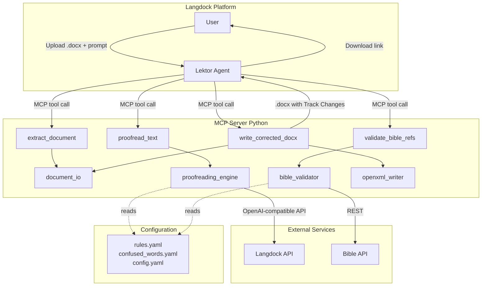
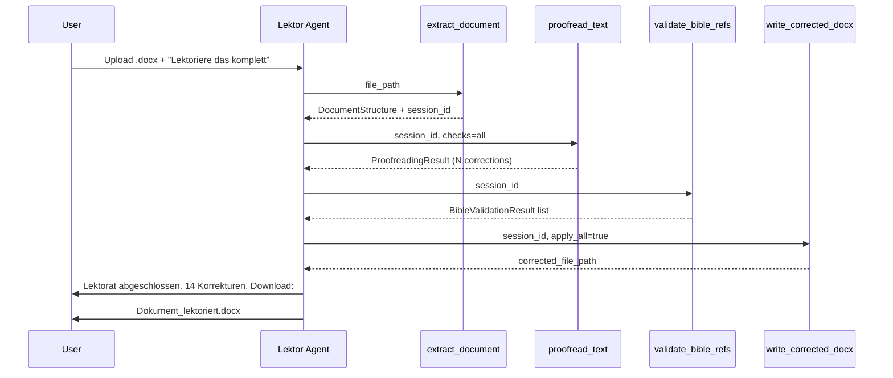
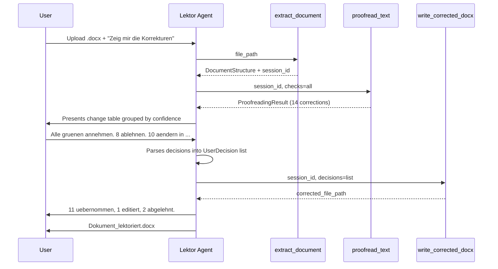

# Technical Design: MCP-Based Interactive Proofreading Server

**Version:** 1.0
**Date:** 2026-03-04
**Author:** Opus
**Related Documents:** [ADR-0001](docs/adr/ADR-0001-mcp-based-interactive-proofreading-server.md), [DEV_SPEC-0001](docs/tasks/DEV_SPEC-0001-mcp-based-interactive-proofreading-server.md)

---

### 1. Introduction

This document provides a detailed technical design for the MCP-Based Interactive Proofreading Server. It translates the requirements defined in DEV_SPEC-0001 into a concrete implementation plan, specifying the architecture, components, data models, and APIs. The goal is to create a robust, secure, and performant solution that integrates seamlessly into the Langdock ecosystem as a custom MCP integration.

The system enables professional-grade proofreading of formatted German-language Word documents, producing output files with Track Changes and comments — all accessible through the familiar Langdock chat interface.

---

### 2. System Architecture and Components

#### 2.1. Component Overview

The system consists of four layers:

*   **Langdock Platform (Frontend & Orchestration):**
    *   **Lektor Agent:** A Langdock Agent with a tailored system prompt that serves as the user-facing interface. Handles intent detection (automatic vs. interactive mode, selective checks), presents results, and manages the conversational review flow.
    *   **File Handling:** Langdock native file upload mechanism delivers `.docx` files to the MCP tools.

*   **MCP Server (Backend Core):**
    *   A Python application implementing the Model Context Protocol, exposing four tools. Runs as a standalone HTTP service (FastAPI + MCP SDK).
    *   **Modules:**
        *   `document_io` — Reading and writing `.docx` files with full formatting preservation
        *   `proofreading_engine` — Orchestrating LLM-based proofreading and rule-based checks
        *   `bible_validator` — Bible reference detection and online validation
        *   `openxml_writer` — Track Changes and comment insertion at the OpenXML level

*   **External Services:**
    *   **Langdock API** (OpenAI-compatible) — Used by `proofreading_engine` for LLM inference
    *   **Bible API** (e.g., bible-api.com or similar) — Used by `bible_validator` for reference validation

*   **Configuration Layer:**
    *   YAML/JSON files for confused-words lists, typography rules, and proofreading parameters
    *   Environment variables for API keys, server configuration, and feature flags

#### 2.2. Component Interaction Diagram



#### 2.3. Project Structure

```
mcp-lektor/
├── pyproject.toml
├── Dockerfile
├── docker-compose.yaml
├── config/
│   ├── config.yaml              # Server & API configuration
│   ├── confused_words.yaml      # Verwechslungswoerter list
│   └── typography_rules.yaml    # Typography rules
├── src/
│   └── mcp_lektor/
│       ├── __init__.py
│       ├── server.py            # MCP server entry point
│       ├── tools/
│       │   ├── __init__.py
│       │   ├── extract_document.py
│       │   ├── proofread_text.py
│       │   ├── validate_bible_refs.py
│       │   └── write_corrected_docx.py
│       ├── core/
│       │   ├── __init__.py
│       │   ├── document_io.py       # .docx read/write with formatting
│       │   ├── proofreading_engine.py
│       │   ├── bible_validator.py
│       │   ├── openxml_writer.py    # Track Changes & comments
│       │   └── models.py           # Pydantic data models
│       ├── config/
│       │   ├── __init__.py
│       │   └── settings.py         # Configuration loader
│       └── utils/
│           ├── __init__.py
│           ├── text_differ.py      # Diff computation
│           └── bible_patterns.py   # Regex patterns for Bible refs
├── tests/
│   ├── conftest.py
│   ├── fixtures/
│   │   ├── sample_formatted.docx
│   │   ├── sample_with_errors.docx
│   │   └── sample_with_bible_refs.docx
│   ├── unit/
│   │   ├── test_document_io.py
│   │   ├── test_proofreading_engine.py
│   │   ├── test_bible_validator.py
│   │   ├── test_openxml_writer.py
│   │   └── test_text_differ.py
│   └── integration/
│       ├── test_extract_document.py
│       ├── test_proofread_text.py
│       ├── test_write_corrected_docx.py
│       └── test_end_to_end.py
└── docs/
    ├── adr/
    │   └── ADR-0001-mcp-based-interactive-proofreading-server.md
    └── tasks/
        ├── DEV_SPEC-0001-mcp-based-interactive-proofreading-server.md
        └── DEV_TECH_DESIGN-0001-mcp-based-interactive-proofreading-server.md
```

---

### 3. Data Model Specification

All data models use Pydantic v2 for validation, serialization, and schema generation.

#### 3.1. Core Models (`src/mcp_lektor/core/models.py`)

```python
from pydantic import BaseModel, Field
from enum import Enum
from typing import Optional
from datetime import datetime


class TextColor(BaseModel):
    r: int = Field(ge=0, le=255)
    g: int = Field(ge=0, le=255)
    b: int = Field(ge=0, le=255)

    @property
    def is_red(self) -> bool:
        return self.r > 180 and self.g < 80 and self.b < 80


class RunFormatting(BaseModel):
    bold: bool = False
    italic: bool = False
    underline: bool = False
    strike: bool = False
    font_name: Optional[str] = None
    font_size: Optional[float] = None
    color: Optional[TextColor] = None
    highlight: Optional[str] = None
    style_name: Optional[str] = None


class TextRun(BaseModel):
    text: str
    formatting: RunFormatting = Field(default_factory=RunFormatting)
    is_placeholder: bool = False

    @property
    def is_red_text(self) -> bool:
        return self.formatting.color is not None and self.formatting.color.is_red


class ParagraphType(str, Enum):
    HEADING = "heading"
    BODY = "body"
    LIST_ITEM = "list_item"
    TABLE_CELL = "table_cell"
    HEADER = "header"
    FOOTER = "footer"


class DocumentParagraph(BaseModel):
    index: int
    paragraph_type: ParagraphType = ParagraphType.BODY
    style_name: Optional[str] = None
    heading_level: Optional[int] = None
    runs: list[TextRun] = Field(default_factory=list)
    is_placeholder_paragraph: bool = False

    @property
    def plain_text(self) -> str:
        return "".join(run.text for run in self.runs)

    @property
    def proofreadable_text(self) -> str:
        return "".join(run.text for run in self.runs if not run.is_placeholder)


class DocumentStructure(BaseModel):
    filename: str
    paragraphs: list[DocumentParagraph] = Field(default_factory=list)
    total_paragraphs: int = 0
    total_words: int = 0
    placeholder_count: int = 0
    placeholder_locations: list[str] = Field(default_factory=list)


class CorrectionCategory(str, Enum):
    SPELLING = "Rechtschreibung"
    GRAMMAR = "Grammatik"
    PUNCTUATION = "Zeichensetzung"
    TYPOGRAPHY = "Typografie"
    QUOTATION_MARKS = "Anfuehrungszeichen"
    ADDRESS_FORM = "Anrede-Konsistenz"
    CONFUSED_WORD = "Verwechslungswort"
    BIBLE_REFERENCE = "Bibelstelle"


class ConfidenceLevel(str, Enum):
    HIGH = "high"
    MEDIUM = "medium"
    LOW = "low"


class ProposedCorrection(BaseModel):
    id: str
    paragraph_index: int
    run_index: int
    char_offset_start: int
    char_offset_end: int
    original_text: str
    suggested_text: str
    category: CorrectionCategory
    confidence: ConfidenceLevel
    explanation: str
    rule_reference: Optional[str] = None


class ProofreadingResult(BaseModel):
    document_filename: str
    total_corrections: int = 0
    corrections: list[ProposedCorrection] = Field(default_factory=list)
    predominant_address_form: Optional[str] = None
    address_form_deviations: int = 0
    placeholder_summary: str = ""
    processing_time_seconds: float = 0.0

    @property
    def high_confidence(self) -> list[ProposedCorrection]:
        return [c for c in self.corrections if c.confidence == ConfidenceLevel.HIGH]

    @property
    def medium_confidence(self) -> list[ProposedCorrection]:
        return [c for c in self.corrections if c.confidence == ConfidenceLevel.MEDIUM]

    @property
    def low_confidence(self) -> list[ProposedCorrection]:
        return [c for c in self.corrections if c.confidence == ConfidenceLevel.LOW]


class BibleReference(BaseModel):
    paragraph_index: int
    raw_text: str
    book: str
    chapter: int
    verse_start: Optional[int] = None
    verse_end: Optional[int] = None


class BibleValidationResult(BaseModel):
    reference: BibleReference
    is_valid: bool
    error_message: Optional[str] = None
    suggested_correction: Optional[str] = None
    source_url: Optional[str] = None


class CorrectionDecision(str, Enum):
    ACCEPT = "accept"
    REJECT = "reject"
    EDIT = "edit"


class UserDecision(BaseModel):
    correction_id: str
    decision: CorrectionDecision
    edited_text: Optional[str] = None


class WriteRequest(BaseModel):
    document_session_id: str
    decisions: list[UserDecision] = Field(default_factory=list)
    apply_all: bool = False
```

#### 3.2. Configuration Models

```python
class ProofreadingConfig(BaseModel):
    checks_enabled: list[CorrectionCategory] = Field(
        default_factory=lambda: list(CorrectionCategory)
    )
    llm_model: str = "anthropic/claude-3.5-sonnet"
    max_tokens_per_call: int = 4096
    temperature: float = 0.1
    author_name: str = "MCP Lektor"
    langdock_api_base: str = "https://api.langdock.com/openai/v1"


class ConfusedWordEntry(BaseModel):
    word: str
    confused_with: str
    explanation: str
    example_correct: str
    example_incorrect: str


class TypographyRule(BaseModel):
    name: str
    pattern: str
    replacement: str
    explanation: str
    category: str
```

#### 3.3. Data Flow Diagram

```mermaid
graph LR
    subgraph "Input"
        DOCX[".docx file"]
    end

    subgraph "extract_document"
        DOCX --> PARSE["python-docx Parse XML"]
        PARSE --> DS["DocumentStructure"]
    end

    subgraph "proofread_text"
        DS --> FILTER["Filter out placeholder runs"]
        FILTER --> CHUNK["Chunk into LLM-sized batches"]
        CHUNK --> LLM["LLM Call via Langdock API"]
        LLM --> PARSE_RESP["Parse LLM response"]
        PARSE_RESP --> PR["ProofreadingResult"]
    end

    subgraph "validate_bible_refs"
        DS --> REGEX["Regex extraction of Bible refs"]
        REGEX --> API["Bible API validation"]
        API --> BVR["BibleValidationResult list"]
        BVR --> PR
    end

    subgraph "write_corrected_docx"
        PR --> DECIDE{"Stage 1? Apply all"}
        DECIDE -->|"Yes"| WR["WriteRequest apply_all=True"]
        DECIDE -->|"No Stage 2"| USER["User reviews in chat"]
        USER --> WR2["WriteRequest with selected decisions"]
        WR --> WRITE["openxml_writer"]
        WR2 --> WRITE
        WRITE --> OUT[".docx with Track Changes + Comments"]
    end
```



---

### 4. Backend Specification

#### 4.1. MCP Server Entry Point (`server.py`)

```python
from mcp.server.fastmcp import FastMCP

from mcp_lektor.tools.extract_document import extract_document
from mcp_lektor.tools.proofread_text import proofread_text
from mcp_lektor.tools.validate_bible_refs import validate_bible_refs
from mcp_lektor.tools.write_corrected_docx import write_corrected_docx

mcp = FastMCP(
    "MCP Lektor",
    description="Professional German-language proofreading server for Word documents"
)

mcp.tool()(extract_document)
mcp.tool()(proofread_text)
mcp.tool()(validate_bible_refs)
mcp.tool()(write_corrected_docx)

if __name__ == "__main__":
    mcp.run(transport="sse")
```

#### 4.2. MCP Tool Specifications

##### Tool 1: `extract_document`

| Property | Value |
|---|---|
| **Name** | `extract_document` |
| **Description** | Reads a .docx file and returns a structured representation with formatting metadata. Identifies and marks red-text placeholders. |
| **Input** | `file_path: str` |
| **Output** | `DocumentStructure` (JSON) |
| **Side Effects** | Creates a session in the in-memory store |

**Implementation outline:**

```python
async def extract_document(file_path: str) -> str:
    doc = Document(file_path)
    session_id = str(uuid4())

    paragraphs = []
    for idx, para in enumerate(doc.paragraphs):
        runs = []
        for run in para.runs:
            formatting = _extract_run_formatting(run)
            text_run = TextRun(
                text=run.text,
                formatting=formatting,
                is_placeholder=_is_placeholder(run, formatting)
            )
            runs.append(text_run)

        doc_para = DocumentParagraph(
            index=idx,
            paragraph_type=_classify_paragraph(para),
            style_name=para.style.name if para.style else None,
            heading_level=_get_heading_level(para),
            runs=runs,
            is_placeholder_paragraph=all(
                r.is_placeholder for r in runs if r.text.strip()
            )
        )
        paragraphs.append(doc_para)

    structure = DocumentStructure(
        filename=Path(file_path).name,
        paragraphs=paragraphs,
        total_paragraphs=len(paragraphs),
        total_words=sum(len(p.plain_text.split()) for p in paragraphs),
        placeholder_count=sum(
            1 for p in paragraphs if p.is_placeholder_paragraph
        ),
        placeholder_locations=[
            f"Paragraph {p.index}"
            for p in paragraphs if p.is_placeholder_paragraph
        ]
    )

    SESSION_STORE[session_id] = {
        "file_path": file_path,
        "structure": structure,
    }

    result = {"session_id": session_id, "document": structure.model_dump()}
    return json.dumps(result, ensure_ascii=False, indent=2)
```

**Placeholder detection helper:**

```python
def _is_placeholder(run, formatting: RunFormatting) -> bool:
    if formatting.color and formatting.color.is_red:
        return True
    if run.text.strip().startswith("[") and run.text.strip().endswith("]"):
        if formatting.color and formatting.color.is_red:
            return True
    return False
```

##### Tool 2: `proofread_text`

| Property | Value |
|---|---|
| **Name** | `proofread_text` |
| **Description** | Performs proofreading analysis on extracted document text. Returns structured correction proposals without modifying the document. |
| **Input** | `session_id: str`, `checks: list[str]` (optional, defaults to all) |
| **Output** | `ProofreadingResult` (JSON) |

**LLM Prompt Strategy:**

The proofreading engine sends text to the LLM in paragraph batches (up to ~3000 tokens per batch) with a structured system prompt that enforces JSON output. The prompt instructs the LLM to:
- Never modify placeholder text
- Use German typographic conventions
- Return only genuine errors with explanations
- Classify each correction by category and confidence level

**Chunking Strategy:**

```python
async def _proofread_in_batches(
    paragraphs: list[DocumentParagraph],
    config: ProofreadingConfig,
    checks: list[CorrectionCategory]
) -> list[ProposedCorrection]:
    all_corrections = []
    batch = []
    batch_token_estimate = 0

    for para in paragraphs:
        if para.is_placeholder_paragraph:
            continue

        text = para.proofreadable_text
        if not text.strip():
            continue

        para_tokens = len(text) // 3
        if batch_token_estimate + para_tokens > 2500:
            corrections = await _call_llm_for_batch(batch, config, checks)
            all_corrections.extend(corrections)
            batch = []
            batch_token_estimate = 0

        batch.append(para)
        batch_token_estimate += para_tokens

    if batch:
        corrections = await _call_llm_for_batch(batch, config, checks)
        all_corrections.extend(corrections)

    return all_corrections
```

##### Tool 3: `validate_bible_refs`

| Property | Value |
|---|---|
| **Name** | `validate_bible_refs` |
| **Description** | Detects and validates all Bible references against an online API. |
| **Input** | `session_id: str` |
| **Output** | `list[BibleValidationResult]` (JSON) |

**Bible Reference Detection Patterns:**

```python
import re

BIBLE_REF_PATTERN = re.compile(
    r"(?P<book>"
    r"(?:[12345]\.\s?)?"
    r"(?:Gen|Ex|Lev|Num|Dtn|Jos|Ri|Rut|Sam|Koen|Chr|Esr|Neh|Est|"
    r"Ijob|Ps|Spr|Koh|Hld|Jes|Jer|Klgl|Ez|Dan|Hos|Joel|Am|Obd|"
    r"Jona|Mi|Nah|Hab|Zef|Hag|Sach|Mal|"
    r"Mt|Mk|Lk|Joh|Apg|Roem|Kor|Gal|Eph|Phil|Kol|Thess|Tim|Tit|"
    r"Phlm|Hebr|Jak|Petr|Jud|Offb|"
    r"Mose|Koenige|Samuel|Chronik|Korinther|Thessalonicher|"
    r"Timotheus|Petrus|Johannes)"
    r")"
    r"\s*"
    r"(?P<chapter>\d{1,3})"
    r"(?:\s*[,:]\s*(?P<verse_start>\d{1,3}))?"
    r"(?:\s*[-\xe2\x80\x93]\s*(?P<verse_end>\d{1,3}))?",
    re.IGNORECASE
)
```

##### Tool 4: `write_corrected_docx`

| Property | Value |
|---|---|
| **Name** | `write_corrected_docx` |
| **Description** | Writes approved corrections as Track Changes with comments. Returns the modified .docx file. |
| **Input** | `session_id: str`, `decisions: str` (JSON of WriteRequest) |
| **Output** | Path to the corrected `.docx` file |

**OpenXML Track Changes Implementation:**

This is the most technically complex component. Track Changes in OpenXML require inserting `<w:del>` and `<w:ins>` elements with revision metadata directly into the paragraph XML.

```python
from lxml import etree
from copy import deepcopy

WORD_NS = "http://schemas.openxmlformats.org/wordprocessingml/2006/main"


def _apply_track_change(
    paragraph_element,
    run_index: int,
    char_start: int,
    char_end: int,
    original_text: str,
    replacement_text: str,
    author: str,
    timestamp: str,
    revision_id: int
) -> None:
    runs = paragraph_element.findall(f".//{{{WORD_NS}}}r")
    if run_index >= len(runs):
        return

    target_run = runs[run_index]
    text_elem = target_run.find(f"{{{WORD_NS}}}t")
    if text_elem is None or text_elem.text is None:
        return

    full_text = text_elem.text
    rpr = target_run.find(f"{{{WORD_NS}}}rPr")
    rpr_copy = deepcopy(rpr) if rpr is not None else None

    parent = target_run.getparent()
    run_position = list(parent).index(target_run)

    before_text = full_text[:char_start]
    after_text = full_text[char_end:]

    parent.remove(target_run)
    insert_pos = run_position

    # 1. Insert before-text run
    if before_text:
        before_run = _make_run(before_text, rpr_copy)
        parent.insert(insert_pos, before_run)
        insert_pos += 1

    # 2. Insert <w:del> element
    del_elem = etree.SubElement(
        parent, f"{{{WORD_NS}}}del",
        {
            f"{{{WORD_NS}}}id": str(revision_id),
            f"{{{WORD_NS}}}author": author,
            f"{{{WORD_NS}}}date": timestamp,
        }
    )
    del_run = _make_run(original_text, rpr_copy, is_delete=True)
    del_elem.append(del_run)
    parent.insert(insert_pos, del_elem)
    insert_pos += 1

    # 3. Insert <w:ins> element
    ins_elem = etree.SubElement(
        parent, f"{{{WORD_NS}}}ins",
        {
            f"{{{WORD_NS}}}id": str(revision_id + 1),
            f"{{{WORD_NS}}}author": author,
            f"{{{WORD_NS}}}date": timestamp,
        }
    )
    ins_run = _make_run(replacement_text, rpr_copy)
    ins_elem.append(ins_run)
    parent.insert(insert_pos, ins_elem)
    insert_pos += 1

    # 4. Insert after-text run
    if after_text:
        after_run = _make_run(after_text, rpr_copy)
        parent.insert(insert_pos, after_run)


def _make_run(text, rpr=None, is_delete=False):
    run = etree.Element(f"{{{WORD_NS}}}r")
    if rpr is not None:
        run.append(deepcopy(rpr))
    if is_delete:
        dt = etree.SubElement(run, f"{{{WORD_NS}}}delText")
        dt.set("{http://www.w3.org/XML/1998/namespace}space", "preserve")
        dt.text = text
    else:
        t = etree.SubElement(run, f"{{{WORD_NS}}}t")
        t.set("{http://www.w3.org/XML/1998/namespace}space", "preserve")
        t.text = text
    return run
```

**Comment Insertion:**

```python
def _add_comment(
    document,
    paragraph_element,
    run_index: int,
    comment_text: str,
    author: str,
    timestamp: str,
    comment_id: int
) -> None:
    comments_part = _get_or_create_comments_part(document)

    runs = paragraph_element.findall(f".//{{{WORD_NS}}}r")
    if run_index >= len(runs):
        return

    target_run = runs[run_index]
    parent = target_run.getparent()
    run_pos = list(parent).index(target_run)

    range_start = etree.Element(f"{{{WORD_NS}}}commentRangeStart")
    range_start.set(f"{{{WORD_NS}}}id", str(comment_id))
    parent.insert(run_pos, range_start)

    range_end = etree.Element(f"{{{WORD_NS}}}commentRangeEnd")
    range_end.set(f"{{{WORD_NS}}}id", str(comment_id))
    parent.insert(run_pos + 2, range_end)

    ref_run = etree.Element(f"{{{WORD_NS}}}r")
    ref_rpr = etree.SubElement(ref_run, f"{{{WORD_NS}}}rPr")
    ref_style = etree.SubElement(ref_rpr, f"{{{WORD_NS}}}rStyle")
    ref_style.set(f"{{{WORD_NS}}}val", "CommentReference")
    comment_ref = etree.SubElement(ref_run, f"{{{WORD_NS}}}commentReference")
    comment_ref.set(f"{{{WORD_NS}}}id", str(comment_id))
    parent.insert(run_pos + 3, ref_run)

    _add_comment_to_part(
        comments_part, comment_id, author, timestamp, comment_text
    )
```

#### 4.3. Session Management

```python
from datetime import datetime, timedelta
from typing import Any
import asyncio

SESSION_STORE: dict[str, dict[str, Any]] = {}
SESSION_TTL = timedelta(minutes=30)


async def cleanup_expired_sessions():
    while True:
        now = datetime.utcnow()
        expired = [
            sid for sid, data in SESSION_STORE.items()
            if now - data.get("created_at", now) > SESSION_TTL
        ]
        for sid in expired:
            file_path = SESSION_STORE[sid].get("file_path")
            if file_path and Path(file_path).exists():
                Path(file_path).unlink()
            del SESSION_STORE[sid]
        await asyncio.sleep(60)
```

#### 4.4. Proofreading Engine (`proofreading_engine.py`)

```python
class ProofreadingEngine:
    def __init__(self, config: ProofreadingConfig):
        self.config = config
        self.client = AsyncOpenAI(
            api_key=config.langdock_api_key,
            base_url=config.langdock_api_base
        )
        self.confused_words = load_confused_words()
        self.typography_rules = load_typography_rules()

    async def proofread(
        self,
        structure: DocumentStructure,
        checks: list[CorrectionCategory]
    ) -> ProofreadingResult:
        start = time.time()
        all_corrections = []

        # Step 1: Rule-based pre-scan (fast, no LLM needed)
        if CorrectionCategory.TYPOGRAPHY in checks:
            all_corrections.extend(
                self._apply_typography_rules(structure)
            )
        if CorrectionCategory.CONFUSED_WORD in checks:
            all_corrections.extend(
                self._scan_confused_words(structure)
            )
        if CorrectionCategory.QUOTATION_MARKS in checks:
            all_corrections.extend(
                self._check_quotation_marks(structure)
            )

        # Step 2: LLM-based analysis
        llm_checks = [c for c in checks if c in {
            CorrectionCategory.SPELLING,
            CorrectionCategory.GRAMMAR,
            CorrectionCategory.PUNCTUATION,
            CorrectionCategory.ADDRESS_FORM,
        }]
        if llm_checks:
            llm_corrections = await self._proofread_with_llm(
                structure, llm_checks
            )
            all_corrections.extend(llm_corrections)

        # Step 3: Deduplicate
        all_corrections = self._deduplicate(all_corrections)

        # Step 4: Assign IDs
        for i, corr in enumerate(all_corrections, 1):
            corr.id = f"C-{i:03d}"

        return ProofreadingResult(
            document_filename=structure.filename,
            total_corrections=len(all_corrections),
            corrections=all_corrections,
            processing_time_seconds=time.time() - start
        )
```

---

### 5. Frontend Specification

There is no custom frontend. The **Langdock Agent** serves as the user interface.

#### 5.1. Agent System Prompt

The Agent system prompt is the primary mechanism for controlling user interaction. It handles mode selection (automatic, interactive, selective), result presentation (grouped by confidence), and decision collection (natural language parsing of approve/reject/edit commands). The full prompt is maintained as a versioned configuration artifact alongside the MCP server.

Key behaviors defined in the prompt:
- Detect user intent for Stage 1 vs. Stage 2 vs. selective checks
- Present corrections as structured tables grouped by confidence level
- Parse natural language decisions ("1,3,5 annehmen, 2 ablehnen")
- Summarize results after writing corrections
- Always respond in German

#### 5.2. Sequence Diagram: Automatic Mode (Stage 1)



#### 5.3. Sequence Diagram: Interactive Mode (Stage 2)



---

### 6. Security Considerations

| Concern | Mitigation |
|---|---|
| **Document Confidentiality** | Documents stored only in temporary session storage (in-memory + temp file). Sessions expire after 30 minutes. No persistent storage of document content. |
| **API Key Protection** | Langdock API key and Bible API key stored as environment variables, never in code or committed config files. |
| **Transport Security** | MCP server deployed behind HTTPS/TLS. Langdock communicates with MCP servers over HTTPS. |
| **Input Validation** | File extension must be `.docx`, size must be <= 50 MB, file must be a valid ZIP archive. Malformed files rejected before processing. |
| **Injection Prevention** | LLM prompt includes only document text, not user-controllable instructions. System prompt is fixed. LLM output parsed as structured JSON. |
| **Session Isolation** | Each upload creates a unique session ID (UUID4). Sessions cannot access each other. |
| **Logging** | Server logs contain only session IDs, timestamps, and correction counts. Never document content. |

---

### 7. Performance Considerations

| Aspect | Strategy | Target |
|---|---|---|
| **LLM Latency** | Paragraphs batched at ~2500 tokens per batch to minimize API round-trips. | <= 8 API calls for 20-page doc |
| **Parallel Processing** | Bible validation runs concurrently with LLM proofreading via `asyncio.gather()`. Rule-based checks complete in < 1 second. | 30% latency reduction |
| **Memory Usage** | `python-docx` loads full document into memory. Peak ~200 MB for 50 MB files. | <= 512 MB per session |
| **Document Size** | Documents > 20 pages processed in same pipeline but may exceed 120s target. Warning for > 100 pages. | 120s for <= 20 pages |
| **Concurrency** | One session per MCP request. Multiple users via uvicorn workers. Recommended: 4 workers. | 20 concurrent users |
| **Caching** | Typography and confused-word rules loaded once at startup. | < 1ms rule lookup |

**Resource Sizing:**

| Deployment | CPU | RAM | Concurrent Users |
|---|---|---|---|
| Development | 1 core | 1 GB | 1-2 |
| Small Team (5-10) | 2 cores | 2 GB | 5-10 |
| Department (20-50) | 4 cores | 4 GB | 20-30 |

---

### 8. Deployment

#### 8.1. Dockerfile

```dockerfile
FROM python:3.12-slim

WORKDIR /app
COPY pyproject.toml ./
RUN pip install --no-cache-dir .
COPY src/ ./src/
COPY config/ ./config/

EXPOSE 8080

CMD ["uvicorn", "mcp_lektor.server:mcp.app", "--host", "0.0.0.0", "--port", "8080"]
```

#### 8.2. docker-compose.yaml

```yaml
version: "3.9"
services:
  mcp-lektor:
    build: .
    ports:
      - "8080:8080"
    environment:
      - LANGDOCK_API_KEY=${LANGDOCK_API_KEY}
      - BIBLE_API_URL=${BIBLE_API_URL:-https://bible-api.com}
      - LOG_LEVEL=${LOG_LEVEL:-info}
    volumes:
      - ./config:/app/config:ro
    restart: unless-stopped
    deploy:
      resources:
        limits:
          memory: 2G
          cpus: "2.0"
```

#### 8.3. Langdock MCP Registration

1. Navigate to **Workspace Settings > Integrations > Custom Integrations**
2. Select **MCP (Model Context Protocol)**
3. Enter the server URL: `https://your-server.example.com:8080/mcp`
4. Langdock auto-discovers the four tools
5. Create an Agent with the system prompt and attach the MCP integration

---

### 9. Technology Stack Summary

| Layer | Technology | Version | Purpose |
|---|---|---|---|
| Runtime | Python | 3.12+ | Core language |
| MCP Framework | `mcp` (Anthropic SDK) | latest | MCP protocol implementation |
| ASGI Server | uvicorn | latest | HTTP server for MCP SSE transport |
| Word Processing | `python-docx` | 1.1+ | High-level .docx read/write |
| XML Manipulation | `lxml` | 5.x | Low-level OpenXML for Track Changes |
| Data Validation | Pydantic | 2.x | Data models, serialization |
| HTTP Client | `httpx` | 0.27+ | Async calls to Langdock API, Bible API |
| LLM Client | `openai` | 1.x | OpenAI-compatible client for Langdock API |
| Configuration | PyYAML | 6.x | Loading rule config files |
| Testing | pytest + pytest-asyncio | latest | Unit and integration tests |
| Containerization | Docker | latest | Deployment |
| Linting | ruff, black | latest | Code quality |
