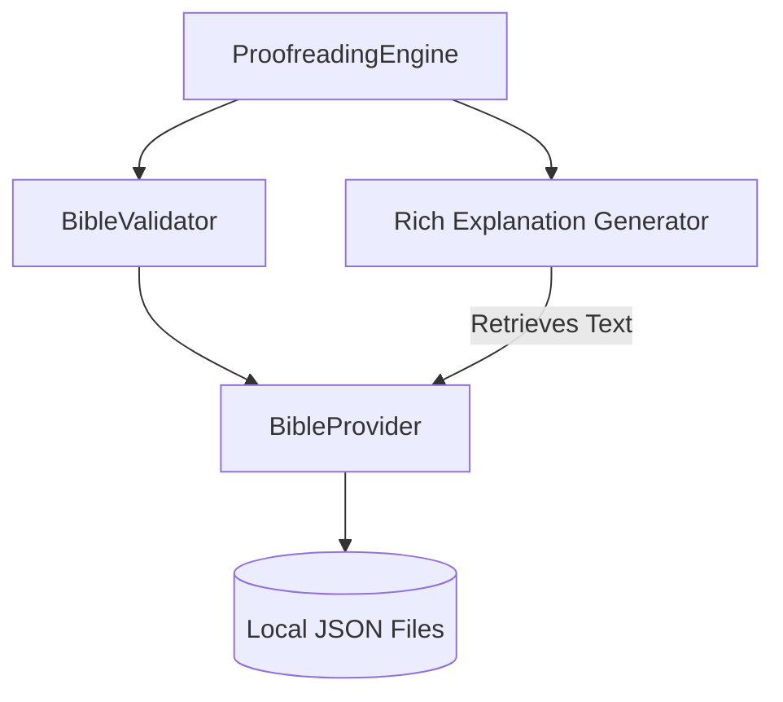
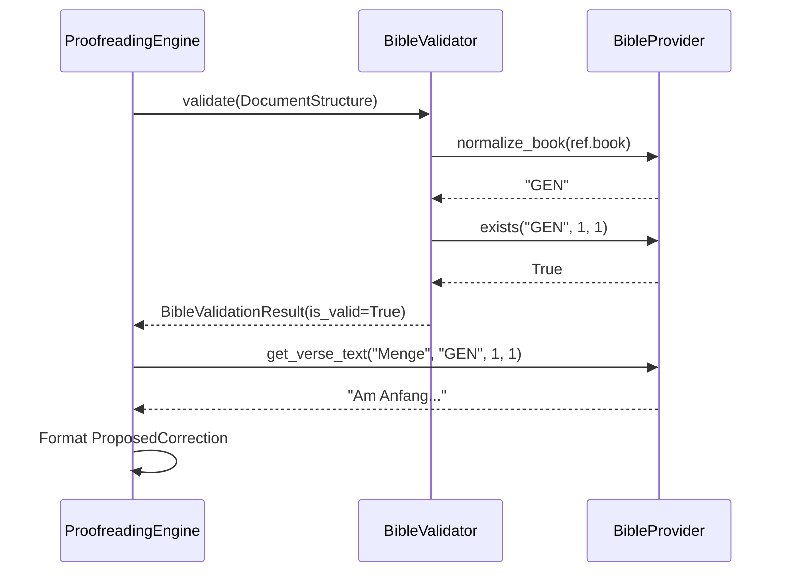

# Technical Design: Local Bible Knowledge Base

**Version:** 1.0
**Date:** 2026-03-11
**Author:** Gemini
**Related Documents:** [ADR-0007](docs/adr/ADR-0007-local-bible-knowledge-base.md), [DEV_SPEC-0007](docs/tasks/DEV_SPEC-0007-local-bible-knowledge-base.md)

---

### 1. Introduction

This document provides a detailed technical design for the "Local Bible Knowledge Base" feature. It specifies the architecture for storing, loading, and querying Bible translations locally to provide robust validation and rich text citations within the proofreading workflow.

---

### 2. System Architecture and Components

#### 2.1. Component Overview

*   **Data Layer (`data/bibles/`):**
    *   Storage of Bible translations in JSON format.
    *   Files: `menge.json`, `neu.json`, `elberfelder1905.json`, `luther1912.json`.

*   **Logic Layer (`src/mcp_lektor/core/`):**
    *   **`bible_provider.py` (New):** Responsible for loading JSON files into memory and providing a standardized query interface (lookup by book, chapter, verse).
    *   **`bible_validator.py` (Refactored):** Orchestrates the validation process. Instead of scraping, it uses `BibleProvider` for instant lookup.
    *   **`proofreading_engine.py` (Update):** Formats the rich citations retrieved from `BibleProvider` into `ProposedCorrection` objects.

*   **Configuration (`config/config.yaml`):**
    *   Defines which local translations are available and which one is the master for validation.

#### 2.2. Component Interaction Diagram



---

### 3. Data Model Specification

#### 3.1. Local JSON Schema
Each translation file follows a nested dictionary structure for O(1) lookup:
```json
{
  "GEN": {
    "1": {
      "1": "Am Anfang schuf Gott den Himmel und die Erde.",
      "2": "..."
    }
  }
}
```
*Keys:*
- **Book ID:** Standard uppercase abbreviations (e.g., GEN, EXO, MAT).
- **Chapter Number:** String representation of the integer.
- **Verse Number:** String representation of the integer.

#### 3.2. BibleReference (Updated in previous task)
```python
class BibleReference(BaseModel):
    paragraph_index: int
    raw_text: str
    book: str
    chapter: int
    verse_start: Optional[int] = None
    verse_end: Optional[int] = None
    char_offset_start: int
    char_offset_end: int
```

---

### 4. Backend Specification

#### 4.1. `BibleProvider` Class
- **`load_all()`:** Synchronously loads all enabled JSON files from `data/bibles/` into a private `_data` dictionary at startup.
- **`get_verse_text(translation, book, chapter, verse)`:** Returns the string for a specific verse.
- **`exists(book, chapter, verse)`:** Boolean check against the master translation (Menge).
- **`normalize_book_name(name)`:** Maps "1. Mose", "Genesis", "Gen" to the standard "GEN" key.

#### 4.2. `ProofreadingEngine` Integration
The engine will iterate through extracted references and for each:
1.  Verify existence via `BibleProvider.exists()`.
2.  If valid, retrieve text from all available local translations.
3.  Format the `explanation` field:
    ```
    Bibelstelle verifiziert.
    
    Menge: "..."
    NeÜ: "..."
    
    Vergleichslinks:
    Luther 1984: https://...
    Elberfelder: https://...
    ```

#### 4.3. Sequence Diagram: Bible Validation Workflow



---

### 5. Security Considerations
- **File System Access:** Path joining for loading JSON files must be sanitized to prevent directory traversal (though paths are currently internal).
- **Data Integrity:** The JSON files are read-only for the application.

---

### 6. Performance Considerations
- **Memory Footprint:** Loading 4 German bibles (OT+NT) into memory will consume approx. 30-50 MB of RAM. This is acceptable for a CLI/Server application.
- **Initialization Time:** Loading JSON files happens once at startup (or on first request) and takes < 500ms.
- **Query Speed:** Dictionary lookups are near-instant, removing the previous 1-2 second HTTP latency per reference.
