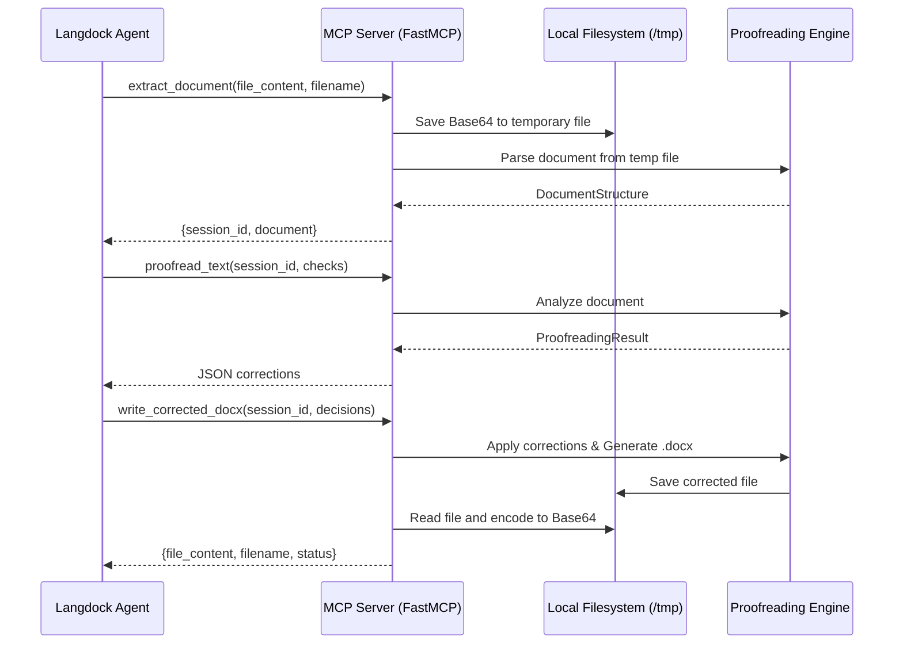

# Technical Design: Langdock Cloud Integration

**Version:** 1.0
**Date:** 2026-03-17
**Author:** Gemini
**Related Documents:** [ADR-0008](docs/adr/ADR-0008-langdock-cloud-integration-and-file-handling.md), [DEV_SPEC-0008](docs/tasks/DEV_SPEC-0008-langdock-cloud-integration.md)

---

### 1. Introduction

This document provides a detailed technical design for the Langdock Cloud Integration feature. It translates the requirements defined in DEV_SPEC-0008 into a concrete implementation plan, specifying the architecture, components, data models, and APIs. The goal is to allow the MCP-Lektor server to operate in a cloud environment (e.g., via SSE) where the client has no shared filesystem access.

---

### 2. System Architecture and Components

The architecture remains based on the Model Context Protocol (MCP) using the `FastMCP` framework, but with enhanced data transfer capabilities and a security layer.

#### 2.1. Component Overview

*   **MCP Server (`server.py`):**
    *   Acts as the entry point for SSE connections.

*   **Tools Layer (`src/mcp_lektor/tools/`):**
    *   **`extract_document.py`**: Updated to handle Base64 input strings.
    *   **`write_corrected_docx.py`**: Updated to generate and return Base64 output strings.

*   **Core Layer (`src/mcp_lektor/core/`):**
    *   **`session_manager.py`**: Remains in-memory but manages the lifecycle of temporary files generated from Base64 inputs.
    *   **`document_io.py`**: No changes needed; continues to work with local paths (the tools layer handles the conversion from Base64 to temp-files).

#### 2.2. Component Interaction Diagram

---

### 3. Data Model Specification

The existing Pydantic models in `src/mcp_lektor/core/models.py` are sufficient. The "Data Model" changes are primarily in the Tool request/response schemas (implicit in FastMCP).

---

### 4. Backend Specification

#### 4.1. File Lifecycle Management
To prevent disk exhaustion in the container:
*   Temporary files from Base64 input will be named `session_{session_id}.docx`.
*   The `session_manager.prune_expired()` method will be updated to also delete files associated with the pruned sessions.

---

### 5. Sequence Diagram: Cloud Integration Flow
(See section 2.2)

---

### 6. Security Considerations
*   **Base64 Size Limit:** We should implement a basic check for the input string length to prevent OOM (Out of Memory) attacks. A limit of 10MB (approx. 13MB Base64) is reasonable for `.docx`.
*   **Sanitization:** The `filename` provided in `extract_document` must be sanitized to prevent directory traversal attacks (e.g., using `pathlib.Path(filename).name`).

---

### 7. Performance Considerations
*   **Encoding Overhead:** Base64 increases CPU usage. For very large documents, this might introduce latency.
*   **Memory:** Reading the entire corrected file into memory to encode it as Base64 is safe for standard documents (usually < 2MB), but could be an issue for extreme edge cases. We will monitor memory usage during integration tests.
